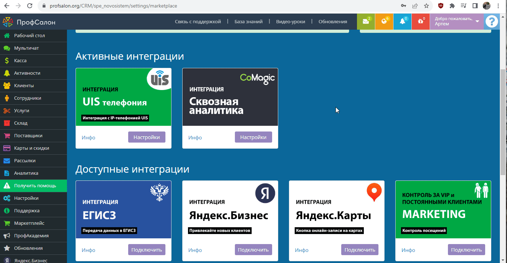

### Интеграция с ПрофСалон
  

 **Ценность**     
 
Решение позволяет передавать в наш кабинет заявки, оставленные клиентами в форме Онлайн-записи, а также сделки из ПрофСалона, для дальнейшего построения Сквозной аналитики.
  

**Какие данные передаются**    

Данные получаемые по сделкам:  
- сделки: сумма сделки, название, даты изменения и тд; 
- воронка продаж и ее этапы;
- контакты;
- ответственный менеджер;
- дополнительные поля.  
  
Данные получаемые по заякам:  

- контактные данные (имя,телефон,email)  
- дату и время создания  
- передача обращений в дефолтную РК или источник     

### Подключение интеграции с Онлайн-виджетом    
 **Необходимые компоненты для работы интеграции**    
- Загрузка оффлайн-заявок из внешней системы в нашем сервисе   
 

  
 Шаги по подключению 
     
 
1. Нажмите "Активен" на этой странице.
2. Заполните настройки интеграции    

**Авторизация**  

a. Зайдите в ПрофСалон в раздел Маркетплейс. В нем необходимо найти интеграцию с CoMagic и подключить ее.   
После подключения будут выведены данные для авторизации (токен, ID салона, логин салона)   
b. Необходимо внести эти данные в раздел Авторизация в настройках интеграции.
   

**Настройте Webhook в Профсалон**  

В Профсалон необходимо настроить Webhook на создание/изменение сделки.   
Для этого необходимо направить запрос  в ПрофСалон с просьбой создать хук на наш URL (указан в поле Webhook url).

Если в настройках ПрофСалона есть блок Интеграции → Вебхуки на внешний сервер , то это можно сделать самостоятельно.

   

**Переключатели:**   
a. Нажмите "Подключить интеграцию с Онлайн-виджетом". После этого будут выведены остальные настройки.  
b. "Рекламная компания/источник" - необходимо выбрать какую сущность использовать для обращений без сессии. По умолчанию выбрана Рекламная компания (переключатель не прожат), при прожатии выбирается Источник.    
В зависимости от положения маркера выводится либо список РК из личного кабинета клиента, либо список источников и сайтов. Необходимо указать какую РК/источник и сайт используем в случае отсутствия сессии.    

3. Нажмите сохранить.   

После подключения интеграции заявки будут попадать в  Сырые данные -> Обращения и цели.  
Для проверки корректности работы интеграции оставьте тестовую запись в виджете ПрофСалона.

  

  

  ### Подключение интеграции по передаче сделок    

**Необходимые компоненты для работы интеграции**     
- Сквозная аналитика в нашем сервисе   

  
  Шаги по подключению 
    

1. Нажмите "Активен" на этой странице.
2. Заполните настройки интеграции   

**Авторизация**   
a. Зайдите в ПрофСалон в раздел Маркетплейс. В нем необходимо найти интеграцию с CoMagic и подключить ее.   
После подключения будут выведены данные для авторизации (токен, ID салона, логин салона)   
b. Необходимо внести эти данные в раздел Авторизация в настройках интеграции.
   

**Настройте Webhook в Профсалон**   

В Профсалон необходимо настроить Webhook на создание/изменение сделки.   
Для этого необходимо направить запрос  в ПрофСалон с просьбой создать хук на наш URL (указан в поле Webhook url).

Если в настройках ПрофСалона есть блок Интеграции → Вебхуки на внешний сервер , то это можно сделать самостоятельно.

   

**Переключатели:**  
a. Нажмите "Подключить интеграцию по передаче сделок". После этого будут выведены остальные настройки.  
b. "Дефолтная воронка" - при прожатии все сделки будут передаваться в воронку по умолчанию "Сделки из ПрофСалона". В противном случае будет создана воронка с названием салона, с которым подключена интеграция.  

3. Нажмите сохранить.  

После подключения интеграции сделки будут попадать в  Сырые данные -> Сделки.  
Для проверки корректности работы интеграции создайте тестовую сделку(запись) в ПрофСалоне.

