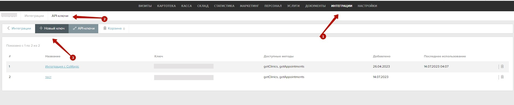

### Интеграция с Renovatio    

**Ценность**      

Решение позволяет передавать в наш кабинет данные по сделкам, для дальнейшего построения Сквозной аналитики.    

 **Какие данные передаются**       
- сделки: сумма сделки, клиника, к которой относится сделка, тип визита, услуги, врач и тд;  
- воронка продаж и ее этапы;  
- контакты;  
- ответственный менеджер.    

Сделки передаются раз в сутки. В качестве сделки выступает сущность визита.     
Все сделки передаем либо в одну воронку продаж “Сделки из  МИС Renovatio", либо создаем под каждую клинику отдельную воронку .     

**Необходимые компоненты для работы интеграции**      
- Сквозная аналитика.    

### Подключение интеграции    

Интеграция подключается в несколько шагов:    

1. Нажмите "Активен" на этой странице.    
2. Заполните поля в настройках:  
   
- **Использовать для загрузки воронку по умолчанию**  — прожимается в том случае, если клиенту не требуется создавать под каждую клинику отдельную воронку
- **Глубина загрузки данных**  — указывается кол-во дней, за сколько запрашиваем сделки раз в сутки. По умолчанию запрашиваем за 1 день.
- **API-ключ Renovatio**  — вносим токен сгенерированный в ЛК Renovatio в разделе 'Интеграции" →  "API-ключи".  
У ключа обязательно должны быть доступы к методам getClinics, getAppointments, либо ко всем (по умолчанию).    
 
   
 
   

3. Для ретроспективной загрузки сделок за нужный период активируйте **Передать исторические данные**, выберите даты и нажмите **Загрузить**.   
4. Нажмите сохранить    

После подключения интеграции сделки будут попадать в  Сырые данные -> Сделки.     
Сделки грузятся раз в сутки, поэтому корректность работы интеграции можно будет проверить на следующий день.    
