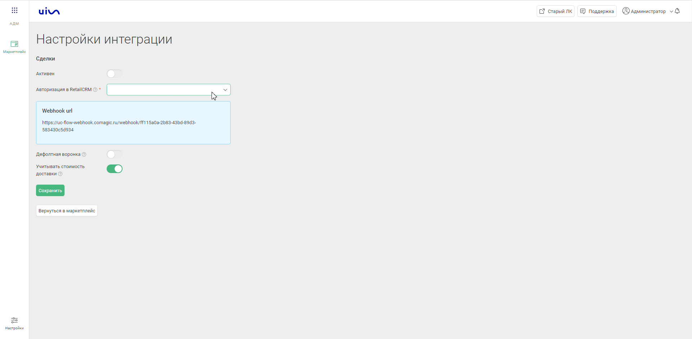

### Интеграция с RetailCRM  

**Ценность**  

Решение позволяет передавать в наш кабинет данные по сделкам, для дальнейшего построения Сквозной аналитики, а также интегрировать функционал телефонии и передавать данные по звонкам в RetailCRM.   

**Какие данные передаются**  

Данные получаемые по сделкам:     
- сделки: сумма сделки, статус, магазин, к которому относится сделка и тд; 
- воронка продаж и ее этапы;
- контакты;
- ответственный менеджер.    

Данные передаваемые по звонкам:   

- всплывающие уведомления о входящих звонках;
- звонок в один клик из RetailCRM;
- сохранение истории и записей звонков в RetailCRM.  

 
 
 
 

## Подключение передачи сделок    

 
 Шаги по подключению 
  

1. Укажите **Учетные данные**  

- нажать "Авторизация";
- если ранеее добавляли учетные данные RetailCRM, то выбрать их из списка;   
- если нет, то нажать "Добавить учетные данные" и заполнить значения:
  - название;  
  - URL (домен RetailCRM ) в формате https://shop472.retailcrm.ru/ , часть 'shop472' у каждого клиента уникальна; 
  - API key - ключ API RetailCRM, Настройки - > Интеграция → Ключи доступа к API -> Добавить   
  Создаем новый ключ, с доступом ко всем магазинам и методам. Добавляем данный ключ в настройки интеграции.   

   

      
После добавления учетных данных на странице появятся Параметры интеграции.   

2. Нажмите **Активен** на этой странице.  

3. **Настройте Триггер в RetailCRM**  

  
 Подробнее 
  

Автоматизация → Триггеры →  Добавить триггер  
Заполните настройки триггера:

- название ;
- добавляем событие 'Изменение заказа ': 
  - обязательно указываем в условиях:  "Новый заказ" или  "Изменение статуса заказа с Любой на Любой" или "Заказ оплачен "Да";
  - в действие добавляем "Выполнить HTTP-запрос"  , в нем заполняем настройки :
     - Адрес  - Webhook url из настроек интеграции;
     - HTTP метод - GET;
     - Передавать параметры - в строке запроса; 
        - Параметр: orderId 
        - Значение: {{ order.id }}  

 

 
 
4. Проставьте требуемые настройки:  
- **Дефолтная воронка** — при прожатии все сделки будут передаваться в 1 воронку по умолчанию. В противном случае по каждом магазину будет создана отдельная воронка.  
- **Учитывать стоимость доставки** — при прожатии в сумму сделки будет включена стоимость доставки.  

5. Нажмите сохранить.  

После подключения интеграции сделки будут попадать в  Сырые данные -> Сделки.   
Для проверки корректности работы интеграции создайте тестовую сделку в RetailCRM.

 

 
 
 
 
 
 
 

## Подключение телефонии    

 
 Шаги по подключению 
  
  
1. Укажите **Учетные данные**  

- нажать "Авторизация";
- если ранеее добавляли учетные данные RetailCRM, то выбрать их из списка;   
- если нет, то нажать "Добавить учетные данные" и заполнить значения:
  - название;  
  - URL (домен RetailCRM ) в формате YOURDOMAIN.retailcrm.ru , часть 'YOURDOMAIN' у каждого клиента уникальна;
  - API key - ключ API RetailCRM, Настройки - > Интеграция → Ключи доступа к API -> Добавить   
  Создаем новый ключ, с доступом ко всем магазинам и методам. Добавляем данный ключ в настройки интеграции.   

   

      
После добавления учетных данных на странице появятся Параметры интеграции.   

2. **Фильтровать по виртуальным номерам** - выберите настройку, если требуется  фильтрация по виртуальным номерам (в случае подключения нескольких сетей/интеграций).  
При прожатии будет выведена дополнительная настройка с выбором виртуальных номеров.  

**Список виртуальных номеров** - укажите виртуальные номера, по которым необходимо отображать данные по звонкам в Мегаплан в подключенной сети.  

3. **Создавать контакт при звонке** - настройка позволяет создавать контакт в разделе "Клиенты" при начале разговора.  

При её выборе выводится дополнительные настройки:   

- **Назначать ответственного на** - выберете кого назначать ответственным за успешный звонок от нового клиента (последний или первый разговаривавший).  
- **Ответственный по умолчанию** - если звонок потерян или поступил на сотрудника, который отсутствует в RetailCRM, то выбранный сотрудник будет назначен ответственным при автоматическом создании контакта. 

4. **Сотрудники** 
  
 

**Варианты сопоставления сотрудников** - выберете один из двух вариантов:   

- **Синхронизация** - настройка позволяет автоматически импортировать выбранных сотрудников из RetailCRM в UIS.  
Связь сотрудника в UIS с сотрудником из RetailCRM происходит по e-mail. При прожатии будут выведены дополнительные настройки:   
 - список сотрудников из RetailCRM. Необходимо выбрать тех сотрудников, которых требуется создать в UIS.
 - кнопка"Синхронизировать", для принудительной синхронизации сотрудников. По умолчанию синхронизация происходит каждые 2 часа.
 
  
- **Соответствие** - настройка позволяет вручную указать соответствие сотрудников из RetailCRM и UIS.   
  
 

5. **Прочие параметры интеграции**
  
 

- Нажмите **Интеграция активна** на этой странице, для ее активации.  
- Выберите настройку **Включить переадресацию на персонального менеджера**, если необходима переадресация на персонального менеджера из CRM.   
-  **Внешние номера магазинов** - укажите соответствие магазинов из RetailCRM и их внешних номеров (виртуальные номера).  

6. Нажмите сохранить.  

При подключении интеграции в нашем ЛК, автоматически подключается приложение в Маркетплейсе в RetailCRM. 
Для проверки работы интеграции на тестовых звонках проверьте работу пунктов указаных в **"Данные передаваемые по звонкам"**.  

 

