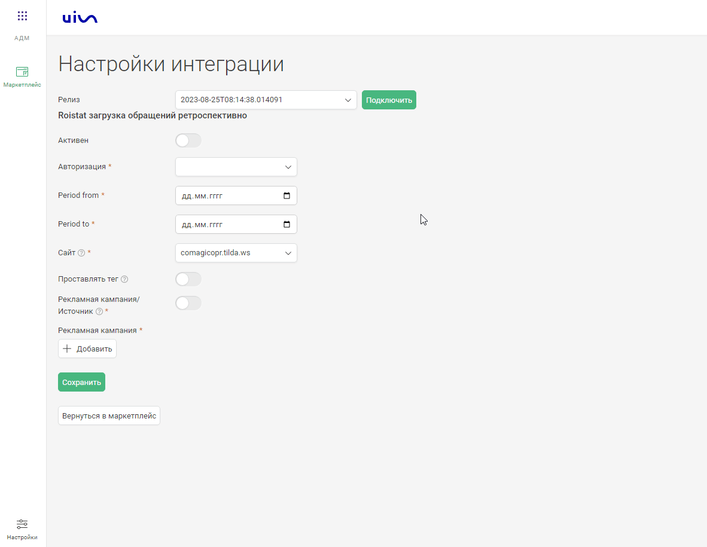

### Интеграция с Renovatio     

**Ценность**   

Решение позволяет подтягивать в наш кабинет данные по обращениям за выбранный период.   

**Какие данные передаются**    
- данные по обращениям(заявкам) с привязкой к рекламной кампании\источнику.     

**Необходимые компоненты для работы интеграции**    
- Загрузка оффлайн-заявок из внешней системы.     

### Подключение интеграции    
Интеграция подключается в несколько шагов:   

1. Нажмите "Активен" на этой странице.   
2. Заполните поля в настройках.    

- **Авторизация** — введите ключ API Roistat и ваш id проекта.    
- **Period from** — дата с которой начать выгрузку.  
- **Period to** — дата до которой выполнять выгрузку.  
- **Сайт** — сайт в который будут попадать заявки, в которых Roistat не определил сессию.  
- **Проставлять тег** — в случае если вы хотите тегировать обращения одним из ваших тегов.  
- **Рекламная кампания/Источник** — выберите в какую сущность хотите загружать обращения.
По умолчанию выбрана Рекламная компания (маркер не прожат), при прожатии выбирается Источник.
 - В зависимости от положения маркера выводится либо список РК из личного кабинета, либо список источников и сайтов. Необходимо сопоставить данные сущности с источниками Roistat.   

  

3. Нажмите сохранить.  

