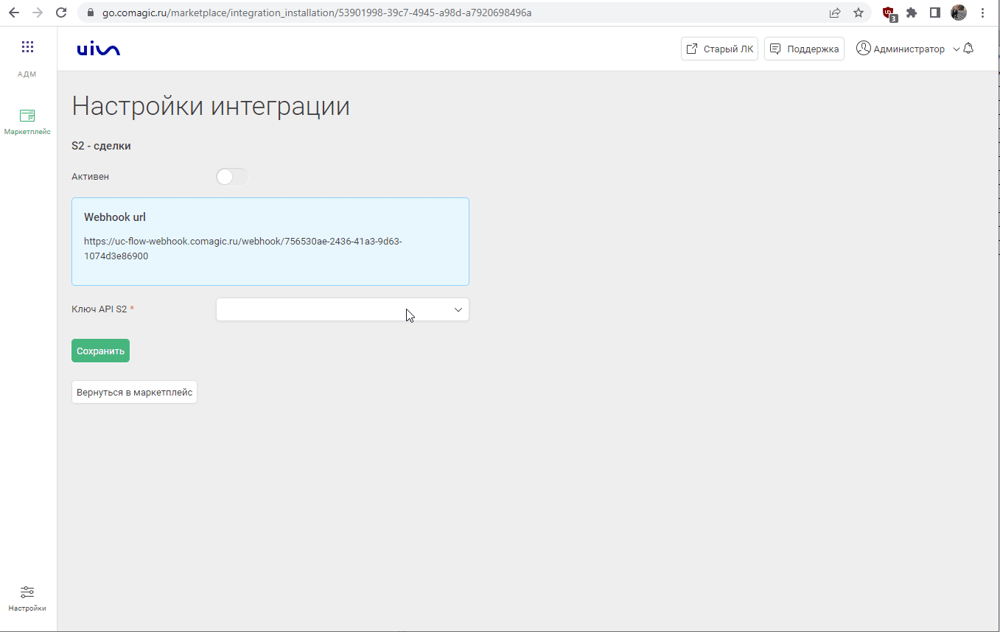
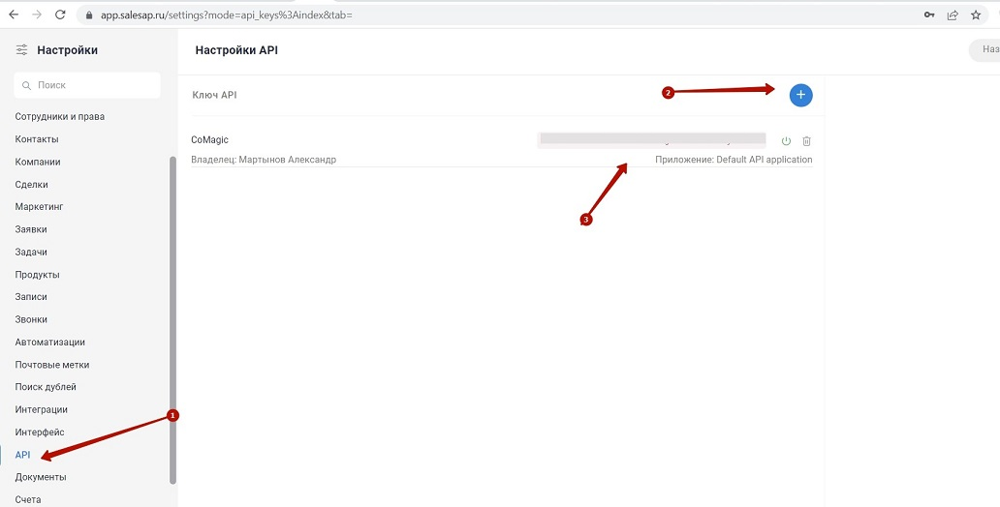
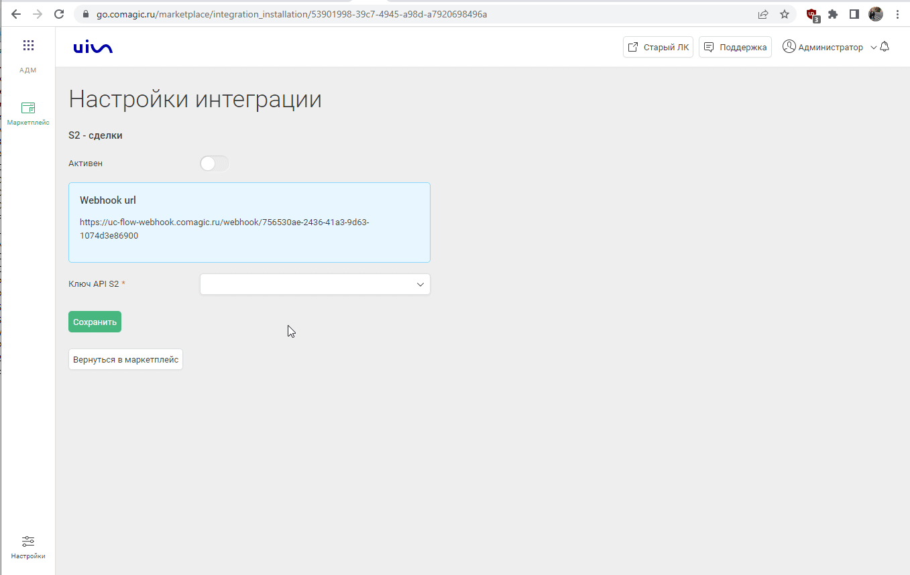

### Интеграция с S2

**Ценность**  

Решение позволяет передавать в наш кабинет данные по сделкам, для дальнейшего построения Сквозной аналитики.

**Какие данные передаются**

- сделки: сумма сделки, название, даты изменения и тд; 
- воронка продаж и ее этапы;
- контакты;
- ответственный менеджер.  

**Необходимые компоненты для работы интеграции**  
- Сквозная аналитика.

### Подключение интеграции 

Интеграция подключается в несколько шагов:

1. Нажмите "Активен" на этой странице.
2. Создайте сценарий в S2 на Webhook url сервиса CoMagic/UIS из настроек.  

**Как создать сценарий:** 

Настройки -> Автоматизации -> Сценарии 

a. Необходимо добавить 2 сценария на создание и изменение сделки.  
b. Указать любое название   
c. Добавить условие: 
- Для одного вебхука  - сделка была создана  
- Для другого - сделка была изменена   

d. Добавить действие “Вызвать вебхук”   
e. Выбрать метод POST, формат JSON и указать Webhook url сервиса CoMagic/UIS из настроек интеграции.  

 

3. Добавьте Ключ API, сгенерированный в S2.  

**Как сгенерировать ключ АПИ в S2 CRM и добавить токен в интеграцию :** 

a. Получаем ключ  АПИ в S2 : Настройки -> API 
  

b. Скопированный ключ вставляем в настройки интеграции в CoMagic/UIS 

4. Нажмите сохранить.

После подключения интеграции сделки будут попадать в  Сырые данные -> Сделки.  
Для проверки корректности работы интеграции создайте тестовую сделку в S2.

 

