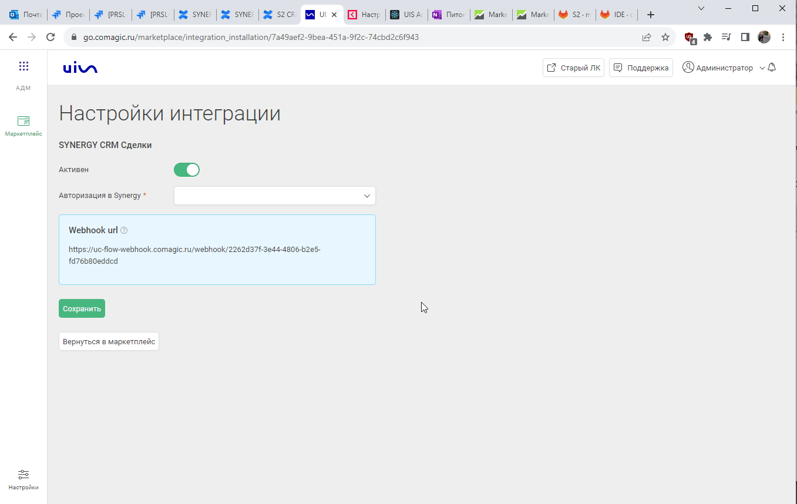

### Интеграция с SYNERGY CRM   

**Ценность**   

Решение позволяет передавать в наш кабинет данные по сделкам, для дальнейшего построения Сквозной аналитики.  

**Какие данные передаются**   

- сделки: сумма сделки, название, даты изменения и тд; 
- воронка продаж и ее этапы;
- контакты;
- ответственный менеджер.    

**Необходимые компоненты для работы интеграции**    
- Сквозная аналитика в нашем ЛК.   

### Подключение интеграции    

Интеграция подключается в несколько шагов:

1. Нажмите "Активен" на этой странице.
2. Выполните настройку интеграции.  

- Создайте сценарий в SYNERGY CRM   

  
 Подробнее 
  

   Настройки -> Автоматизации -> Сценарии  
   
   - Необходимо добавить 2 сценария на создание и изменение сделки.
   - Указать любое название.
   - Добавить условие: 
     - Для одного вебхука  - сделка была создана. 
     - Для другого - сделка была изменена.   
   
   - Добавить действие “Вызвать вебхук”.   
   - Выбрать метод POST, формат JSON и указать Webhook url сервиса CoMagic/UIS из настроек интеграции.  
   
    

 
 

- Добавьте Ключ API, сгенерированный в SYNERGY CRM .   

  
 Подробнее 
  
 
  - Получаем ключ  АПИ в SYNERGY CRM  : Настройки -> API 
          
    
  - Скопированный ключ вставляем в настройки интеграции в CoMagic/UIS 
    
    

 
 

3. Нажмите сохранить.   

После подключения интеграции сделки будут попадать в  Сырые данные -> Сделки.    
Для проверки корректности работы интеграции создайте тестовую сделку в SYNERGY CRM .

 

