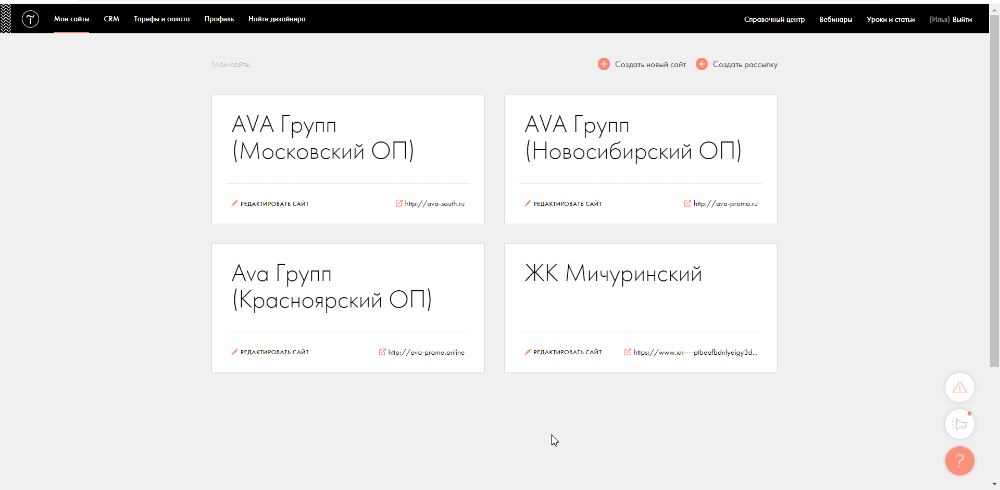

## Интеграция с Tilda  

Решение позволяет настроить передачу заявок с форм Tilda в наш сервис для дальнейшего анализа эффективности рекламы.  

 **Какие данные передаются**   
  
- контактные данные (имя,телефон,email);
- дату и время создания;
- данные сессии (рекламный источник, UTM-метки и тд);
- в случае отсутствия сессии, дефолтную РК или источник.   

Вы можете осуществить настройку под каждый сайт отдельно - для этого необходимо будет подключить интеграцию несколько раз.  

### Подключение интеграции   

1. Нажмите "Активен" на этой странице.  
2. **Название** — укажите название.   
3. **Настройте Webhook в Tilda для каждого сайта** 

 
 Подробнее 
  
   
   - Копируем сгенерированный URL из интерфейса настройки UIS, переходим в личный кабинет Tilda и добавляем вебхук на данный URL.
   - Выбираем нужный сайт, переходим в Настройки сайта-> Формы ->Webhooks
     -  Проставляем настройку "Посылать Cookies"
     -  Сохраняем настройки и применяем их ко всем формам. 
     -  После этого необходимо переопубликовать все страницы сайта.    

 

 
 
 

<Alert backgroundColor="#c3e8d7">
    
  **Важно**:  
  - Если вы добавили новую форму на сайт, уже после создания Webhook, необходимо зайти в настройки Webhook и применить его ко всем формам, после чего опять опубликовать.
  - Обратите внимание, в наш сервис передаются заявки с параметрами:  
     - name 
     - phone 
     - email  
     
  В настройках формы Tilda  поле имя переменной (variable name) уже заполнено с указанием верных параметров.
  Убедитесь, что  имя переменной (variable name) для каждой формы содержат параметры по умолчанию.
  
  

 
</Alert>   
 

 
 
 
 

4. **Сайт** — выберите сайт для загрузки обращений без сессии.  
 
5. **Тип трафика** — необходимо выбрать какую сущность использовать для обращений без сессии. По умолчанию выбран Источник.  
В зависимости от выбранного **типа трафика** выводится либо список источников из личного кабинета клиента, либо список рекламных кампаний. Необходимо указать какой **источник/рекламную кампанию** используем в случае отсутствия сессии.   

6. **Расширенные настройки**  

  
 При необходимости, выберите опции: 
  

- **Устанавливать теги** — при выборе будет показана дополнительная настройка с выбором тега(ов). Выбранный тег(и) будут проставляться на все обращения из Tilda.
- **Игнорировать сессию** — при выборе все обращения будут загружаться принудительно в выбранную клиентом дефолтную РК или источник (в зависимости от выбранных ниже значений)
- **Создавать сессию** - при выборе настройки будем создавать сессию по UTM меткам, если не определилась реальная сессия uis.

 
 

7. Нажмите сохранить.  

После подключения интеграции квизы будут попадать в наши отчеты с типом **"Заявки" (Сырые данные -> Обращения и цели)**.    
Для проверки корректности работы интеграции оставьте тестовое обращение в форме Tilda на сайте.  

