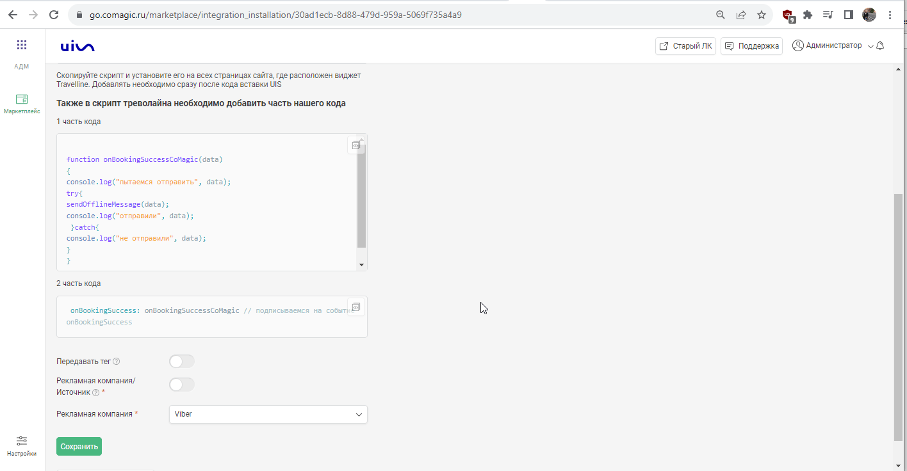
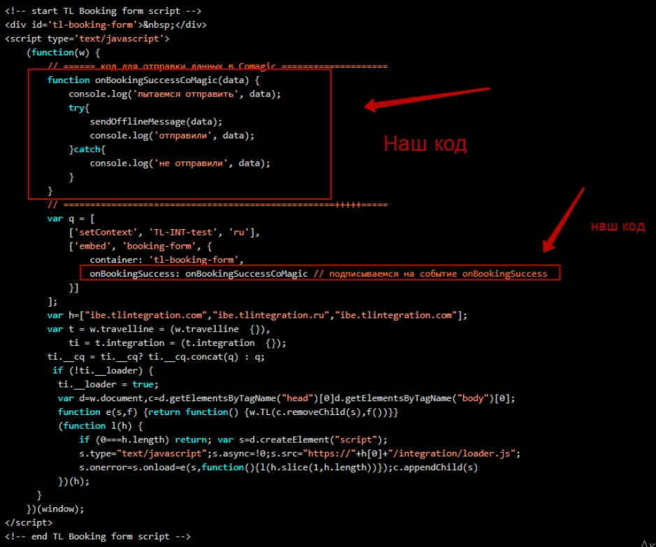

### Интеграция с Travelline

**Ценность**  

Решение позволяет настроить передачу заявок, оформленных через виджета онлайн-записи Travelline в CoMagic, для дальнейшего построения Сквозной аналитики.

 **Какие данные передаются**    
  
В заявку передаем:

- контактные данные (имя,телефон,email)
- дату и время создания
- данные сессии (рекламную компанию, источник, UTM-метки и тд)
- в случае отсутствия сессии, дефолтную РК или источник  

**Необходимые компоненты для работы интеграции**  
- Загрузка оффлайн-заявок из внешней системы.

### Подключение интеграции 

Интеграция подключается в несколько шагов:

1. Нажмите "Активен" на этой странице.
2. Заполните поля в настройках. 

- **Передавать тег** -при прожатии появится список тегов из ЛК. Необходимо выбрать из данного списка какой тег будет проставляться на обращения с форм бронирования Travelline.
- **Рекламная компания/источник** - необходимо выбрать какую сущность использовать для обращений без сессии.  
По умолчанию выбрана Рекламная компания (маркер не прожат), при прожатии маркера выбирается Источник.  
В зависимости от положения маркера выводится либо список РК из личного кабинета клиента, либо список источников и сайтов. Необходимо указать какую РК/источник и сайт используем в случае отсутствия сессии.

3. Нажмите сохранить.
4. После сохранения будет выведен скрипт, который необходимо установить на сайт в соответствие с описанием в настройках.

Пример, как в скрипт Travelline необходимо добавить наш.

