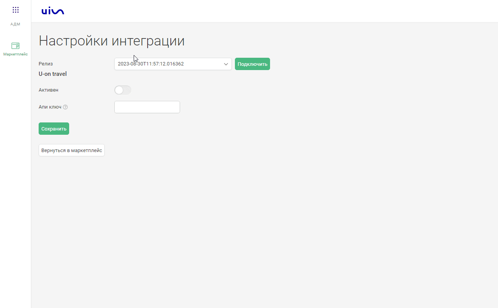

### Интеграция с U-on travel

**Ценность**  

Решение позволяет передавать в наш кабинет данные по сделкам, для дальнейшего построения Сквозной аналитики.

**Какие данные передаются**

- сделки: сумма сделки; 
- воронка продаж и ее этапы;
- контакты;
- Наименование туроператора и услуги.  

**Необходимые компоненты для работы интеграции**  
- Сквозная аналитика.

### Подключение интеграции 

Интеграция подключается в несколько шагов:

1. Нажмите "Активен" на этой странице.
2. Введите ваш ключ API полученный в U-on.  
3. Нажмите сохранить.
  
