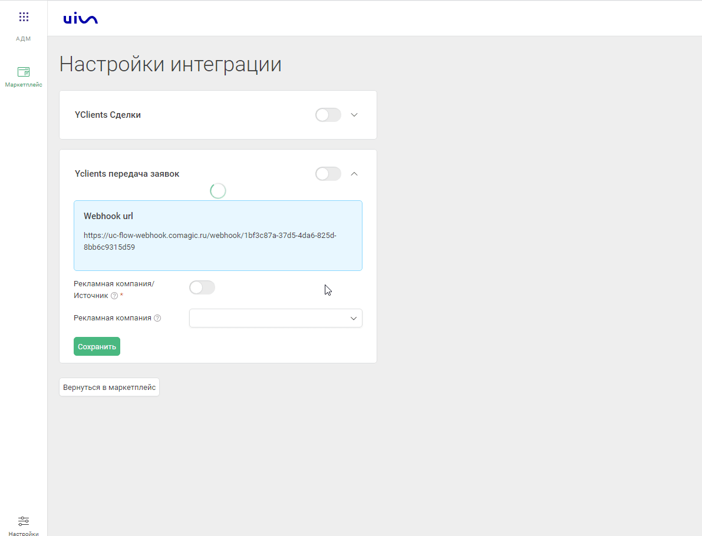
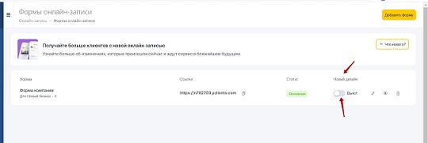
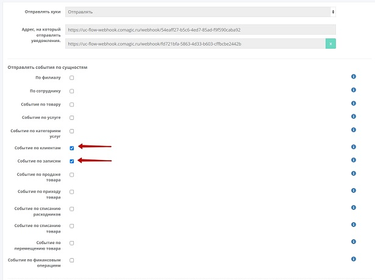

### Интеграция с Yclients  
**Ценность**   

Решение позволяет получать заявки оставленные клиентами в форме Онлайн-виджета и загружать в наш кабинет записи(сделки) из Yclients.   
 
 **Какие данные передаются**    

Данные получаемые по сделкам:  
- сделки: сумма сделки, название, даты изменения и тд; 
- воронка продаж и ее этапы;
- контакты;
- ответственный менеджер;
- дополнительные поля.  

Данные получаемые по заякам:  

- контактные данные (имя,телефон,email)  
- дату и время создания  
- данные сессии (рекламную компанию, источник, UTM-метки и тд)  
- в случае отсутствия сессии, дефолтную РК или источник    
  
  ### Подключение интеграции с Онлайн-виджетом. 

**Необходимые компоненты для работы интеграции**  
- Загрузка оффлайн-заявок из внешней системы. 
  
Интеграция подключается в несколько шагов:   
1. Заходим в интеграцию с Yclients и спускаемся до раздела "Yclients передача заявок"  
2. Активируем интеграцию .  
3. Выбираем рекламную кампанию или источник для загрузки обращений без сессии.  
4. Находим скрипт для установки .  Скрипт появится после прожатия кнопки **"Сохранить"**.   
   
 Данный скрипт устанавливаем на всех страницах сайта, где расположен виджет Yclients, а так же требуется добавить наш скрипт и стандартный код вставки в саму форму в YClients (инъекция скрипта).  
**Важно**: Инъекция скрипта доступна для всех клиентов в старом дизайне. В новом дизайне Yclients  добавляет данную функцию по запросу.  
    
5. Если клиент на сайт добавляет не виджет Yclients (кнопку), а отдельную ссылку на лендинг, то в этой ссылке необходимо добавить  class="yclick"

Пример:

a class="yclick" href="https://n822081.yclients.com/" target="_blank">Открыть новую вкладку</a    

6. Находим адрес для отправки хука (цифра 3 на рис 1).  
Отправка хука настраивается в Yclients через создание собственного приложения, инструкция по созданию находится [по ссылке](https://support.yclients.com/67-68-202?_ga=2.235690817.1118622726.1689663799-975683808.1687778856) .  
В настройке хука в разделе **"Отправлять события по сущностям"** выбираем **"Событие по записям", "Событие по клиентам"**.  
  
 
  
  ### Подключение загрузки сделок  

**Необходимые компоненты для работы интеграции**  
- Сквозная аналитика.

Интеграция подключается в несколько шагов:   
  
1. Заходим в настройки интеграции.  
2. Прожимаем переключатель включения интеграции  
3. В поле "Credential" нажимаем "Add Credential".  
 
4. В открывшемся окне вводим название, логин от кабинета Yclients (username), пароль от кабинета Yclients(password).  
5. Нажимаем клавишу сохранить. 
    
6. Адрес вебхука полученного на рис. 1 необходимо внести в Yclients.  
Отправка хука настраивается в Yclients через создание собственного приложения, инструкция по созданию находится [по ссылке](https://support.yclients.com/67-68-202?_ga=2.235690817.1118622726.1689663799-975683808.1687778856).  
В настройке хука(рис.3) в разделе " Отправлять события по сущностям" выбираем "Событие по записям", "Событие по клиентам".  
**Важно**: если у клиента несколько филиалов, для каждого необходимо Webhook настраивать отдельно, так как настройки для каждого филиала располагаются отдельно друг от друга.  
  
рис. 3  
  
  После подключения интеграции сделки будут попадать в  Сырые данные -> Сделки.  
Для проверки корректности работы интеграции создайте тестовую сделку в Yclients.

