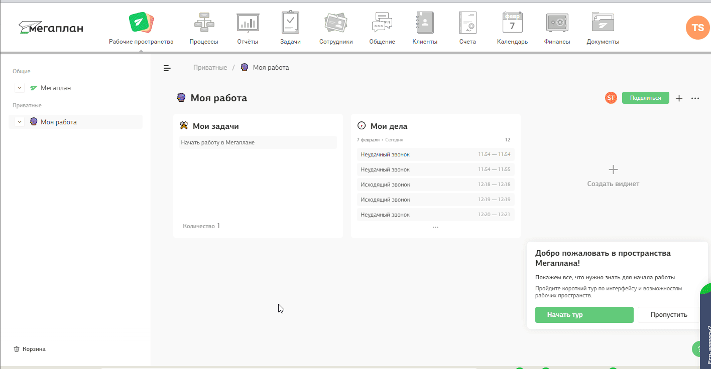

## Интеграция с Мегаплан    

Решение позволяет интегрировать функционал телефонии и передавать данные по звонкам  из нашего ЛК в Мегаплан.    

**После настройки вам будет доступно**  

- всплывающие уведомления о входящих и исходящих звонках;
- звонок в один клик из Мегаплан;
- синхронизация с режимом “не беспокоить” веб-телефона Мегаплан;
- возможность завершить звонок из веб-телефона Мегаплан по кнопке "Завершить";
- сохранение истории и записей звонков в Мегаплан;
- возможность создавать коммуникации по выбранным типам звонков;
- переадресация на ответственного из CRM, при настройки соответственного сценария в ЛК  

 
 

## Подключение интеграции   

1. Укажите **Учетные данные**   

Для авторизации в мегаплан необходимо:    

- нажать "Авторизация в Мегаплан";
- если ранеее добавляли учетные данные Мегаплан, то выбрать их из списка;   
- если нет, то нажать "Добавить учетные данные" и заполнить значения:
  - название;
  - логин(username) и пароль(password) от Мегаплан;
  - домен Мегаплан в формате https://mp361546.megaplan.ru , часть 'mp361546' будет у каждого клиента уникальной.   
    
После добавления учетных данных на странице появятся Параметры интеграции.   

2. Нажмите **Активен** на этой странице.  
3. **Создавать коммуникацию по звонку** - настройка позволяет создавать коммуникации в разделе "Клиенты" - "Коммуникации" с типом "Звонок" после завершения звонка.  
При её выборе выводятся дополнительные настройки передачи коммуникаций:  
  - **Создание коммуникации по типам звонков** - добавьте необходимые типы звонков, по которым необходимо создавать коммуникацию в требуемом статусе.  
  - **Длительность коммуникации** - укажите время в минутах, которое необходимо добавлять к времени начала коммуникации, при формировании времени окончания. По умолчанию указано 120 минут (2 часа).  
  
4. В **Мегаплан** заполните настройку телефонии:    
 -  Под пользователем, который входит в группу «Директора» или «Админы», зайти в личный кабинет Мегаплан.
 -  В аккаунте выбрать раздел «Расширения».
 -  Найти приложение «Телефония Новофон» в категории «Телефония» и установить его.
 -  Теперь необходимо указать для каждого пользователя Megaplan внутренний номер виртуальной АТС Novofon. 
    - Для этого открываем интерфейс CRM-системы, переходим в раздел “Настройки”, открываем вкладку “Интеграция”, в меню слева выбираем пункт “Телефония”. 
    - Обращаем внимание на блок “Подключение к телефонии по API” и там нажимаем “Настройки телефонии”. 
    - Переходим на вкладку на “Пользователи”.
    - Добавьте всех пользователей, использующих телефонию. Для каждого из них укажите внутренние номера АТС из раздела "Сотрудники".   
    
    **Важно:** если сотрудник не будет указан в данном разделе, то функционал поднятия карточки звонка и передача информации по нему не будет доступен. 
    - Нажимаем сохранить.   
     
5. Нажмите кнопку "Синхронизировать настройки телефонии из Мегаплан".    
6. Нажмите сохранить    
