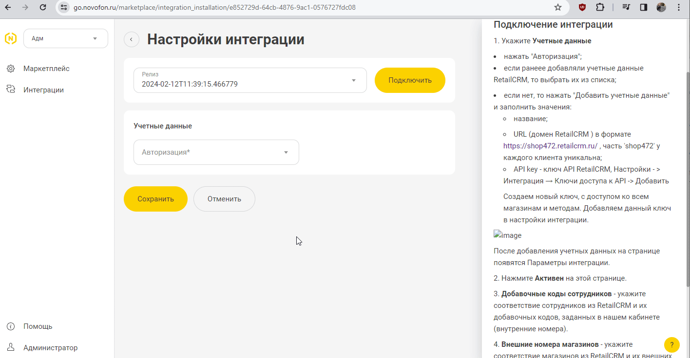

## Интеграция с RetailCRM  

Решение позволяет интегрировать функционал телефонии и передавать данные по звонкам  из нашего ЛК в RetailCRM.    

**После настройки вам будет доступно**  
- всплывающие уведомления о входящих звонках;
- звонок в один клик из RetailCRM;
- сохранение истории и записей звонков в RetailCRM.  

## Подключение интеграции   

1. Укажите **Учетные данные**  

- нажать "Авторизация";
- если ранеее добавляли учетные данные RetailCRM, то выбрать их из списка;   
- если нет, то нажать "Добавить учетные данные" и заполнить значения:
  - название;  
  - URL (домен RetailCRM ) в формате https://shop472.retailcrm.ru/ , часть 'shop472' у каждого клиента уникальна; 
  - API key - ключ API RetailCRM, Настройки - > Интеграция → Ключи доступа к API -> Добавить   
  Создаем новый ключ, с доступом ко всем магазинам и методам. Добавляем данный ключ в настройки интеграции.   

   

      
После добавления учетных данных на странице появятся Параметры интеграции.   

2. Нажмите **Активен** на этой странице.  
3. **Добавочные коды сотрудников** - укажите соответствие сотрудников из RetailCRM и их добавочных кодов, заданных в нашем кабинете (внутренние номера).   
4. **Внешние номера магазинов** - укажите соответствие магазинов из RetailCRM и их внешних номеров (виртуальные номера).  
5. Нажмите сохранить.  

При подключении интеграции в нашем ЛК, автоматически подключается приложение в Маркетплейсе в RetailCRM. 
Для проверки работы интеграции на тестовых звонках проверьте работу пунктов указаных в **После настройки вам будет доступно**.  
