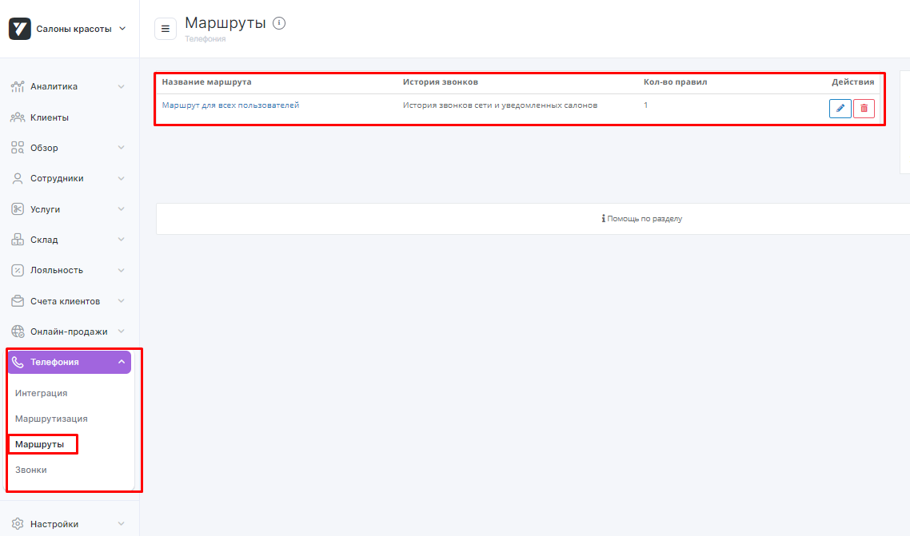

## Интеграция с Yclients   

Решение позволяет передавать данные по звонкам из нашего ЛК в Yclients.    
 
**После настройки вам будет доступно**  

- всплывающее уведомление о поступлении входящего звонка и отображение информации о вызовах;
- интеграция статистики и возможность прослушивания записей звонков;
- возможность звонить в один клик из карточки клиента с помощью расширения для браузера Chrome.  

 
 

## Подключение интеграции   

1.Укажите **Учетные данные**   

Для авторизации в Yclients необходимо:    

- если ранее не добавляли учетные данные Yclients, то выберете пункт "Подключить новые учетные данные" и заполните значение:    
  
  - название;
  - **User token** из Yclients в поле **Yclients CRM Token**.  
User token можно получить в **Телефония -> Интеграция**, поле **Токен**.

  
  
  
- если добавляли - выберете пункт "Использовать учетные данные, подключенные ранее" и укажите нужные из выпадающего списка.   

2. Нажмите **Активен** в параметрах интеграции.  
3. **Сеть** - укажите название сети, с которой подключаете интеграцию. С каждой сетью интеграция подключается отдельно, так как User token в Yclients формируется под каждую сеть.  
4. **Список виртуальных номеров** - укажите виртуальные номера, по которым необходимо отображать данные по звонкам в Yclients в указанной сети.  
5. **Способ маршрутизации** - выберите, какая сущность будет использоваться для маршрутизации, SIP или внутренний номер.    
6. Нажмите **сохранить**.  
7. В кабинете Yclients, после проведенных настроек, появятся дополнительные разделы в блоке Сеть –> Телефония:    
Маршрутизация, Маршруты и Звонки (1), а статус интеграции изменится на Интеграция подключена (2)

 

8. В Yclients перейдите в раздел **Маршруты** и выстроите маршрут, по которому будет идти звонок.  
Маршрут по умолчанию всего один – Маршрут для всех пользователей.  
Настройка маршрута по умолчанию – сохранять историю звонков по маршруту в Истории сети. 

   

Кликните, чтобы открыть настройки.  

  

При такой настройке всплывающие уведомления о звонках работать не будут, а звонки будут видны только в истории звонков сети.   
**Измените настройку** на ту, которая вам подходит:  
  - история звонков сети и всех салонов – всплывающее окно о звонке будет появляться во всех филиалах сети, звонок будет виден во всех филиалах в разделе Обзор – Звонки. 
  - история звонков сети и уведомленных салонов – всплывающее окно о звонке будет появляться в том филиале/филиалах, которые будут выбраны в этом маршруте.  
  
9. После настройки маршрута свяжите его с номером телефона/идентификатором абонента телефонии, sip или внутренний номер сотрудника, на который поступают звонки.  
Для этого перейдите в раздел **Маршрутизация**.
   
Укажите номер телефона своей компании без плюса, скобок, дефисов, пробелов и других символов и сохраните.  
**Настройка в  Yclients завершена.**  
 

Для проверки работы интеграции на тестовых звонках проверьте работы пунктов указаных в **После настройки вам будет доступно**.  
Если после всех настроек звонки в Yclients не появляются, проверьте, совпадают ли номера телефонов в маршрутизации Yclients и нашем Личном кабинете.
