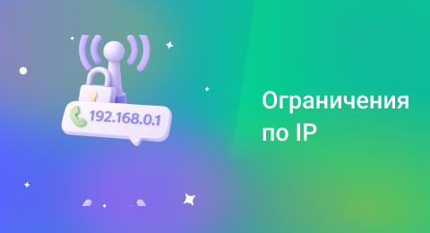

## Ограничения по IP

 
 

 
 

В этом разделе можно ограничить доступ к сервису по IP-адресам, для того, чтобы: 

- Защитить API от несанкционированного доступа
- Ограничить вход в личный кабинет только с рабочих сетей
- Предотвратить звонки с неизвестных или скомпрометированных IP

 

Разрешенные списки настраиваются для каждой вкладки отдельно («Доступ к API», «Доступ к личному кабинету», «Ограничение исходящих звонков по IP»). Во всех вкладках логика работы одинаковая. 

 

Вкладки не зависят друг от друга – в одной вкладке могут быть настроены ограничения, а в другой доступ может оставаться полностью открытым.”

 
 

### Как работает ограничение

 

По умолчанию в списке всегда присутствует **0.0.0.0/0**, что означает, что доступ разрешён для всех устройств. Чтобы разрешить доступ **только определённым IP-адресам**, отредактируйте или удалите правило **0.0.0.0/0** и добавьте нужные IP-адреса. 

 

В этом случае доступ будет разрешён только тем адресам, которые явно указаны в списке. Любой IP, не попавший ни под одно правило, будет заблокирован. При попытке входа в кабинет пользователь увидит сообщение о том, что доступ запрещен.

 
 

### Какие правила можно добавить

 

Можно добавлять разрешения двух типов. Они хранятся в одном списке и работают одновременно.

 

**1. IP-адрес или подсеть**. Подходит, если известны конкретные IP-адреса, которые нужно разрешить. Можно указать один IP или подсеть в формате CIDR (например, 192.168.1.0/24).

 
 

<Alert type="info">Будьте внимательны. Использование VPN изменяет IP-адрес.</Alert>

 
 

**2. IP по географии**. Подходит, если нужно разрешить доступ из определённого места. Выберите страну, регион, город. Будет разрешён доступ пользователям из выбранного места. 

 
 

<Alert type="info">В поле комментарии удобно пояснить, кто использует этот список IP-адресов, например, «Московский офис».</Alert>

 
 

Если в список добавить **0.0.0.0/0**, доступ снова станет открыт для всех.

 
 
 
 
 
 
