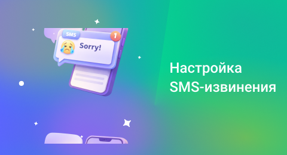

## SMS-извинения

 
 

 
 

**SMS-извинение** позволяет автоматически отправлять клиенту извинительное сообщение после пропущенного звонка. Это поможет сохранить клиента, даже если не всегда удается ответить на звонок.

 
 

<Alert type="info">Визитки отправляются только в период с 9:00 до 20:00 по московскому времени (GMT+3). Отправка происходит после пропущенного звонка на номер звонящему.</Alert>

 
 

### Создание SMS-извинения

 

1. Нажмите «Добавить SMS-извинение» и задайте её название.
2. Выберите номер или несколько номеров. В случае пропущенного звонка на этот номер/номера звонящему будет отправлено SMS‑извинение. Рекомендуем вам избегать дубликатов номеров в разных извинениях.
3. Введите текст SMS. В одном сообщении помещается до 70 символов на русском и до 140 на английском; при превышении лимита сообщение будет разбито на несколько частей (до 404 символов суммарно).

 
 

<Alert type="info">При отправке SMS на экране клиента отобразится стандартно имя отправителя — UIS. Изменить его невозможно из-за юридических требований. Название компании можно указать в тексте сообщения.</Alert>

 
 

### Отражение в отчётах

 

В отчёте «Звонки» отображается столбец «SMS». Если визитка была отправлена, в нём будет указано название шаблона. Прочерк означает, что сообщение не отправлялось.

 
 
 
 
