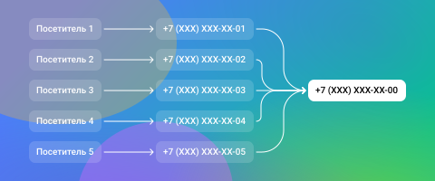
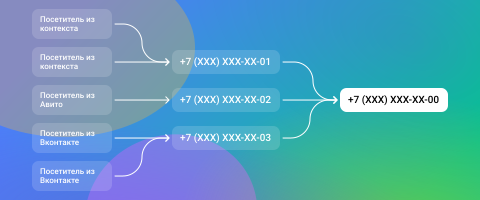

## Настройка правил коллтрекина - Шаг 1

 
 

 
 

Правила определяют механизм подмены номеров на сайте: количество номеров коллтрекинга, условия их показа и переадресация звонков на эти номера.

 
 

В названии правила удобно указать сайт, площадку или сегмент посетителей, на который оно настроено.

 
 

### Динамический коллтрекинг

 

Связывает звонки с сессиями конкретных пользователей, получая максимум информации о звонящих.

 
 

 
 

Каждый посетитель видит номер телефона, который в этот момент демонстрируется только ему.

 
 

<Alert>Рекомендуем настроить динамический коллтрекинг, который будет отслеживать всех посетителей</Alert>

 
 

Если необходимо отслеживать только определенные каналы и источники, выберите их из списка. Также вы можете создать свой собственный рекламный источник или использовать ручную настройку для тонкой сегментации трафика.

 
 

### Статический коллтрекинг

 

Отслеживает факт звонка из выбранных источников, не связывая его с конкретными сессиями.

 
 

 
 

Выберите «Статический коллтрекинг» → «Подмена номера на сайте» для отслеживания звонков с сайта. Номера будут подменяться для посетителей из источников, которые будут выбраны на следующем шаге.

 
 

<Alert>Посетители из источника А увидят номер телефона 1. Все звонки на номер 1 будут связаны с источником А.</Alert>

 
 

Выберите «Звонки со сторонних площадок» для отслеживания звонков с групп в соцсетях, маркетплейсов, уличных баннеров и т.п.

 
 

<Alert>На площадке Б размещен номер 2. Все звонки на номер 2 будут связаны с этой площадкой.</Alert>

 
 
 
 
 

<button b_to="/call-tracking//rules/step21.md" b_type="fill" b_theme="primary">Далее</button>