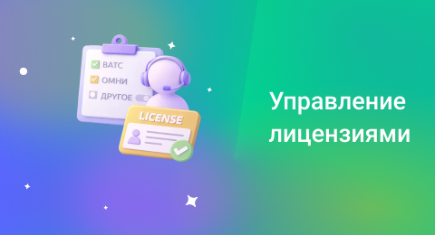

## Управление лицензиями

 
 

 
 

Лицензия дает конкретному сотруднику возможность работать с определенными функциями сервиса: 

- **Лицензия ВАТС** открывает доступ к работе с телефонией
- **Лицензия ОМНИ** нужна для работы с чатами

 

Для работы с телефонией у вас должен быть подключен тариф ВАТС или опция Виртуальная АТС, или ВАТС Pro. В их настройках есть лимит «Сотрудников ВАТС» – он и отвечает за количество доступных лицензий. 

 

По аналогии, для работы с чатами должен быть подключен тариф или опция ОМНИ. В ее настройке есть лимит «Сотрудников ОМНИ». 

 

Можно свободно передавать доступные лицензии от одного сотрудника к другому. С помощью плашек рядом с поиском, можно отфильтровать всех сотрудников по одной лицензии или ли сразу по нескольким (в списке останутся сотрудники, у которых есть все выбранные лицензии).

 

Внизу страницы указано, сколько лицензий используется в данный момент. Вы можете выдать больше лицензий, чем доступно. В этом случае будет предложено расширить лимит и докупить недостающие лицензии. 

 
 

<Alert type="info">Важно: если забрать у сотрудника лицензию, она становится свободной, но за нее продолжает начисляться оплата. Для того, чтобы отключить лицензию, перейдите в раздел «Тарифы и опции» и уменьшите соответствующий лимит.</Alert>

 
 
 
 
 
 
