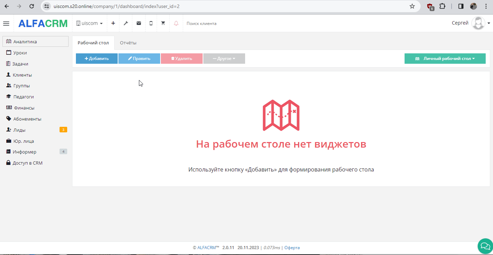
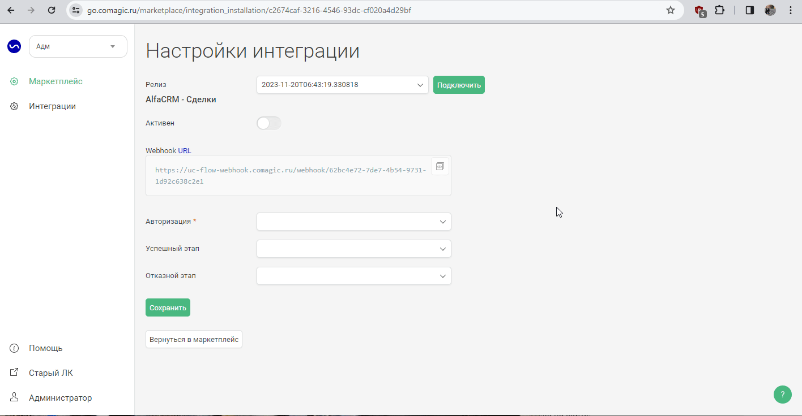

## Интеграция с AlfaCRM  

Решение позволяет передавать в наш кабинет данные по лидам/платежам в качестве сделок, для дальнейшего построения Сквозной аналитики.  

**Какие данные передаются**    
Данные передаваемые по текстовым коммуникациям:   

- возможность гибкой настройки создания лидов по обращениям;
- создание задач по пропущенным чатам;
- передача дополнительных полей в лид;
- встройка нашего виджета РМО в кабинет AlfaCRM при подключении соответствующего расширения.  

Данные получаемые по сделкам:    
- сделки: лиды, статусы , платежи и тд ;
- 2 воронки: "Первая продажа" (лиды) и "Допродажи" (платежи после перехода лида в клиента);
- контакты;
- дополнительные поля: учитель, филиал.   

## Подключение передачи сделок      

 
 Шаги по подключению 
  

1. Нажмите "Активен" на этой странице.  
2. Настройте **Webhook** в AlfaCRM  

  
 Подробнее 
  

ЛК AlfaCRM -> Настройки -> Автодействия и рассылки -> Триггеры и вебхуки (настраивается по каждому филиалу отдельно)   

- Необходимо добавить 2 триггера по Клиенту и Платежу (Целевая сущность).
  - Выбираете все события.
  - Затронутые поля - любые.
  - Реакция - Webhook.
  - Webhook URL - берете из настроек интеграции.
  - Нажмите "Сохранить".

 

   

3. **Авторизация** в AlfaCRM  

  
 Подробнее 
  

- **Название**  — укажите название авторизации.
- **hostname**  —  YOURDOMAIN замените на домен, от своего кабинета в AlfaCRM.
- **api_key**  — укажите Ключ API (v2api), из личного кабинета AlfaCRM. (Профиль -> Ключ API (v2api) , от админского ЛК)
- **email**   — укажите email, из личного кабинета AlfaCRM. (Профиль -> E-mail , от админского ЛК)

 
  

4. Заполните настройки воронки продаж "Первая продажа": 

- **Успешный этап**  — выберете этап(ы) воронки , которые считаются завершающими успешными в AlfaCRM (в нашем сервисе они будут объединены в один этап).
- **Отказной этап**  — выберете этап(ы) воронки , которые считаются завершающими неуспешными(отказными) в AlfaCRM (в нашем сервисе они будут объединены в один этап).
 

5. Нажмите сохранить.  

После подключения интеграции сделки будут попадать в  Сырые данные -> Сделки.   
Для проверки корректности работы интеграции создайте тестовый лид в AlfaCRM.   

 
 
 
 
 
 
 
 

## Подключение текстовых коммуникаций      

 
 Шаги по подключению 
    
  
1. Укажите **Учетные данные**   
Добавьте название авторизации, адрес вашего портала, API ключ и email учетной записи.       
2. Укажите необходимый для работы филиал.   
3. **Передача заявок**   
3.1. **Передавать заявки** - выберите настройку, если требуется передавать данные по заявкам в AlfaCRM.
При её выборе выводятся дополнительные настройки вариантов передачи заявок.  
3.2. **Условия фильтрации** - задайте условия, если требуется фильтровать заявки по сайтам и/или типам. 
3.3. **Создавать лид по обращению** - настройка позволяет создавать лид по заявкам.  
3.4. **Передавать дополнительные поля** - настройка позволяет передавать дополнительные поля в лид.  
При её выборе выводятся дополнительные настройки выбора сущности в AlfaCRM и соответствия их полей в AlfaCRM и UIS.
Добавьте все требуемые значения. Если требуется передавать значение в поля не только при первичных чатах (при создании клиента), но и при повторных, выберите настройку "Обновлять всегда".   

4. **Передача чатов**   
4.1. **Передавать чаты** - выберите настройку, если требуется передавать данные по чатам в AlfaCRM.
При её выборе выводятся дополнительные настройки вариантов передачи чатов.   
4.2. **Условия фильтрации** - задайте условия, если требуется фильтровать чаты по сайтам, каналам и/или тегам.   
4.3.**Создавать лид** - настройка позволяет создавать лид по чатам.  
При её выборе выводятся дополнительные настройки:
- Выберите на какое событие создавать лид: начало чата, завершение чата, простановка тега.
- При выборе простановки тега дополнительно выводится список тегов.  
4.4. **Создавать задачу по потерянному чату** -  настройка создания задач по потерянным чатам:
- измените шаблон названия, при необходимости (через "+" можно добавить требуемые параметры) 
4.5. **Передавать чаты от посетителей без контактных данных** -  настройка позволяет создавать лид по чатам, в которых отсутствует номер телефона. При каждом новом чате с посетителем без контактных данных будет создаваться новый лид, что может привести к дублям в AlfaCRM.   
   **Важно!** Текст переписки чата будет передан только при завершении чата.  
4.6. **Передавать дополнительные поля** - настройка позволяет передавать дополнительные поля в контрагента.  
При её выборе выводятся дополнительные настройки выбора сущности в AlfaCRM и соответствия их полей в AlfaCRM и UIS.
Добавьте все требуемые значения. Если требуется передавать значение в поля не только при первичных чатах (при создании клиента), но и при повторных, выберите настройку "Обновлять всегда".   
