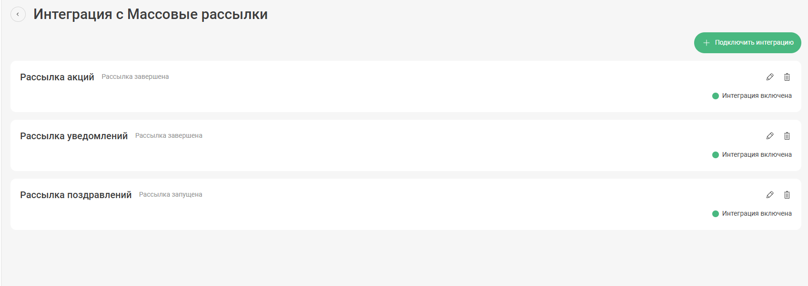
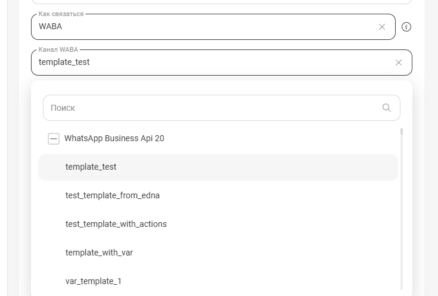
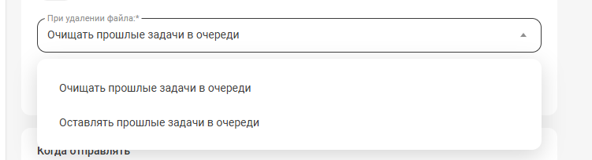
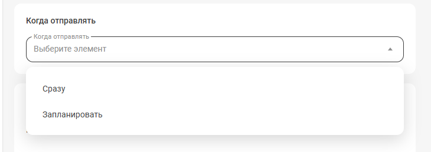
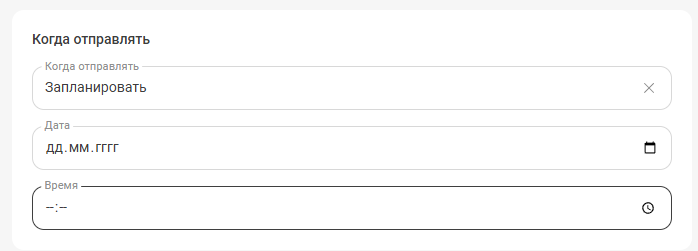

## Массовые рассылки  

Решение позволяет осуществлять массовую расслыку сообщений клиентам через канал WABA или SMS.  

## Настройка интеграции     
1. **Название рассылки** - введите название рассылки для отображения в отчетах и на странице подключения интеграции.    

2. **Как связаться** - выберите через какой канал связи будет осуществляться рассылка.  

  
 Возможные настройки 
  

2.1 **Каналы WABA:**  

- При выборе WABA появится дополнительное поле **Канал WABA**, в нём выберите нужный вам канал WABA и шаблон, который будет использоваться в расслке.  

2.2 **Каналы SMS:**  

- При выборе SMS появится дополнительное поле **Канал SMS**, в нём выберите нужный вам канал SMS.  

- Так же появится поле **Текст рассылки**, в нём необходимо указать текст, который будет отправлен в рассылке. В данном поле есть возможность добавлять переменные.  
**Важно!** Для канала SMS существуют ограничения на кол-во отправленных символов в сообщении. До 70 символов (кириллица) или 160 (латиница). Если текст длиннее — отправится несколькими сообщениями (максимум: 335 символов кириллицы или 765 латиницы). Счётчик символов под полем ввода шаблона не учитывает значения в переменных — итоговая длина SMS может отличаться.  

 

 

3. **Скачать шаблон файла для рассылки** - при нажатии на надпись произойдёт скачивание шаблона файла рассылки на ваш компьютер.  

4. **Поле для загрузки файла** - перетащите сюда ваш файл рассылки. Файл должен быть в формате CSV размером менее 10мб. В файле необходимо заполнить номера телефонов(решение считывает любой формат номера РФ) и, при необходимости, переменные. Необходимый разделитель - точка с запятой.  

5. **Игнорировать дубли** - настройка позволяет исключить повторы номеров добавленных в файл.  

6. **Дополнить список рассылки** - при включении данного переключателя откроется дополнительное поле для загрузки файла. Данная настройка необходима если у ваша база клиентов разбита на два файла.  

7. **При удалении файла** - данная настройка поволяет указать что делать с оставшимися записями для рассылки при удалении файла в пунтках 5 и 6.   

8. **Количество сообщений в минуту** - задайте максимальное кол-во сообщений для обработки в минуту. Максимум 300 сообщений в минуту. 

9. **Когда отправлять** - выберите время начала рассылки. Доступна отправка сразу, либо в выбранное вами время.  

10. **Управление рассылкой** - набор контролов для управленипя рассылкой.  
 - **Остановить рассылку** - позволяет поставить запущенную рассылку на паузу. Доступен только при активной рассылке.  
 - **Запустить рассылку** - позволяет снять с паузы остановленную рассылку. Доступен при остановленной рассылке.  
 - **Очистить рассылку** - позволяет удалить загруженные контакты, полностью очищая очередить. Доступна при остановленной и запущенной рассылке.  
 - **Перезапустить рассылку** - позволяет отправить рассылку заново по всем файлам загруженным в пункте 5 и 6. Доступна при завершенной рассылке.    
11. **Отчет** - нажмите на надпись, чтобы скачать отчет по рассылке.

**Важно!** В РМО чаты с сообщениями из рассылки отобразятся только после получения ответа от клиента на сообщение из рассылки.  

 
