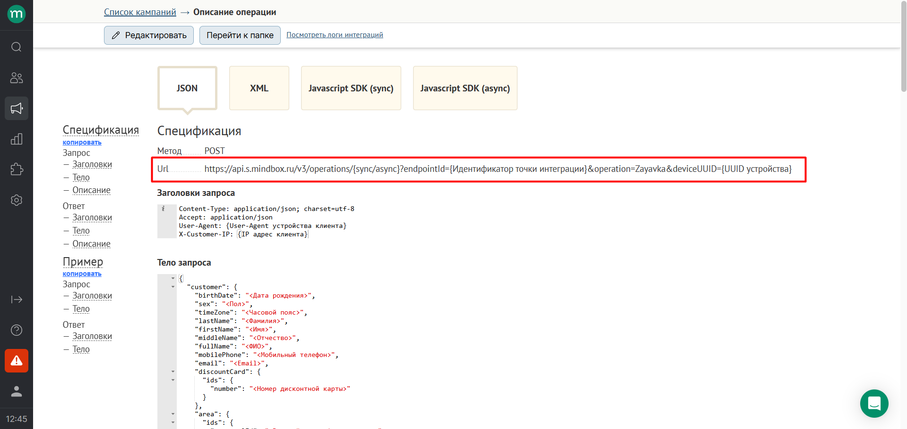
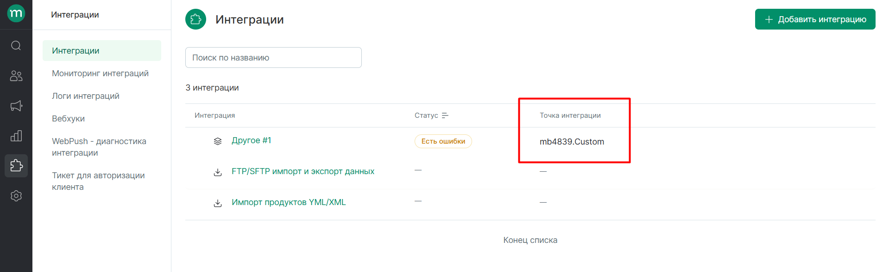
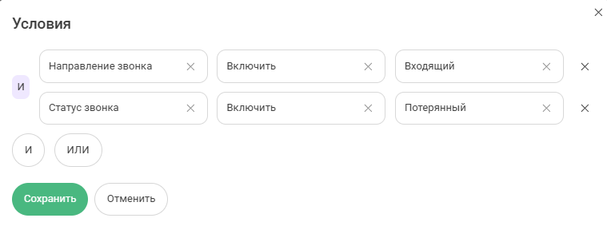

## Интеграция с Mindbox 
<br />

Интеграция автоматически, в режиме реального времени передает данные клиентов из UIS в Mindbox при звонке или создании заявки. В Mindbox эти данные можно использовать для:
- Email-рассылок
- Сегментации клиентов
- Других маркетинговых задач
<br />
<br />
<br />


## Настройка в Mindbox <br /> 
Создайте операцию в Mindbox. **[Инструкция по созданию операции](https://help.mindbox.ru/docs/%D0%BE%D0%BF%D0%B5%D1%80%D0%B0%D1%86%D0%B8%D0%B8-v-%D0%BE%D1%81%D0%BD%D0%BE%D0%B2%D0%BD%D1%8B%D0%B5-%D1%81%D0%B2%D0%B5%D0%B4%D0%B5%D0%BD%D0%B8%D1%8F)** <br />

<br />

## Настройка в UIS <br />

**Шаг 1: Активация интеграции**
Включите интеграцию в UIS и нажмите "Сохранить".
Появятся дополнительные настройки:
<br />

**Скрипт для вашего сайта**

Скопируйте скрипт и установите его на всех страницах сайта, где расположен виджет Mindox. Добавлять необходимо после кода вставки UIS.
<br />
<br />

**Шаг 2: Добавление операции** <br /> 

Для каждой операции из Mindbox заполните:

- **Название операции** → укажите название из Mindbox.
- **URL** → скопируйте URL из настроек операции в Mindbox. 

<br />


<br />

Замените {Идентификатор точки интеграции} на endpointId из Mindbox (можно найти в разделе "Интеграции").
<br />


<br /> 

Дополнительно: если используется deviceUUID, добавьте &deviceUUID={UUID устройства}.  <br /> 

Выберите, тип выполнения операции sync  или async, работаем преимущественно асинхронно, поэтому лучше выбирать тип /async. <br /> 

**Пример URL ИЗ Mindbox**: https://api.s.mindbox.ru/v3/operations/{sync/async}?endpointId={Идентификатор точки интеграции}&operation=Zayavkataksi <br />  

**Пример готового URL**: https://api.s.mindbox.ru/v3/operations/async?endpointId=mb4839.Custom&operation=Zvonok&deviceUUID={UUID устройства} <br />  
<br />


**Шаг 3: Настройка условий**  <br />   

**Тип коммуникации** → выберите, для каких событий отправлять данные:
- Звонки
- Офлайн-заявки
- Заявки такси
<br />   

**Условия фильтрации (необязательно)** → укажите, если нужны дополнительные ограничения.
<br />  

Вы можете выбрать по какому признаку передавать данные о коммуникациях в MindBox.
<br />  


<br /> 
<br />

**Шаг 4: Тело уведомления (JSON)** <br /> 

Заполните тело уведомления в формате JSON. Тело также берется из настроек операции в Mindbox. Его необходимо отредактировать и вместо значений после ":" добавить нашу мнемонику, по аналогии со стандартными http уведомлениями. <br /> 

<details>
  <summary style="font-weight:bold;"> Пример тела </summary> <br />
  
```python
  {
    "customer": {
      "fullName": {{visitor_name}},
      "mobilePhone": {{contact_phone_number}},
      "email": {{visitor_email}},
      "subscriptions": [
        {
          "brand": "NFdBH",
          "pointOfContact": "Email",
          "topic": "93534775"
        },
        {
          "brand": "NFdBH",
          "pointOfContact": "Email",
          "topic": "93534775"
        }
      ]
    }
  }
  ```


</details> 
<br />
<br />


**Шаг 5: Сохранение** <br />

Нажмите «Сохранить» → интеграция подключена!
<br />
<br />

## Что проверить, если интеграция не работает? <br />

- Корректность URL и endpointId из Mindbox.
- Правильность мнемоник в JSON.
- Соответствие типов коммуникации (звонки/заявки).
- Наличие данных в UIS (если поля пустые, в Mindbox ничего не придет).


