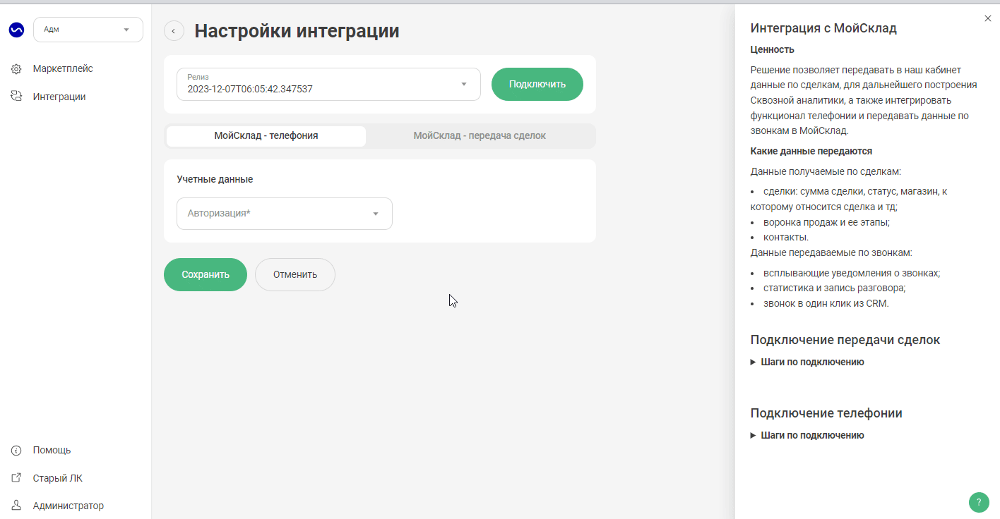

## Интеграция с МойСклад    

**Ценность**     

Решение позволяет передавать в наш кабинет данные по сделкам, для дальнейшего построения Сквозной аналитики, а также интегрировать функционал телефонии и передавать данные по звонкам и текстовым коммуникациям в МойСклад.     

**Какие данные передаются**    

Данные передаваемые по звонкам:     
- возможность гибкой настройки создания контрагентов и заказов по звонкам;
- создание задач по пропущенным звонкам;
- синхронизация сотрудников;
- передача дополнительных полей в контрагента;
- всплывающие уведомления о звонках;
- статистика и запись разговора;
- переадресация на персонального менеджера из CRM;
- звонок в один клик из CRM.  

Данные передаваемые по текстовым коммуникациям:   

- возможность гибкой настройки создания контрагентов и заказов по обращениям;
- создание задач по пропущенным чатам;
- передача дополнительных полей в контрагента;
- встройка нашего виджета РМО в кабинет МойСклад при подключении соответствующего расширения.  

Данные получаемые по сделкам:     
- сделки: сумма сделки, статус, магазин, к которому относится сделка и тд; 
- воронка продаж и ее этапы;
- контакты.  
   
 
 

## Подключение передачи сделок    
 

 
 Шаги по подключению 
  

1. Прожмите переключатель "МойСклад - передача сделок", для активации интеграции.  
2.  **Авторизация в МойСклад**  

Добавьте название авторизации, а также логин и пароль, от МойСклад.

 

3. Нажмите сохранить.  
  
После подключения интеграции сделки будут попадать в  Сырые данные -> Сделки.     
Для проверки корректности работы интеграции создайте тестовую сделку в МойСклад .    

 
 
 
 
 
 
 
 

## Подключение телефонии    

 
 Шаги по подключению 
  

1. Укажите **Учетные данные**  
- нажать "Авторизация в Мегаплан";
- если ранеее добавляли учетные данные МойСклад, то выбрать их из списка,   
- если нет, то нажать "Добавить учетные данные" и заполнить значения:
  - название;
  - Token, скопированный из параметра **Ключ доступа** приложения МойСклад. (описание подключения приложения ниже в п.3)
  

 

2. Нажмите **Активен** на этой странице.  
3. Подключите в МойСклад модуль UIS.  
 - Перейдите в раздел **Приложения** и если ни одного приложения не подключено, нажмите **Выбрать приложение**.
 - В открывшемся разделе найдите ниже **Телефония — UIS** и нажмите Установить.
 - В появившемся окне настроек:  
   - В поле **Адрес провайдера телефонии** вставьте URL из поля **Webhook URL** из наших настроек.
   - Скопируйте ключ из поля **Ключ доступа** (его необходимо добавить в учетных данных в п.1).
   - Введите внутренние номера сотрудников, соответствующие внутренним номерам в Личном кабинете UIS.
   - Прожмите **Установлено**.
   - Сохраните настройку.  
   
   

4. **Показывать внутренние звонки** - выберете настройку, если в МойСклад необходимо фиксировать звонки между сотрудниками.  
   
5. Нажмите сохранить.  

Для проверки работы интеграции на тестовых звонках проверьте работы пунктов указаных в **"Данные передаваемые по звонкам"**.  

 
