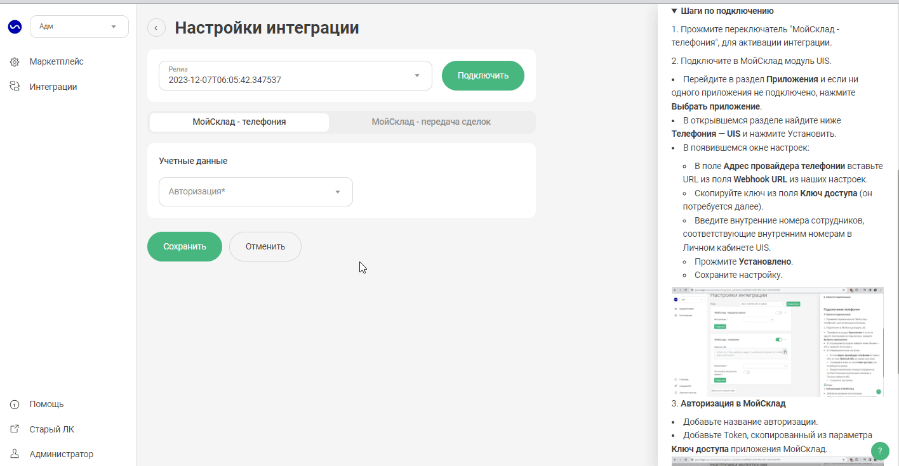
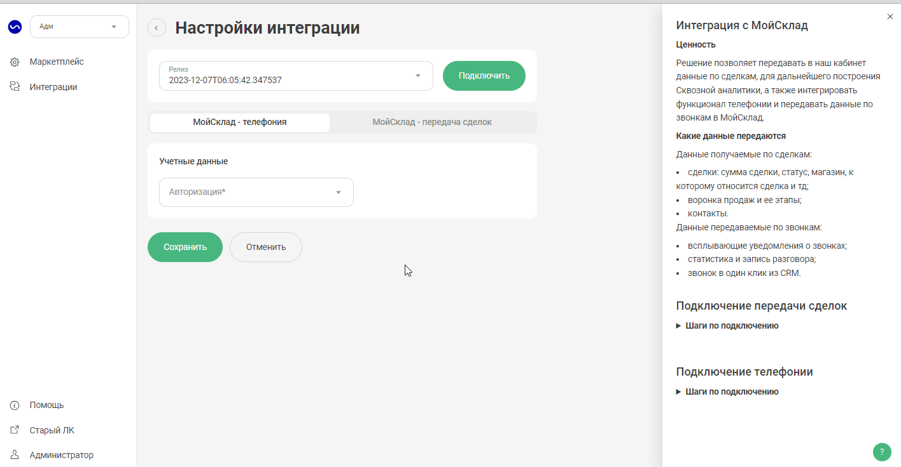

# Интеграция с МойСклад

Решение позволяет передавать в наш кабинет данные по сделкам для дальнейшего построения Сквозной аналитики, а также интегрировать функционал телефонии и передавать данные по звонкам и текстовым коммуникациям в МойСклад.

 
 
 
 
 
 

## Функционал интеграции

 Подробнее 

 

**Данные передаваемые по звонкам:**

- всплывающие уведомления о входящих звонках;
- звонок в один клик из МойСклад (Софтфон UIS);
- сохранение истории и записей звонков в МойСклад;
- синхронизация сотрудников;
- возможность гибкой настройки создания контрагентов, заказов и задач по звонкам.

**Данные передаваемые по текстовым коммуникациям:**

- возможность гибкой настройки создания контрагентов, заказов и задач по обращениям (заявки и чаты);
- передача дополнительных полей в контрагента или заказ;
- встройка виджета РМО UIS в кабинет МойСклад при подключении соответствующего расширения.

**Данные получаемые по сделкам:**

- сделки: сумма сделки, статус, этапы воронки продаж и т.д.;
- воронка продаж и её этапы;
- контрагенты;
- ответственный менеджер.

 
 
 
 
 
 
 

## Подключение учетной записи

 Шаги по подключению 

 

1. Укажите **Учетные данные**  
- нажать "Авторизация в МойСклад";
- Для работы интеграции по телефонии, потребуются две авторизации;
- если ранее добавляли учетные данные МойСклад, то выбрать их из списка,   
- если нет, то нажать "Добавить учетные данные" и заполнить значения:  
  **Для верхней авторизации:**   
  Добавьте название авторизации, а также логин и пароль, от МойСклад.  
  
       
  **Для нижней авторизации:**       
  - название;     
  - Token, скопированный из параметра **Ключ доступа** приложения МойСклад. (описание подключения приложения ниже в п.3)      
  
    

 
 
 
 
 
 
 

## Синхронизация сотрудников

 

 Шаги по подключению 

 

Свитч активации **Синхронизация сотрудников** необходим для корректной работы всех компонентов интеграции. Выключение может привести к потере работоспособности.

1. **Синхронизировать всех сотрудников** — выберите настройку, если требуется импортировать всех сотрудников из МойСклад в UIS. При выключенной настройке становится доступным список сотрудников для синхронизации.

2. Выберите конкретных сотрудников в настройке **Сотрудники для синхронизации**, если требуется синхронизировать не всех сотрудников.

3. Нажмите кнопку **Синхронизировать сотрудников** для ручной синхронизации. При первом подключении интеграции — обязательное действие.

4. Нажмите **Сохранить**.

 
 
 
 
 
 
 

---

# 1. Телефония

 

 Шаги по подключению 

 

Для передачи данных по звонкам из UIS в МойСклад прожмите свитч активации интеграции **"Телефония"**.

 

## Основное

 

1. **Фильтровать звонки** — данная настройка необходима для фильтрации звонков по определенным условиям. Если не использовать фильтр, то по всем звонкам будет создаваться сущность в МойСклад. При включении настройки станут доступны поднастройки: **"Фильтр входящих"** и **"Фильтр исходящих"** звонков. Условия можно прописывать через операторы И/ИЛИ. Если фильтр настроен, он будет помечен зеленой точкой.

2. **Номер для звонка по клику** — выберите, какой виртуальный номер будет отображаться при звонке по клику из МойСклад.

3. **Всегда отображать номер** — если включить опцию, то правила отображения номера сотрудника будут игнорироваться и всегда будет отображаться выбранный номер.

4. **Входящие звонки** — перечень настроек для обработки входящих звонков:
   - **Первичные обращения** — выберите, какие сущности создавать при первичном обращении (контрагент / контрагент и заказ / ничего).
   - **Создавать на сотрудника** — выберите, на какого сотрудника назначать созданные сущности (завершивший звонок / из настроек интеграции / принявший звонок).
   - **Юридическое лицо** — выберите юр. лицо для создаваемого заказа (доступно при выборе "контрагент и заказ").
   - **Создавать заказ при повторных обращениях** — включите, если необходимо создавать заказ при повторных обращениях.
   - **Включить переадресацию на персонального менеджера** — активируйте, если необходима переадресация на персонального менеджера из МойСклад.

5. **Исходящие звонки** — перечень настроек для обработки исходящих звонков:
   - **Первичные обращения** — выберите, какие сущности создавать при первичном обращении.
   - **Создавать на сотрудника** — выберите, на какого сотрудника назначать созданные сущности (совершивший звонок / из настроек интеграции).
   - **Юридическое лицо** — выберите юр. лицо для создаваемого заказа.
   - **Создавать заказ при повторных обращениях** — включите, если необходимо создавать заказ при повторных обращениях.

6. **Задачи** — настройка создания задач по потерянным звонкам:
   - **При потерянном входящем звонке создавать задачу** — выберите, откуда взять ответственного для создания задачи (на сотрудника из карточки контрагента / из настроек интеграции).
   - **Срок задачи по входящему звонку (часы)** — задайте продолжительность задачи для входящего звонка.
   - **При неуспешном исходящем звонке создавать задачу** — выберите, откуда взять ответственного (на сотрудника из карточки контрагента / из настроек интеграции).
   - **Срок задачи по исходящему звонку (часы)** — задайте продолжительность задачи для исходящего звонка.

 

## Шаблоны

 

В этом разделе вы можете настроить шаблон названий задач, которые будут автоматически создаваться в МойСклад при пропущенных входящих или неуспешных исходящих звонках.

1. Нажав на кнопку **"плюса"**, можно выбрать переменную для вставки в шаблон наименования задачи.

2. Кнопка с иконкой **(глаза)** позволяет сделать предпросмотр наименования, которое будет отображено в создаваемой задаче.

3. Кнопка с иконкой **(закругленной стрелочки)** возвращает шаблон поля к последнему сохраненному значению.

 

## Ответственные

 

Настройка позволяет управлять назначением ответственных сотрудников за сущности в зависимости от условий.

1. Задайте **Ответственного по умолчанию за входящие звонки** — обязательное поле.

2. Задайте **Ответственного по умолчанию за исходящие звонки** — обязательное поле.

3. Для добавления условия назначения ответственного нажмите кнопку **"Добавить"**:
   - Выберите сотрудника из выпадающего списка.
   - Далее выберите условия или группы условий для определения правил, по которым будут проставляться ответственные в создаваемых сущностях.
   - Нажмите **"Сохранить"**.

Доступно две коллекции условий — для входящих и для исходящих звонков.

 

## Дополнительные поля

 

Настройка позволяет передавать дополнительные поля в контрагента и заказ.

1. **Для контрагентов** — сопоставьте дополнительные поля из МойСклад и параметры коммуникации из UIS.

2. **Для заказов** — сопоставьте дополнительные поля из МойСклад и параметры коммуникации из UIS.

3. При необходимости обновлять поля при каждом обращении — прожмите **"Обновлять всегда"**.

4. После добавления сопоставления всех требуемых дополнительных полей — нажмите **"Сохранить"**.

 

 
 
 
 
 
 
 

---

# 2. Текстовые коммуникации

 

 Шаги по подключению 

 

Для передачи данных по чатам и заявкам из UIS в МойСклад прожмите свитч активации интеграции **"Текстовые коммуникации"**.

 

## Основное

 

### Заявки

2. **Для первичных обращений** — выберите, какие сущности создавать при первичном обращении (контрагент / контрагент и заказ / ничего).

3. **Создавать на сотрудника** — выберите, на какого сотрудника назначать созданные сущности (из настроек интеграции / из карточки контрагента).

4. **Юридическое лицо** — выберите юр. лицо для создаваемого заказа (доступно при выборе "контрагент и заказ").

5. **Создавать заказ при повторных обращениях** — включите, если необходимо создавать заказ при повторных обращениях.

6. **Фильтры** — настройка для фильтрации заявок по определенным условиям (сайт, тип заявки, рекламная кампания, источник). Если фильтр настроен, он будет помечен зеленой точкой.

### Чаты

2. **Для первичных обращений** — выберите, какие сущности создавать при первичном обращении (контрагент / контрагент и заказ / ничего).

3. **Создавать контрагента / заказ** — выберите событие, при котором необходимо создавать выбранные сущности (на начало чата / на конец чата / при простановке тега).

4. **Теги** — выберите теги, при простановке которых будет происходить создание сущностей (доступно при выборе "при простановке тега").

5. **Юридическое лицо** — выберите юр. лицо для создаваемого заказа.

6. **Создавать заказ при повторных обращениях** — включите, если необходимо создавать заказ при повторных обращениях.

7. **Создавать заказ на сотрудника** — выберите, на какого сотрудника назначать созданные сущности при повторных обращениях.

8. **Создавать задачу по потерянному чату** — выберите, откуда взять ответственного для создания задачи (на сотрудника из карточки контрагента / из настроек интеграции / ничего).

9. **Срок задачи по потерянному чату (в часах)** — задайте продолжительность задачи.

10. **Передавать чаты от посетителей без контактных данных** — включите, если необходимо передавать чаты от посетителей без номера телефона. При каждом новом чате будет создаваться новый контакт, что может привести к дублям.

11. **Фильтры** — настройка для фильтрации чатов по определенным условиям (сайт, канал, тег, рекламная кампания, источник).

 

## Шаблоны

 

В этом разделе вы можете настроить шаблон названий задач, которые будут автоматически создаваться в МойСклад при потерянных чатах.

1. Нажав на кнопку **"плюса"**, можно выбрать переменную для вставки в шаблон.

2. Кнопка с иконкой **(глаза)** позволяет сделать предпросмотр наименования.

3. Кнопка с иконкой **(закругленной стрелочки)** возвращает шаблон к последнему сохраненному значению.

 

## Ответственные

 

Настройка позволяет управлять назначением ответственных сотрудников за сущности в зависимости от условий.

1. Задайте **Ответственного по умолчанию за заявки** — обязательное поле.

2. Задайте **Ответственного по умолчанию за чаты** — обязательное поле.

3. Для добавления условия назначения ответственного нажмите кнопку **"Добавить"**:
   - Выберите сотрудника из выпадающего списка.
   - Далее выберите условия или группы условий для определения правил (сайт, рекламная кампания, источник, тип заявки — для заявок; сайт, канал, тег, рекламная кампания, источник — для чатов).
   - Нажмите **"Сохранить"**.

 

## Дополнительные поля

 

Настройка позволяет передавать дополнительные поля в контрагента и заказ.

1. **Для контрагентов** — сопоставьте дополнительные поля из МойСклад и параметры коммуникации из UIS.

2. **Для заказов** — сопоставьте дополнительные поля из МойСклад и параметры коммуникации из UIS.

3. При необходимости обновлять поля при каждом обращении — прожмите **"Обновлять всегда"**.

4. После добавления сопоставления всех требуемых дополнительных полей — нажмите **"Сохранить"**.

 

 
 
 
 
 
 
 

---

# 3. Передача сделок

 

 Шаги по подключению 

 

## Настройки интеграции

1. **Анализ воронок продаж в отчетах** — включите, если необходимо анализировать воронки продаж в отчетах UIS.

2. **Воронки (каналы) продаж** — выберите воронки продаж из МойСклад, которые нужно анализировать в отчетах UIS. Если не выбрано ни одной, анализируются все воронки.

3. **Дополнительные поля из CRM** — выберите дополнительные поля из заказа покупателя в МойСклад, которые требуется передавать в наши отчеты в связке со сделками.

4. Нажмите **"Сохранить"**.

 

## Проверка работы интеграции

Для проверки корректности работы интеграции:

1. Создайте тестовую сделку в МойСклад.
2. Дождитесь срабатывания вебхука (обычно в течение 1-2 минут).
3. Проверьте появление сделки в ЛК UIS: **Сырые данные → Сделки**.

 
 
 
 
 
 
 

---

*При подключении интеграции в нашем ЛК убедитесь, что во вкладке "События" активированы необходимые триггеры для передачи данных.*