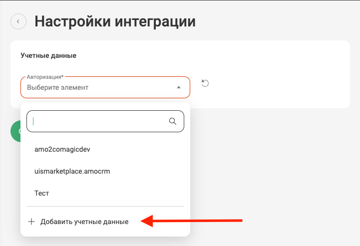
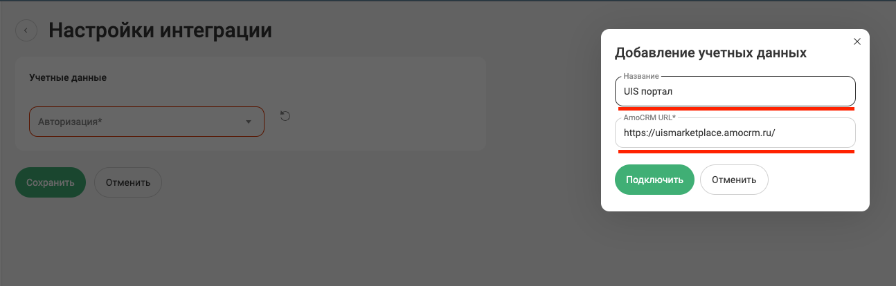
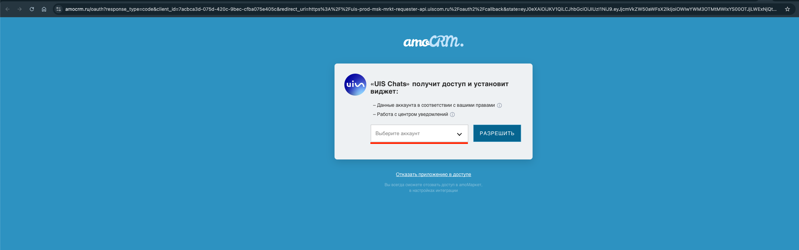

## Интеграция с amoCRM    

Интеграция позволяет переписываться с клиентами в мессенджерах и соцсетях, не покидая интерфейс amoCRM, при этом не используя дополнительные средства в виде виджета внутри amoCRM или расширения в браузере Google Chrome.
При поступлении чатов и заявок в amoCRM будут автоматически создаваться Сделки и Контакты — в зависимости от выбранных настроек интеграции.   

 
 
 
 
 
 

## Функционал интеграции    

 
 Подробнее 
  

- передача в CRM чатов и заявок с сайта;
- встройка виджета РМО UIS в кабинет amoCRM;
- автоматическое создание контактов/сделок/неразобранного;
- автоматическое создание задач;
- передача дополнительных полей в контакт/сделку;
- простановка тегов.  

 

 
 
 
 
 
 
 

## Подключение учетной записи  

 
 Шаги по подключению 
  

Для авторизации в amoCRM необходимо в ЛК UIS:    
- нажать "Авторизация";
- если ранеее добавляли учетные данные amoCRM, то выбрать их из списка;   
- если нет, то нажать "Добавить учетные данные".
  
   

Откроется окно для ввода данных портала, который вам нужно подключить.
- В поле "Название" можно ввести любое понятное вам название, тк оно будет отображаться в выпадающем списке.
- В поле "AmoCRM URL" необходимо вставить ссылку на ваш портал AmoCRM, например: https://uismarketplace.amocrm.ru/.
- Нажмите кнопку "Подключить".

   

Откроется страница amocrm для подключения портала и передачи доступа к нему UIS Чатам. Выберите нужный аккаунт и нажмите "Разрешить".   

<Alert type=warning> Если данная страница не открылась, то нажмите на круглую стрелочку напротив поля с вашим порталом в настройках интеграции. </Alert>   

     

Далее, откроется страница с сообщением что портал успешно подключен и закроется автоматически.
     

<Alert type=warning> Также есть возможность отредактировать или удалить учетные данные которые вы установили. Для этого, в окне "Учетных данных" в выпадающем списке, при наведении курсора на портал - справа появляется иконка "шестеренки", при нажатии на которую открывается окно, где можно отредактировать и сохранить изменения, либо удалить эти данные. </Alert>   
    
    

      
После добавления учетных данных на странице появятся Параметры интеграции.   

 

 
 
 
 
 
 
 
