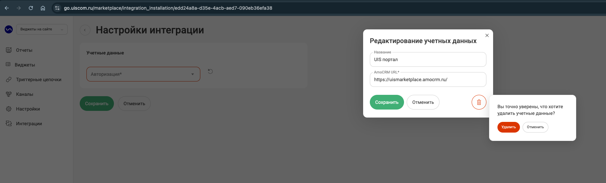

## Интеграция с amoCRM    

Интеграция позволяет переписываться с клиентами в мессенджерах и соцсетях, не покидая интерфейс amoCRM, при этом не используя дополнительные средства в виде виджета внутри amoCRM или расширения в браузере Google Chrome.  

При поступлении чатов и заявок в amoCRM будут автоматически создаваться Сделки и Контакты — в зависимости от выбранных настроек интеграции.   

 
 
 
 

## Функционал интеграции    

- передача в CRM чатов и заявок с сайта;
- встройка виджета РМО UIS в кабинет amoCRM;
- автоматическое создание контактов/сделок/неразобранного;
- автоматическое создание задач;
- передача дополнительных полей в контакт/сделку;
- простановка тегов.  

 
 
 
 

## Подключение учетной записи  

 
 Шаги по подключению 
  

Для авторизации в amoCRM необходимо в ЛК UIS:    
- нажать "Авторизация";
- если ранеее добавляли учетные данные amoCRM, то выбрать их из списка;   
- если нет, то нажать "Добавить учетные данные".
  
   

Откроется окно для ввода данных портала, который вам нужно подключить.
- В поле "Название" можно ввести любое понятное вам название, тк оно будет отображаться в выпадающем списке.
- В поле "AmoCRM URL" необходимо вставить ссылку на ваш портал AmoCRM, например: https://uismarketplace.amocrm.ru/.
- Нажмите кнопку "Подключить".

   

Откроется страница amocrm для подключения портала и передачи доступа к нему UIS Чатам. Выберите нужный аккаунт и нажмите "Разрешить".   

<Alert type=warning> Если данная страница не открылась, то нажмите на круглую стрелочку напротив поля с вашим порталом в настройках интеграции. </Alert>   

     

Далее, откроется страница с сообщением что портал успешно подключен и закроется автоматически.
     

<Alert type=warning> Также есть возможность отредактировать или удалить учетные данные которые вы установили. Для этого, в окне "Учетных данных" в выпадающем списке, при наведении курсора на портал - справа появляется иконка "шестеренки", при нажатии на которую открывается окно, где можно отредактировать и сохранить изменения, либо удалить эти данные. </Alert>   
    
    

      
После добавления учетных данных на странице появятся Параметры интеграции.   

 

 
 
 
 

## Чаты  

 
 Шаги по подключению 
  

 
 

 
 
 
 

## Офлайн-заявки  

 
 Шаги по подключению 
  

Для передачи заявок из UIS в amoCRM прожмите свитч активации интеграции "Офлайн-заявки".    

### Основное 

1. **График работы компании** - выберите график работы компании из предложенного списка.     
Настройка будет учитываться при создании задач.    

2. **Метод передачи**- выберите требуемый способ обработки заявки.      

- Если выбрана Обрабатывать вручную - не создаются нижеперечисленные сущности. 
- При выборе Использовать функционал «Неразобранное» заявка на сделку в Неразобранном будет создаваться всегда при поступлении заявки. 
- Если выбраны способы Создавать контакт или Создавать сделку и контакт, то сделка будет создаваться всегда, а контакт — только если обращение первичное.     

3. **Только для первичных обращений** - параметр активирует обработку только первичных обращений тем способом, который был указан ранее.     

4. **Создавать задачу на сотрудника** - для любой поступившей заявки можно настроить автоматическое создание задач.    

Если в параметре "Создавать задачу на сотрудника" выбран вариант "Не создавать" - задачу не создаем , иначе создаем задачу на ответственного сотрудника в соответствии с настройками ниже.  

5. **Срок задачи** - выберите временной промежуток, который необходимо указывать в качестве срока задачи.   

При простановке срока задачи учитывается выбранный **График работы компании**.   

6. **Фильтры** - задайте условия, если требуется фильтровать заявки по сайтам, типам и проч. 

7. **Тегирование** - при выключенной настройке теги не будут ставиться на сущности amoCRM. И также, неактивно поле "Списка тегов".  

При включении настройки - активируется поле "Список тегов"  

Поле содержит фиксированный список тегов, доступный для выбора. При выборе тегов, проставляться они будут как на сущность сделки, так и на сущность контакта при их создании.

  

### Шаблоны 

Для настройки наименований создаваемых сущностей доступны поля: "Контакты", "Сделки", "Задачи". В каждом поле можно задавать любые нужные вам наименования, используя переменные значения, через кнопку плюса под полем.

<Alert type=warning> Обратите внимание: что название шаблонов, которые вы задаете относятся только к сущностям сделок, контактов и задач в amoCRM. К записям, создаваемых в "Не разобранном" - они не применяются. </Alert>   

  

### Мультиворонки 

Мультиворонки позволяют создавать сделки в разных воронках.

Вкладка **Мультиворонки** становится доступна, при выборе метода передачи "Создавать сделку и контакт" во вкладке **Основное**.

1. Задайте необходимую воронку и этап по умолчанию - это обязательные поля.  

2. Для добавлении условия попадания сделки в воронку нажимаем кнопку "Добавить". Подгружается список всех имеющихся в amoCRM воронок. Сначала выбираем воронку, а затем этап этой воронки. Далее выбираем условия или группы условий для определения правил, по которым будут создаваться сделки по обращениям в выбранную воронку.  

 

### Ответственные 

  

### Дополнительные поля 

  

 
 

 
 
 
 