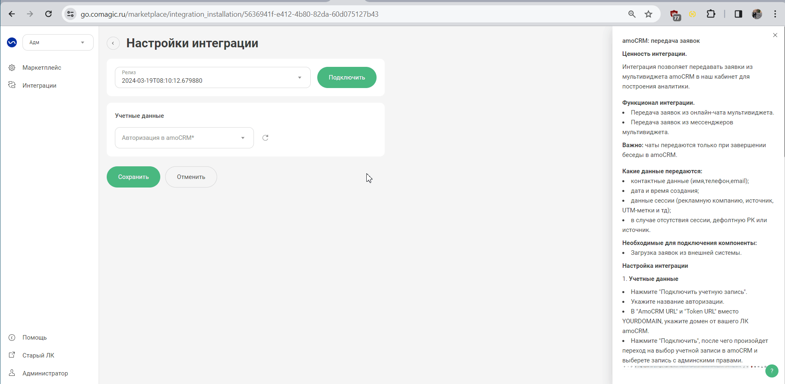
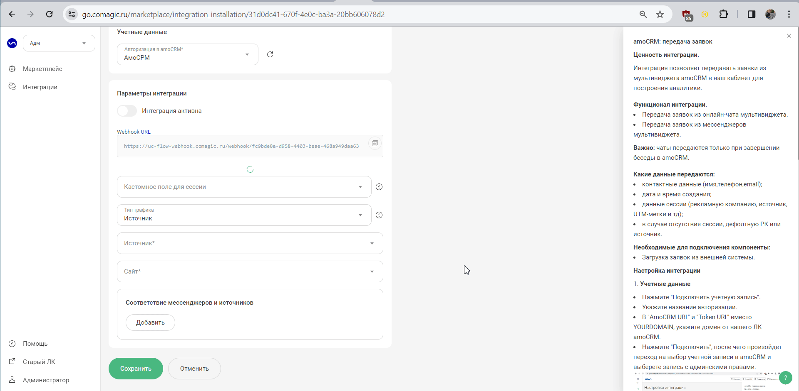

**Ценность интеграции.**  
Интеграция позволяет передавать чаты (отображаем, как заявки в нашем ЛК) из мультивиджета amoCRM для построения аналитики.  
 

**Функционал интеграции.**  
- Передача заявок из онлайн-чата  мультивиджета.  
- Передача заявок из мессенджеров мультивиджета.  

**Важно:** 
- чаты передаются только при завершении беседы в amoCRM.  
- в нашем отображаем чаты как заявки, так как в amoCRM остутствует возможность передачи переписки по чату.
 
 

**Какие данные передаются:**   
- контактные данные (имя,телефон,email);  
- дата и время создания;  
- данные сессии (рекламную компанию, источник, UTM-метки и тд);  
- в случае отсутствия сессии, дефолтную РК или источник.  
   

**Настройка интеграции**    
1. **Учетные данные**     
- Нажмите "Подключить учетную запись".
- Укажите название авторизации.
- В "AmoCRM URL" и "Token URL" вместо YOURDOMAIN, укажите домен от вашего ЛК amoCRM.
- Нажмите "Подключить", после чего произойдет переход на выбор учетной записи в amoCRM и выберете запись с админскими правами.

  
  

2. **Настройте Webhook в amoCRM** 
Из поля "Webhook url" забираем адрес для настройки Webhook в amoCRM на событие "Беседа изменена"   
Настройка хука в amoCRM:  

 

3. **Кастомное поле для сессии** — для определения источника чата, в амоСРМ необходимо создать кастомное поле, в которое будет передаваться сессия UIS. Выберете его из списка в настройках интеграции.  
4. **Тип трафика** — необходимо выбрать какую сущность использовать для обращений без сессии. 
   
В зависимости от выбранного типа трафика выводится либо список источников и сайтов  из личного кабинета клиента, либо список рекламных кампаний. Необходимо указать какой источник и сайт/рекламную кампанию используем в случае отсутствия сессии.   

5. В разделе **Соответствие мессенджеров и источников** настраиваем в какую Рекламную кампанию\Источник и сайт будут попадать чаты из мессенджеров.   

 

6. Нажмите "Активен" и после этого "Сохранить".  
7. После сохранения настроек будет выведено новое поле  "Скрипт для вашего сайта". 
Данный скрипт необходимо установить на каждой странице сайт ниже основного кода вставки нашего сервиса.     

После подключения интеграции заявки будут попадать в  Сырые данные -> Обращения и цели.    
Для проверки корректности работы интеграции оставьте тестовое обращение в мультивиджете amoCRM.  

