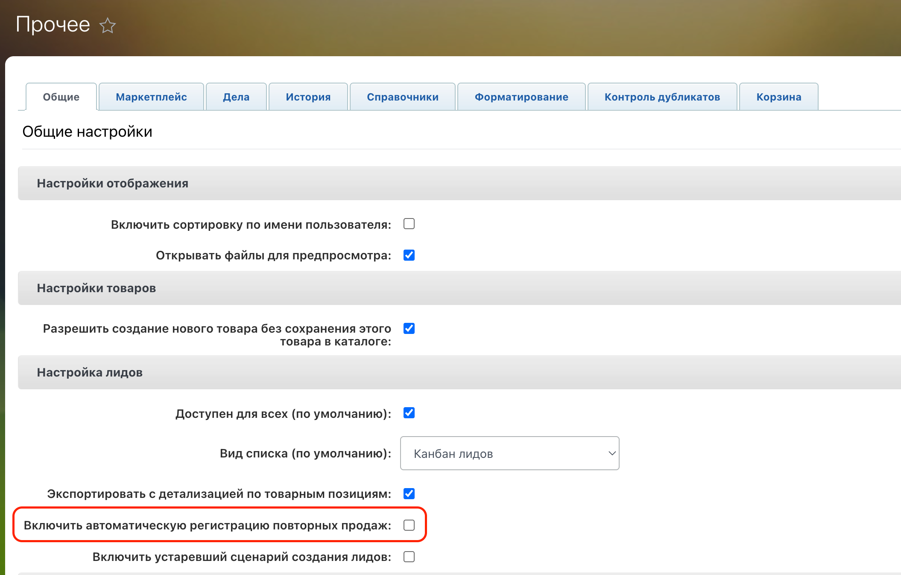
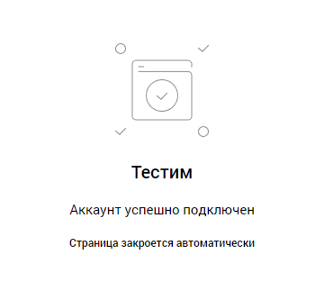

Подключение новой интеграции "Bitrix24 - OMNI" происходит в новом личном кабинете.
Нажмите кнопку «Подключить интеграцию», вам откроется страница:

Обратите внимание, что теперь для всех разделов настроек интеграции - есть только одна общая кнопка "Сохранить"
По клику на знак вопроса в правом нижнем углу откроется справочник с базовыми данными о настройке интеграции:

Добавьте портал, с которым будете работать кликнув по кнопке "Добавить учетные данные".
Если вы подключались ранее через Bitrix24, портал будет выбран автоматически. В примере ниже курсор наведен на созданный автоматически [comagic.bitrix24.ru](http://comagic.bitrix24.ru/):

При добавлении или редактировании через «шестеренку», откроется контекстное меню:

В поле «Название» задайте произвольное наименование портала, чтобы отличать его от других, если порталов будет несколько.
«Домен портала» - вставьте свой домен с «https://» и нажмите "Сохранить".
Включите переключатель "Главная" и нажмите "Сохранить".

Далее нужно будет выбрать в настройках телефонии, чатов, офлайн заявок или "Открытых линий" в каждом разделе ваш портал и "Сохранить".

Телефония

# Настройки интеграции
Далее рассмотрим доступный функционал новой телефонии. На рисунках ниже видны все настройки:

#### Вы можете пользоваться Softohone как в веб-версии, так и использовать расширение Chrome для звонков, просто установив его в ваш браузер через магазин Google Chrome.
## Настройка "Учетные данные"
В данном разделе, при клике на кнопку "Подключить учетную запись" вы подключаете ваш портал Bitrix24.

При клике открывается окно на рисунке ниже, где вы можете указать ваш портал Bitrix24, например: https://your-portal-name.bitrix24.ru/ и в поле название указываете понятное вам наименование вашей интеграции:

## Настройка "Основное"
### Раздел "Обработка звонков"
Рассмотрим ниже весь функционал раздела "Обработка звонков":

#### "Использовать другую телефонию"
Данный функционал работает так, что мы переадресовываем звонки в другую телефонию, где уже есть интеграция с CRM. Например у клиента своя АТС, а вся обработка звонков и логика на их стороне. Из такой логики выходит, что мы не создаем сущности, а обновляем только те, что создала другая интеграция.

Как будет работать, примеры:

* У клиента уже есть существующая сделка и контакт, либо лид - при звонке если происходит любое изменение в сделке, то после этого мы обновляем доп. поля, но обновляем только в тех сущностях, в которых были произведены изменения во время звонка.
* У клиента уже есть существующая сделка и контакт, либо лид - при звонке, если изменений не было никаких в сущностях - то ничего не обновляем.
* Дело обновить не возможно и мы ничего с ним не делаем в этих кейсах.
* Если у клиента сущностей нет вообще, то мы ничего не создаем, но события регистрируем.
* В Bitrix24 есть поле: "ID первой коммуникации". Если это поле пустое в измененных сущностях, то мы его пробрасываем в сущность, то есть заполняем его последним полученным значением.
 
При включении данной функции, вся основная функциональность телефонии будет деактивирована, пример на картинке ниже:

#### "Переадресация на персонального менеджера из CRM"
При включении данной функции начинает работать сценарий "переадресации на ПМ из CRM", который вы установите в настройках сценария вашего SIP клиента в старом ЛК.

При выключении данной функции - "переадресация на ПМ из CRM" такой сценарий срабатывать не будет, и звонок клиента будет завершен.
Все остальные сценарии переадресации будут работать при выключенной функции "переадресация на ПМ из CRM" в настройках новой интеграции.

#### "Создавать лид/сделку для всех входящих звонков"
При включении этой функции на все входящие звонки будет создаваться лид, либо сделка/контакт/компания, в зависимости от режима CRM.

При первичном входящем звонке - будет создаватьсялид, либо сделка/контакт/компания
При повторном звонке будет создаваться лид, либо сделка/контакт/компания в случае если старые сущности в завершенном статусе.
Дело при этом будет создаваться для пропущенных звонков всегда со статусом "Не выполненное", а для успешных звонков со статусом "Выполнено"
Если в сущности есть "не выполненное" дело, и далее происходит успешный входящий звонок, то "не выполненное" предыдущее дело получит статус "Обработано".
#### "Создавать лид/сделку для всех исходящих звонков"
Данная настройка работает аналогично настройке выше: "Создавать лид/сделку для всех входящих звонков"

#### "Обновлять ответственного через"
В данной настройке можно регулировать промежуток времени, через который должны произойти смена ответственного в лиде, или сделке/контакте/компании. После того как мы меняем ответственного, сразу же добавляем дело уже с этим ответственным. То есть сначала создается сущность с ответственным по умолчанию, и далее, спустя выбранное время уже обновляем ответственного и добавляем дело.

#### "Передавать виртуальные номера как источник обращения"
При включении данной настройки, передаем наш виртуальный номер в поле "Дополнительно об источнике" Bitrix24

поле "Дополнительно об источнике" в Bitrix24:

Примеры:
* Входящий/исходящий потерянный/успешный звонок → в поле "Дополнительно об источнике" укажем номер виртуального номера на который звонили, либо с которого был исход
* С трансфером входящий/исходящий потерянный/успешный → записываем в поле "Дополнительно об источнике" первый виртуальный номер, который принял звонок
#### "Фильтровать звонки"
При включении этой опции можно настроить правила фильтрации входящих звонков.
* По умолчанию все звонки пропускаются без фильтрации.
* Если добавлено хотя бы одно условие, система будет обрабатывать только те звонки, которые ему соответствуют.

Как использовать:
1. Активируйте чек-бокс.
2. Добавьте нужные условия (например, номер телефона, тип звонка или источник).
3. Только подходящие под условия звонки будут учитываться в дальнейшей обработке.

ВНИМАНИЕ! У вас установлен один или несколько фильтров на входящие звонки из списка: "Сотрудник", "Выбранная посетителем группа" или "Последняя операция сценария":При данном фильтре вызов может быть зарегистрирован в Bitrix24 только после принятия звонка сотрудником, а значит пропущенные звонки не будут зарегистрированы в Bitrix24.

Фильтрация содержит параметры, условия и значение. Для гибкой настройки фильтрации звонков их можно формировать по группам через логическое И / ИЛИ.

Для входящих звонков есть параметры:
1. Виртуальный номер
2. Последняя операция сценария
3. Сценарий ВАТС
4. Выбранная посетителем группа
5. Сотрудник
6. Рекламная кампания
7. Первая рекламная кампания
8. Сайт
9. Источник

Условия:

1. Включить - выбирая включить, вы обрабатываете все входящие звонки подпадающие под выбранные условия.
2. Исключить - выбирая исключить, вы исключаете все входящие звонки подпадающие под выбранные условия.

Для исходящих звонков есть параметры:
1. Виртуальный номер
2. Сотрудник
 
Условия:
1. Включить - выбирая включить, вы обрабатываете все исходящие звонки подпадающие под выбранные условия.
2. Исключить - выбирая исключить, вы исключаете все исходящие звонки подпадающие под выбранные условия.

 
### Раздел "Звонки по клику из CRM"

Данный функционал позволяет использовать звонки по клику на номер телефона из Bitrix24.
* Чек-бокс "Использовать" - активирует функциональность интеграции, которая позволяет сотрудникам совершать исходящие звонки при клике на номер в личном кабинете Bitrix24. При выключении, поле "Номер для исходящего звонка по клику" и чек-бокс "Переопределять АОН для исходящих звонков" деактивируются автоматически.
* Поле "Номер для исходящего звонка по клику" является обязательным при включении функции "Звонки по клику"
* Чек-бокс "Переопределять АОН для исходящих звонков" - для исходящих звонков по клику на номер отображать клиенту только выбранный номер в параметре "Номер для звонка по клику". Если чек-бокс выключен, то номер клиенту будет показан тот, что установлен в настройках SIP, либо в настройках приложения телефонии в Bitrix24.

### Раздел "Обратный звонок"

При включении чек-бокса "Использовать" укажите номер телефона, на который будут поступать звонки от посетителей сайта при использовании обратной формы.
Поле "Номер для исходящего звонка" обязательное, звонить на номер из настроек интеграции будет только в случае, если не смогли найти сотрудника сопоставленного, или если сотрудник без сипа.

Настройка обратной формы в Bitrix24 находится в "Контакт-центре" → "Обратная форма":

### Раздел "Запись разговора"

При активации "Передавать записи разговора" записи будут передаваться в Bitrix24. В зависимости от размера файла запись может загрузиться с задержкой после завершения звонка. При выключении - деактивируется чек-бокс ниже "Создавать дело и передавать записи, если настроены определенные фильтры"
При включении "Создавать дело и передавать записи, если настроены определенные фильтры" - в случае, если настроен один из фильтров: по операции сценария, фильтр по сотруднику - то дело и запись звонка будут передаваться в сущность в зависимости от данной настройки.

Например:
* Включить «передавать записи, если настроен фильтр по операции сценария» = если есть фильтр по сотруднику(Включен) и включена данная функция, то запись и дело в сущности создается. Если тоже самое только фильтр по сотруднику (Исключен), то не создадим.
* Выключена «передавать записи, если настроен фильтр по операции сценария» = есть фильтр по сотруднику(Включен), то даже если включена «Передавать записи разговора» - то записи разговора и дела в сущности не будет. Если все тоже самое, но нет фильтра по сотруднику, то запись разговора передадим.

### Радел "Открытые линии"
При включении «Добавлять сообщение о совершенном звонке сотруднику в чат» сообщение появляется в чате в Bitrix24 при успешном/неуспешном входящем звонке в Bitrix24, находится в уведомлениях, где видно чат по номеру по конкретному сотруднику.

Пример отображения уведомления о звонке:

## Настройка "Шаблоны"

Доступна гибкая настройка для входящих/исходящих вызовов с выбором отдельного шаблона для каждой сущности:

При клике на кнопку + доступен выбор переменных для использования их в названии:

Также можно настроить уже известный вам фильтр с логическими настройками И / ИЛИ и параметрами:

При клике на кнопку с глазом можно посмотреть как будет выглядеть итоговый шаблон:

Данные настройки не обязательные, и если не указаны шаблоны, то будет использоваться универсальный шаблон для каждой не заданной комбинации параметров.

Для входящих:
* "Входящий звонок на номер {{contact_phone_number}} из приложения {{app_name}}"

Для исходящих:
* "Исходящий звонок на номер {{contact_phone_number}} из приложения {{app_name}}"
## Настройка "Воронки"
Поля с стадиями по умолчанию - то куда будут попадать все сущности при входящих/исходящих звонках.

Далее идут поля для гибкой настройки воронок и стадий при входящих/исходящих звонках:
При их добавлении, данные поля являются обязательными.

При клике на круглую кнопку воронки откроются уже знакомые вам параметры и условия фильтрации:
* При выборе параметра с условием "Включить" - для звонков подпадающих под условия фильтра будет выбрана воронка/стадия выбранная в этом фильтре. Все остальные звонки получат воронку/стадию по умолчанию.
* При выборе параметра с условием "Исключить" - для звонков подпадающих под условия фильтра будет выбрана воронка/стадия по умолчанию. Все остальные звонки получат воронку/стадию выбранную в фильтре.

## Настройка "Ответственные"
Для данного раздела поля с ответственными по умолчанию - обязательные.
В поле для исходящих звонков указан ответственный по умолчанию, в случае, если ответственный не найден в системе.
В поле для входящих звонков указан сотрудник, который будет назначен ответственным за сущность в случае пропущенного входящего звонка.

Для входящих звонков доступна гибкая настройка установки ответственных с применением фильтрации:

Рассмотрим примеры, когда звонок первичный:
* Исходящий, сотрудник не найден = в лид и в дело ставим ответственного по умолчанию, указанного в настройках интеграции.
* Исходящий, если сотрудник найден = в лиде и в деле ответственный тот кто делает исходящий звонок.
* Входящий пропущенный (без фильтров) = за лид и дело ответственный тот, кто в поле по умолчанию.
* Входящий успешный = за лид и дело ответственный тот, кто принял звонок, и в зависимости от настроек первый или последний разговаривающий.
* Входящий звонок (с фильтром) или пропущенный входящий на номер из фильтра = если звонок первичный, то создаем сущность и дело на того, кто указан в фильтре. Если есть старая сущность, то ставим на пропущенный входящий в дело того кто ответственный в старой сущности, тк есть приоритеты: самое важное - старая сущность, далее сотрудник которому звонят, потом смотрим фильтры, потом по умолчанию. Но если кто-то ответил на повторный звонок, то ставим того ответственного за дело того, кто ответил лиду.
 
Рассмотрим примеры, когда звонок повторный:
* Входящий с фильтром + повторный пропущенный входящий на номер из фильтра = т.к. есть старый лид, а у него приоритет, поэтому дело ставится на того, кто в старом лиде ответственный.
* Входящий с фильтром + повторный пропущенный входящий на номер из НЕ фильтра = тк есть старый лид, а у него приоритет, поэтому дело ставится на того кто в старом лиде ответственный.
* Входящий с фильтром + пропущенный входящий на другой номер из фильтра = тк есть старый лид, а у него приоритет, поэтому дело ставится на того кто в старом лиде ответственный.
* Входящий с фильтром + успешный повторный входящий на номер из фильтра = ответственный  в сущности и в деле тот кто принял звонок. Если повторный звонок - то на том кто разговаривал последний/первый в зависимости от настроек
 
Также, существует приоритеность выставления ответственных по сортировке "Контакт" - "Компания" - "ЛИД"/"Сделка", где Контакт имеет наивысший приоритет:
* Есть Контакт, Компания и Сделка = берем ответственного с Контакта, если сделка закрыта то создаем новую сделку на того кто в контакте, не смотря на то что звонили на другого сотрудника.
* Есть Компания и Сделка = берем ответственного с Компании если звонок пропущенный. Если успешный то ставим того кто говорил.
* Есть только Сделка = берем ответственного со сделки.
* Есть Сделка и Контакт = берем с контакта при пропущенном, создается дело в контакте и в сделке. При успешном тот кто разговаривал.
* Есть Лид, контакт, Сделка и Компания = берем в дело ответственного из контакта и ставим на пропущенный в дело его. При успешном ответственный тот, кто говорил.
* Есть Лид и Контакт = берем ответственного с контакта, в деле ответственный тот кто в контакте, если звонок был неудачный. Если звонок успешный, то в деле у нас ответственный тот, кто разговаривал в зависимости от настроек первый/последний.
* Есть Лид = берем с лида ответственного и ставим его в новую сделку. В дело же ставим того кто разговаривал, либо если звонок неуспешный то ставим того же, кто стоит в лиде.

## Настройка "Доп. поля"
Передавайте параметры обращения в карточку лида, сделки или контакта. Такими параметрами могут быть: источник звонка, название рекламной кампании и многое другое. Для этого укажите название полей из Bitrix24 и какие параметры коммуникации вы хотели бы передавать.

В списке доступных полей отображаются только поля с типом «Текст».
* Если переключатель "Обновлять всегда" выключен, то поля будут заполняться только при автоматическом создании "Лида".
* Если "Обновлять всегда" включен, то данные будут обновляться в первой найденной сущности по приоритету "Контакт", "Компания", "Лид".

# Сценарии звонков
Для работы доступны все сценарии звонков, которые вы можете настроить в старом ЛК "Виртуальная АТС" → "Сценарии":

# Проблемы с которыми вы можете столкнуться и как их решить

1. Если при звонках не создаются сущности, проверьте настройки интеграции по созданию сущностей и фильтры (возможно стоит исключающий фильтр для определенных звонков):
Также убедитесь, что установлены ответственные по умолчанию в настройках интеграции

2. Если создаются дубли сущностей, стоит проверить настройку в вашем Bitrix24 если включена, то выключить:

3. Если поля с ответственными или воронки пустые, то выполните синхронизацию сотрудников вручную нажав кнопку "Синхронизировать сотрудников", а в случае с воронками, попробуйте обновить авторизацию нажав круглую стрелочку:

Чаты (офлайн заявки)

# Настройки чатов

Добавьте портал, с которым будете работать кликнув по кнопке "Добавить учетные данные".
Если вы подключались ранее через Б24, портал будет выбран автоматически. В примере ниже курсор наведен на созданный автоматически [comagic.bitrix24.ru](http://comagic.bitrix24.ru):

При добавлении или редактировании через «шестеренку», откроется контекстное меню:

В поле «Название» задайте произвольное наименование портала, чтобы отличать его от других, если порталов будет несколько.
«Домен портала» - вставьте свой домен с «https://» и нажмите "Сохранить".
Включите переключатель "Главная" и нажмите "Сохранить".

Чуть позже нужно будет выполнить аналогичное действие в настройках чатов, офлайн заявок или "Открытых линий"(если работаете с ними) чтобы все компоненты заработали.
На вкладке "Чаты" и "Офлайн заявки" выберите нужный аккаунт, включите переключатель, и переходите к настройке:

## Синхронизация сотрудников

Доступный функционал:
1. Ручная синхронизация по кнопке - при нажатии около 5 минут происходит синхронизация сотрудников
2. Чек-бокс "Импорт статусов" - при включении, один раз в 20 минут будет проверять и обновлять статусы синхронизированных сотрудников в личном кабинете.
3. Чек-бокс "Синхронизация всех сотрудников" - при включении, синхронизация будет происходить раз в 24ч автоматически. Вы можете выбрать конкретных сотрудников в поле "Список сотрудников для синхронизации", которые будут синхронизированы для этой интеграции. Если ничего не выбрано - будут синхронизированы все сотрудники.

# Настройка создания сущностей в Б24

Включите настройку «Создавать Лиды/Сделки/Контакты»:

## Каналы чатов

Поле «Каналы чатов»  отвечает за то, какие каналы будет обрабатывать интеграция. К примеру, нам не нужен канал Telegram, но нужен WhatsApp. Тогда мы выберем нужный нам канал, а тот, который не хотим передавать в Б24, не станем отмечать:

Для коммуникации с клиентом поддерживаются следующие каналы:
* Whatsapp
* Telegram bot
* Telegram privat
* WABA
* Avito
* Vk
* Email
* Web chat
* SMS

## Ответственные
Выберите ответственного по умолчанию и при желании, настройте фильтр ответственных по условиям.
Пример:
Пример: Если в «Фильтре ответственных за чаты» выбраны условия фильтрации по сайту, то приходящие с выбранного сайта запросы от клиентов будут назначены на ответственного, указанного в блоке фильтра, а не ответственного по умолчанию. Запросы с других сайтов будут назначены на ответственного по умолчанию.

## Создание сущностей

Выберите, какие сущности создавать при первичных и повторных обращениях. Чаты привязываются к Лидам и Сделкам в Б24, поэтому для первичных обращений нужно обязательно выбрать что создавать при первичном обращении.
Для повторных обращений можно выбрать: как просто «Дело» или ничего не выбирать при повторном обращении, тогда повторные чаты попадут в первую найденную сущность, которая связана с коммуникацией.
 «Приоритет добавления комментариев» нужен для того, чтобы сотрудник мог определиться, в какую сущность ему надо передать чаты повторных обращений. Активируется, если при повторном обращении ничего не выбрать или выбрать только Дело.
Пример:

Клиент хочет подгружать чаты только при повторных обращениях, так как переезжает в UIS из другого сервиса. Ему важно продолжать работать со старыми сущностями и не плодить дубли. В настройках повторных обращений он ничего не выбрал.
По его бизнес-логике, ему нужно в первую очередь добавлять комментарии в сделку, так как лиды он использует как «мусорную» сущность для поступающих заявок, а потом сортирует их по воронкам в сделках. В этом случае, клиенту нужно выставить в настройках приоритет «В сделки». Тогда мы будем в первую очередь искать сделки и добавлять туда комментарий. Если сделка будет не найдена – будем искать Лид → Контакт/Компанию. Если ничего не найдем, значит это первичное обращение, которое отработаем по соответствующей логике из настроек.
Если же клиент выбрал «В оба», то мы найдем связанную Сделку и Лид, а затем добавим комментарий с чатом в обе сущности. Важно помнить, что это актуально для самой «свежей» сделки и лида. Если у клиента много сделок и лидов с одним и тем же клиентом, то мы не будем понимать, куда положить чат.

## Распределение по воронкам

В разделе "Воронки" можно гибко настроить, куда будут попадать первичные/повторные сущности в Б24. Для повторных обращений находится точно такая же форма как и для первичных.
* При выборе в "Основном" разделе создание только Лида - будет активно только поле "Стадия лида по умолчанию" в разделе "Воронки"
* При выборе в "Основном" разделе создание только Сделок - будут активны только поля "Воронка сделки\*" и "Стадия сделки по-умолчанию\*" в разделе "Воронки"
* При выборе в "Основном" разделе создание Лида + Сделки - будут активны все поля в разделе "Воронки"

«Фильтр воронок чатов для первичного/повторного обращения» необходим для распределения обращений по воронкам. Нажмите «Добавить» и выберите, на какой стадии должен появляться лид, и в какой воронке и стадии окажется сделка, если запрос соответствует условиям:

Нажмите на иконку воронки слева от поля и в открывшемся окне, выберите вариант «И». У вас появятся поля с различными параметрами для гибкой фильтрации входящих обращений:

В поле «Параметр» выберите параметры фильтрации входящих чатов:

Если канал имеет условие "Разрешен", то для всех запросов с этого канала создаваемые Лиды и Сделки будут иметь Стадию/Воронку/Этап, указанную в этом фильтре. Чаты из других каналов попадут в Стадию/Воронку/Этап по умолчанию, которые вы выберите здесь:

Если канал имеет условие "Запрещен", то для чатов с этого канала создаваемые Лиды/Сделки будут иметь Стадию/Воронку/Этап, указанную по умолчанию.
Аналогична настройка и для повторных обращений.
Начало чата: сообщения чата будут подгружаться в комментарий Лида/Сделки в режиме онлайн.
Завершение чата: переписка будет подгружена в Лид/Сделку после завершения диалога.

Отправить уведомления о создании лида или сделки: отправляет уведомление в специальное окно Б24, в котором будет содержаться ссылка на созданные сущности. Уведомление создается исключительно на созданную сущность, а не новое сообщение по причинам лимитов API запросов в Б24 (не хотим отправить клиента в блок Б24) и ряду иных соображений технического характера.

Дополнительно сохранять комментарии в контакт/компанию: включите, если хотите дублировать комментарии с чатами в найденный контакт/компанию.

Если нужно добавлять комментарии в уже закрытые лиды и сделки, включите настройку «Добавлять данные к закрытым лидам/сделкам»:

Если у вас много открытых и закрытых Лидов/Сделок, то комментарий с чатом попадет в последние активные сделки.
Если все Лиды/Сделки закрыты, и нет условий для создания Лида/Сделки, то комментарий с чатом попадет в последний закрытый Лид/Сделку.
Важно!
Интеграция с офлайн заявками настраивается так же, как и с чатами.

# Остальные настройки
В разделе "Фильтры" можно фильтровать передачу чатов и заявок.

В этой настройке тоже используется принцип Разрешения/Запрета, который влияет на создание Лидов/Сделок в Б24.

## Шаблоны названий сущностей
Настройка для выбора названий для создаваемой сущности. Через кнопку "+" доступны переменные, которые будут использоваться в создаваемых сущностях Б24.
Кнопка с глазом покажет как это будет выглядеть в конечном результате.
А кнопка круглой стрелочкой вернет последний сохраненный вами шаблон в поле.

Задайте названия для создаваемых в Б24 сущностей с использованием нужных параметров.
Пример:
Пример: На данном скриншоте, мы выбрали тип события «Чат». В шаблон добавили текст и параметры «Тип канала чата»:

## Сопоставление полей
В разделе "Доп.поля" есть возможность прокидывать необходимые вам поля в сущности Б24. Нажмите кнопку "Добавить", чтобы появились поля для сопоставления:

При клике на "**Поле Битрикс24\***" откроется древовидная структура доп. полей, в которой: lead - лид, deal - сделка, company - компания, contact - контакт. При клике на "+" в одном из разделов, откроется список с доступными полями в Б24:

В поле "Поле DataAPI\*" будет весь доступный список для выбора:

# Сценарии распределения чатов
Чтобы сущности в Б24 не дублировались, для онлайн-чата на сайте [настройте сценарий](https://docs.uiscom.ru/pages/viewpage.action?pageId=154722857) с операцией "Форма сбора контактов":

# Создавать сущности, если нет контактных данных
Доступна функция: "Создавать сущности, если нет контактных данных".
При ее включении: все обращения в чат, где клиент не отправил своих контактных данных - будет создавать лид/сделку с чатом обращения, но не будет создан контакт, тк контактных данных нет.
Стоит обратить внимание, что в таком случае: в  связи с тем, что поиск лидов без контактных данных невозможен - каждое обращение без контактных данных будет считаться первичным! Это значит что каждое новое обращение в новый чат - будет создавать сущность лида в Б24!

# Работа с фреймом РМО внутри Б24:
Важно!
Фрейм рабочего окна внутри Б24 на данный момент работает только для клиентов UIS, если у клиента подразделение Comagic, то фрейм у него сейчас работать не будет!
Обратите внимание: при работе в десктопном приложении Bitrix24 нет гарантий корректной работы фрейма чатов
Помимо возможности создавать лиды и контакты, а также прокидывать переписку в Б24 новая интеграция позволяет внутри Б24 работать в интерфейсе нашего рабочего места оператора

## Как вызвать интерфейс РМО внутри Б24
Приложение позволяет вести переписку в чатах внутри окна Б24, виджет расширения дает возможность работать как со всем списком чатов, вызвав фрейм по кнопке приложения из левого меню по кнопке "UIS Чаты" :

А также общаться внутри контакта или сделки , открыв сразу чат с конкретным клиентом:

Если ранее переписки с данным клиентом не было,  то можно будет инициировать чат с ним по кнопке "Написать новому клиенту" :

## В чем преимущества использования нашего расширения перед возможностью переписываться в открытых линиях или внутри сделки:
1. Расширение позволяет управлять распределением чатов внутри Б24, в то время как во встроенных инструментах логика распределения «Все видят все»
2. Расширение позволяет вести исходящую коммуникацию по никнейму в телеграмм , а также в канале Email, в то время как встроенные инструменты позволяют делать исход только по номеру телефона
3. Расширение позволяет гибко работать с шаблонами, создавая как персональные шаблоны для конкретного сотрудника, так и общие для всех сотрудников
4. Расширение позволяет использовать все дополнительные инструменты нашего РМО, такие как: **Отложенные сообщения, Расширенная карточка контакта с возможностью тегирования чатов, Отправка голосовых сообщений, Видеть аватарки клиентов при общении с ними в чатах**
5. Возможность работать с персональными каналами сотрудника или группы
6. Работать с «чужими чатами», те контролировать и управлять чатами сотрудников своей группы

# Проблемы, с которыми вы можете столкнуться
1.     В некоторых случаях у клиента может не отобразиться список сотрудников в назначении ответственных. Тут будет пусто.

В таком случае, проблема была при повторной синхронизации аккаунта. Нужно промотать настройки в самый верх и нажать на колесико, как на скриншоте ниже:

Всплывет окно, которое подтвердит успех. Ждем несколько секунд и закрываем его, если оно само не закрылось

2.     Если по какой-то причине, чат есть в Б24, но его нет в РМО, то в 100% случаев проблема в правах сотрудника. Мы не можем передавать чаты, если их нет в РМО. Но если чаты есть в РМО, но нет в Б24, то надо внимательно посмотреть на настройки и понять, что привело к проблеме
3.     Если в чат не пробросилось несколько последних сообщений – они появятся чуть позже при отправке следующего. Отправка будет проведена в следующий раз, когда надо будет передать новое сообщение. При закрытии чата в РМО, данные передадутся гарантированно.

Открытые линии

# Интеграция с "Открытыми линиями"

# Термины
* ЛК (Личный кабинет) - ваш личный кабинет UIS в котором реализована настройка для коммуникации с клиентами.
* ОЛ (Открытые линии) - открытые линии в Битрикс24, которые собирают сообщения со всех каналов, распределяют их по очереди, маршрутизируют между сотрудниками и все это в режиме реального времени.
* Б24 / Bitrix24 - ваша CRM система или портал для обработки лидов и сделок, и обработки входящей коммуникации.

Обратите внимание: клиенты на проекте Comagic на данный момент не могут работать с интеграциями amocrm и Bitrix24

# Подключение "Открытых линий" в личном кабинете

Для подключения "Открытых линий" в личном кабинете, авторизуйтесь в ЛК и откройте раздел "Интеграции".
В блоке "CRM" у вас будет кнопка "Bitrix24 - OMNI", нажмите на нее. Далее она окажется у вас в разделе подключенных как на скриншоте ниже.

После клика на "Bitrix24 - OMNI" откроется окно с подключением портала Битрикс24 если он не был подключен у вас ранее, то нажмите кнопку "Подключить интеграцию". Откроется страница ниже:

В разделе "Главная" включите переключатель "Главная" в поле "Аккаунт" выберите аккаунт Битрикс24 или добавьте новый, если это ваше первое подключение интеграции. Нажмите кнопку "Сохранить".

В разделе "Открытые линии" включите их, выберите ваш портал и нажмите кнопку "Сохранить".

Обратите внимание:
* При включении "Открытых Линий" в настройках интеграции → Чаты автоматически НЕ выключаются.
* И при выключении "Открытых Линий" в настройках интеграции → обратно чаты НЕвключаются.

Не забывайте включать/выключать "Чаты" при использовании или отключении "Открытых Линий"
Также, для корректной работы "Открытых линий" необходимо дать права на "Чаты и заявки" сотруднику в старом ЛК. Без данной настройки "Открытые линии" работать не будут, сообщения, которые будет писать оператор из "Открытых линий" в Битрикс24 - отправлены клиенту не будут.
Данная настройка находится в старом ЛК в разделе "Сотрудники". Необходимо найти вашего сотрудника, который будет использовать "Открытые линии", и дать ему права на чаты, включив переключатель "Чаты и заявки".

## Настройка "Доп поля" в "Открытых линиях"
Также, в настройках "Открытых линий" появились доп поля. Где вы можете сопоставлять поля из Bitrix24 с нашими полями, которые мы получаем из Dataapi.

Что касается UTM-меток, все метки попадают в поле Б24 "UTM-метки" при такой настройке (выделено красным):

В Б24 это выглядит так:

Если у вас будет выключен чек-бокс "Обновлять всегда", то поле будет заполняться в Б24 только при создании новой сущности.
Если у вас будет включен чек-бокс "Обновлять всегда", то поле будет обновляться в Б24 всегда, при получении новых данных по выбранному в настройках полю.
Немного о поле "ID первой коммуникации" в Б24. По умолчанию всегда заполняется значением = chat:{chat_id}. Не меняется в уже существующей сущности. Если же сущность была завершена, и создана новая, то в новой сущности будет новое значение chat:{chat_id}, при этом в контакте значение chat:{chat_id} останется первым полученным, как в первой созданной сущности.

# Подключение "Открытых линий" в Битрикс24
Для создания "Открытых линий" перейдите в → "Интеграции" → "Контакт-центр" → нажать на приложение "OMNI"

Вам откроется окно, где необходимо создать "Открытую линию", либо выбрать уже существующую, если ранее уже была такая создана и вам нужна именно она.

Далее нажмите кнопку "Подключить" вам откроется окно:

Выберите нужный канал в поле "Активные каналы" и нажмите "Отправить".
С подключением каналов в Личном кабинете можно ознакомиться тут:  [Подключение каналов текстовых коммуникаций](file:////pages/viewpage.action%3fpageId=164961126)
После отправки вы увидите сообщение что линия успешно подключена:

Далее уже с помощью кнопки "Настроить" можно перейти к настройкам "Открытой линии".
Обратите внимание: если у вас при подключении канала в "Открытых линиях" в Битрикс24 была одновременно открыта страница с настройками интеграции, то по возвращению, у вас будет показано уведомление:

Прежде чем продолжать менять настройки в личном кабинете, следуйте совету и обновите страницу интеграции. Это необходимо для корректной работы "Открытых линий".
Также может быть полезна инструкция по "Открытым линиям" от Битрикс24:  [https://helpdesk.bitrix24.ru/open/2448369/](https://helpdesk.bitrix24.ru/open/2448369/)

# Отключение и изменение канала в "Открытой линии" в Битрикс24
Для отключения "Открытой линии" нажмите кнопку "Отключить"
Для изменения канала коммуникации в текущей "Открытой линии" нажмите кнопку "Изменить"

Вам откроется уже знакомое окно с каналом коммуникации, нажмите на поле "Активные каналы", выберите нужный и нажмите "Отправить"

# Особенности в работе с "Открытыми линиями"
* Одной ОЛ доступен к подключению - один канал коммуникации.
* Несколько ОЛ с разными каналами на одном портале Bitrix24, создает по каждому источнику сделки/лиды/контакты, дублей нет, чаты у них разные.
* Одинаковые каналы на несколько ОЛ - не дает поставить одинаковые каналы, если видит что канал дублируется в ОЛ то удаляет из других каналов этот повтор, и оставляет его только в одной ОЛ - что позволяет корректно работать ОЛ
* Возможность работать ОЛ с каналами: доступны все каналы, кроме sms, Яндекс, и оффлайн заявки с ними ОЛ тоже не работает, т.е. если клиент оставит оффлайн заявку на сайте то в чата ОЛ ее не будет.
* Если чат в ОЛ не принят оператором, т.е. он находится в статусе "новый" в ОЛ - то все исходящие из РМО и фрейма не будут отображены в ОЛ, тк пока чат не принят оператором, он никому не принадлежит, оператор должен принять чат и тогда все последующие исходящие из РМО / iframe сообщения будут отображаться в чате ОЛ.
* Если в РМО чат с клиентом не закрыт, а сущность, например, удалили в Bitrix24, то пока чат будет открыт в РМО, сущность создаваться не будет. Для такого кейса, если вы удаляете сущности в вашем Б24, то для корректной работы рекомендуем добавлять авто-завершение чата на стороне РМО. Имеет смысл использовать авто-завершение только если вы используете только ОЛ, без iframe чатов.

# Подключение "Открытых линий" и iframe чатов в Bitrix24
Для совместного использования интеграции "Открытых линий" с "Чатами UIS" в Bitrix24 в настройках интеграции ЛК вам необходимо включить данные настройки (выделены красным на скриншоте ниже):

После включения данных настроек, на вашем портале появится возможность открыть iframe чатов:

Не забудьте включить на вашем портале Bitrix24 и "Открытые линии", они находятся в Контакт-центре и называются "OMNI":

При включении iframe чатов в настройках интеграции и ОЛ в Bitrix24, происходит автоматическое отключение каналов из настройки чатов, после обновления кред интеграции. Например: в ОЛ подключили канал "Матрикс", в настройках интеграции удалится подписка на данный канал:
Подключили в ОЛ:

Автоматически выключилось в настройках чатов. Здесь автоматически выключили данный канал в списке:
На данном скриншоте включена настройка "Создавать Лиды/Сделки/Контакты" исключительно для проверки, что канал подключенный к ОЛ выключился в настройке. Данную настройку включать и сохранять при совместном использовании ОЛ и iframe чатов - НЕ НУЖНО
****
## Как совместно работают "Открытые линии" и iframe чатов
Если вы всё корректно подключили, то на вашем портале Б24 будет отображаться вкладка "UIS Чаты" в боковом меню слева и внутри лидов/сделок:

Вам необходимо как обычно авторизоваться там для дальнейшего использования чатов совместно с "Открытыми Линиями".
Вся коммуникация будет попадать по-прежнему на ваш портал Б24, но созданием лидов теперь будет управлять функционал "Открытых линий", настройки находятся тут. В зависимости от настроек будут созданы лиды либо сделки, итд. Данный функционал полностью под ответственностью Б24:

С нашей стороны будет также происходить создание чатов внутри РМО / iframe, завершение и принятие чатов также происходит стандартно через интерфейс РМО.
Но также функция принятия/завершения чата есть и в чатах "Открытых линий", таким образом принятие/завершение чата в ОЛ не провоцирует принятия/завершения чатов в РМО / iframe. То есть если вы приняли и завершили чат в ОЛ - то чат в  РМО / iframe по прежнему останется "В новых" или "В работе" в РМО. Но, это также не повлияет на повторную коммуникацию с тем же или новым клиентом, и при его повторном обращении будет все равно создан новый чат в ОЛ или будет создан новый чат в РМО, если вы его там завершали.
В работе с ОЛ доступна работа с Роботами в Б24. Сообщения уходят клиенту, и также они видны в чатах в РМО.

### Входящая коммуникация в "Открытые Линии"
1. Если произошел первый контакт с пользователем, и вы получили первое входящее сообщение от него то будет создан новый чат в ОЛ, также будет создан новый чат в РМО в разделе "В новых", при ответах из РМО/iframe и ОЛ все сообщения видны в ОЛ чате и у клиента. Также будет создана сделка/лид от ОЛ, в зависимости от ваших настроек "Открытых линий" внутри Б24.
Обратите внимание, если вы отвечаете на входящее клиента из РМО или iframe, а данный чат в ОЛ у вас не принят вашим оператором, то данные сообщения в чате ОЛ отображаться не будут, но клиенту уйдут корректно.
Чтобы все исходящие сообщения были видно и в чатах ОЛ - необходимо принять данный чат в Б24 в ОЛ.
2. Если у вас идет повторная коммуникация с клиентом и чат в РМО или iframe был ранее закрыт, а в ОЛ нет, то в данном случае всё равно будет создан новый чат в ОЛ.
Чтобы не дублировать чаты с клиентом в ОЛ, советуем не закрывать данные чаты в РМО или iframe, тогда вся коммуникация будет происходить в рамках одного чата в ОЛ, а при закрытии его в ОЛ - будет создаваться там новый.
3. Если у вас идет повторная коммуникация с клиентом и чат в РМО или iframe был НЕ был ранее закрыт, а в ОЛ закрыт, то в данном случае также будет создан новый чат в ОЛ.
4. Если у вас идет повторная коммуникация с клиентом и чат в РМО или iframe не закрыт, и в ОЛ также старый чат, то вся коммуникация будет проходить только в этих чатах, новые создаваться не будут.
5. Ситуация когда клиент оставил заявку и была уже создана сделка → тут при создании оператором нового чата по номеру из РМО или iframe будет создан чат в ОЛ, дубль сущности создан не будет, в чате по заявке появится комментарий с новым чатом в ОЛ.****

### Исходящая коммуникация из "Открытых Линий"
1. Первый исход из "Открытых Линий" не предусмотрен, но есть возможность сделать первый исход из iframe или РМО. В таком случае будет создана сущность в зависимости от настроек внутри ОЛ, создастся чат в РМО в разделе "В работе", и будет создан пустой чат в "Открытых линиях", в нем не будет исходящего сообщения оператора, так как у нас не присваивается чат сразу ответственному и оператор должен принять чат в ОЛ, чтобы последующие сообщения из iframe или РМО были отображены в чате ОЛ.
2. При наличии закрытого чата в РМО у клиента либо при его отсутствии и наличии старого открытого чата в ОЛ → при исходящем сообщении из старого чата в ОЛ → будет создан чат "В работе" в РМО.
3. Если же при таких же условиях что и в пункте 2, новый исход будет выполнен не из старого чата ОЛ, а из iframe или РМО в новый чат клиенту → то тогда будет создан новый чат в ОЛ, будет создан чат "В работе" в РМО, но сообщение этого исхода не будет в чате ОЛ. Также дубля сущности не будет.

