Подключение новой интеграции **"Bitrix24 - OMNI"** происходит в новом личном кабинете.

Нажмите кнопку «подключить интеграцию». Вам откроется страница:

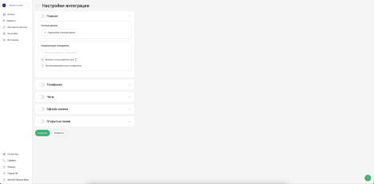

Обратите внимание, что теперь для всех разделов настроек интеграции - есть только **одна общая кнопка "Сохранить"** 

По клику на знак вопроса в правом нижнем углу откроется справочник с базовыми данными о настройке интеграции:

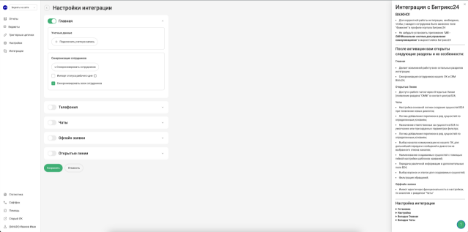

Добавьте портал, с которым будете работать, кликнув по кнопке **"Добавить учетные данные"**.

Если вы подключались ранее через **Bitrix24**, портал будет выбран автоматически. В примере ниже курсор наведен на созданный автоматически [comagic.bitrix24.ru](http://comagic.bitrix24.ru/):

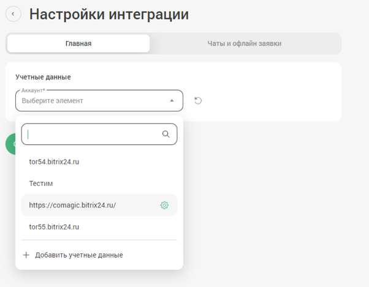

При добавлении или редактировании через «шестеренку», откроется контекстное меню:

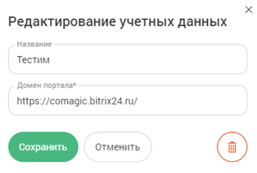

В поле **«Название»** задайте произвольное наименование портала, чтобы отличать его от других, если порталов будет несколько.

«Домен портала» - вставьте свой домен с «https://» и нажмите **"Сохранить"**.

Включите переключатель **"Главная"** и нажмите **"Сохранить"**.

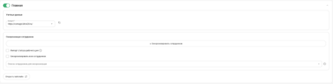

Далее нужно будет выбрать в настройках телефонии, чатов, офлайн заявок или "Открытых линий" в каждом разделе ваш портал и **"Сохранить"**.
# **Настройки интеграции**
Далее рассмотрим доступный функционал новой телефонии. На рисунках ниже видны все настройки:

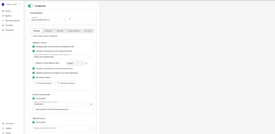

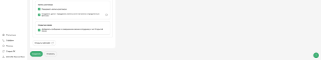
#### **Вы можете пользоваться Softohone как в веб-версии, так и использовать расширение Chrome для звонков, просто установив его в ваш браузер через магазин Google Chrome.**
## **Настройка "Учетные данные"**
В данном разделе, при клике на кнопку "Подключить учетную запись" вы подключаете ваш портал Bitrix24.

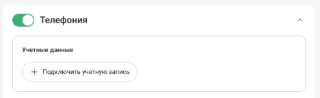

При клике открывается окно на рисунке ниже, где вы можете указать ваш портал Bitrix24, например: https://вашпортал.bitrix24.ru/ и в поле название указываете понятное вам наименование вашей интеграции:

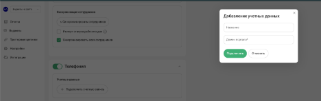
## **Настройка "Основное"**
### **Раздел "Обработка звонков"**
Рассмотрим ниже весь функционал раздела "Обработка звонков":

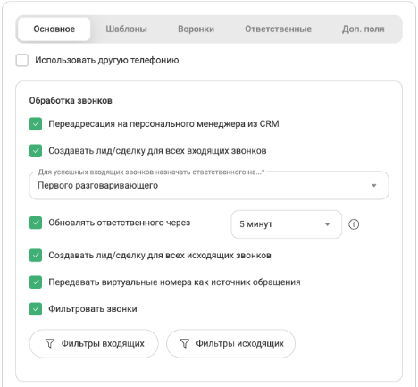
#### **"Использовать другую телефонию"**
Данный функционал работает так, что мы переадресовываем звонки в другую телефонию, где уже есть интеграция с CRM. Например у клиента своя АТС, а вся обработка звонков и логика на их стороне. Из такой логики выходит, что мы не создаем сущности, а обновляем только те, что создала другая интеграция.

Как будет работать, **примеры**:

·       У клиента уже есть существующая сделка и контакт, либо лид - при звонке если происходит любое изменение в сделке, то после этого мы обновляем доп. поля, но обновляем только в тех сущностях, в которых были произведены изменения во время звонка. 

·       У клиента уже есть существующая сделка и контакт, либо лид - при звонке, если изменений не было никаких в сущностях - то ничего не обновляем.

·       Дело обновить не возможно и мы ничего с ним не делаем в этих кейсах.

·       Если у клиента сущностей нет вообще, то мы ничего не создаем, но события регистрируем.

·       В Bitrix24 есть поле: "ID первой коммуникации". Если это поле пустое в измененных сущностях, то мы его пробрасываем в сущность, то есть заполняем его последним полученным значением.

При включении данной функции, вся основная функциональность телефонии будет **деактивирована**, пример на картинке ниже:

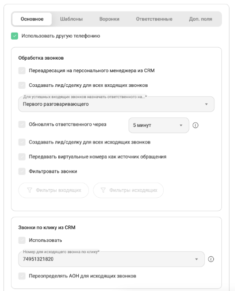
#### **"Переадресация на персонального менеджера из CRM"**
При включении данной функции начинает работать сценарий "переадресации на ПМ из CRM", который вы установите в настройках сценария вашего SIP клиента в старом ЛК.

При выключении данной функции - "переадресация на ПМ из CRM" такой сценарий срабатывать не будет, и звонок клиента будет завершен.

Все остальные сценарии переадресации будут работать при выключенной функции "переадресация на ПМ из CRM" в настройках новой интеграции. 

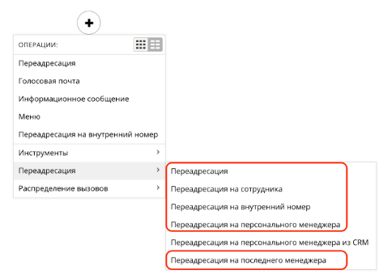
#### **"Создавать лид/сделку для всех входящих звонков"**
При включении этой функции на все входящие звонки будет создаваться лид, либо сделка/контакт/компания, в зависимости от режима CRM.

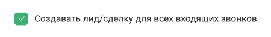

При первичном входящем звонке - будет создаваться лид, либо сделка/контакт/компания

При повторном звонке будет создаваться лид, либо сделка/контакт/компания в случае если старые сущности в завершенном статусе.

Дело при этом будет создаваться для пропущенных звонков всегда со статусом "Не выполненное", а для успешных звонков со статусом "Выполнено"

Если в сущности есть "не выполненное" дело, и далее происходит успешный входящий звонок, то "не выполненное" предыдущее дело получит статус "Обработано".
#### **"Создавать лид/сделку для всех исходящих звонков"**
Данная настройка работает аналогично настройке выше: "Создавать лид/сделку для всех входящих звонков"

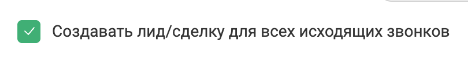
#### **"Обновлять ответственного через"**
В данной настройке можно регулировать промежуток времени, через который должны произойти смена ответственного в лиде, или сделке/контакте/компании. После того как мы меняем ответственного, сразу же добавляем дело уже с этим ответственным. То есть сначала создается сущность с ответственным по умолчанию, и далее, спустя выбранное время уже обновляем ответственного и добавляем дело.

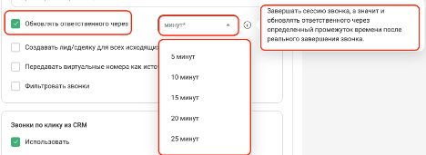
#### **"Передавать виртуальные номера как источник обращения"**
При включении данной настройки, передаем наш виртуальный номер в поле "Дополнительно об источнике" Bitrix24

поле "Дополнительно об источнике" в Bitrix24:

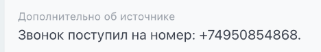

Примеры:

·       **Входящий**/**исходящий** потерянный/успешный звонок → в поле "Дополнительно об источнике" укажем номер виртуального номера на который звонили, либо с которого был исход

·       С трансфером **входящий**/**исходящий** потерянный/успешный → записываем в поле "Дополнительно об источнике" первый виртуальный номер, который принял звонок
#### **"Фильтровать звонки"**
При включении этой опции можно настроить правила фильтрации входящих звонков.

- По умолчанию все звонки пропускаются без фильтрации.
- Если добавлено хотя бы одно условие, система будет обрабатывать только те звонки, которые ему соответствуют.

Как использовать:

1. Активируйте чек-бокс.
1. Добавьте нужные условия (например, номер телефона, тип звонка или источник).
1. Только подходящие под условия звонки будут учитываться в дальнейшей обработке.

ВНИМАНИЕ! У вас установлен один или несколько фильтров на входящие звонки из списка: "Сотрудник", "Выбранная посетителем группа" или "Последняя операция сценария":
При данном фильтре вызов может быть зарегистрирован в Bitrix24 только после принятия звонка сотрудником, а значит пропущенные звонки не будут зарегистрированы в Bitrix24.

Фильтрация содержит параметры, условия и значение. Для гибкой настройки фильтрации звонков их можно формировать по группам через логическое И / ИЛИ.

Для **входящих** звонков есть *параметры*:

1. Виртуальный номер
1. Последняя операция сценария
1. Сценарий ВАТС
1. Выбранная посетителем группа
1. Сотрудник
1. Рекламная кампания
1. Первая рекламная кампания
1. Сайт
1. Источник

*Условия*:

1. Включить - выбирая включить, вы обрабатываете все входящие звонки подпадающие под выбранные условия.
1. Исключить - выбирая исключить, вы исключаете все входящие звонки подпадающие под выбранные условия.

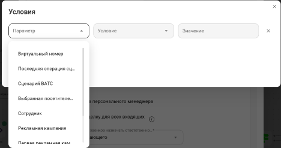

Для **исходящих** звонков есть *параметры*:

1. Виртуальный номер
1. Сотрудник

*Условия*:

1. Включить - выбирая включить, вы обрабатываете все исходящие звонки подпадающие под выбранные условия.
1. Исключить - выбирая исключить, вы исключаете все исходящие звонки подпадающие под выбранные условия.

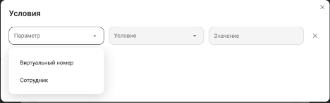
### **Раздел "Звонки по клику из CRM"**
Данный функционал позволяет использовать звонки по клику на номер телефона из Bitrix24.

- Чек-бокс "Использовать" - активирует функциональность интеграции, которая позволяет сотрудникам совершать исходящие звонки при клике на номер в личном кабинете Bitrix24. При выключении, поле "Номер для исходящего звонка по клику" и чек-бокс "Переопределять АОН для исходящих звонков" деактивируются автоматически.
- Поле "Номер для исходящего звонка по клику" является обязательным при включении функции "Звонки по клику"
- Чек-бокс "Переопределять АОН для исходящих звонков" - для исходящих звонков по клику на номер отображать клиенту только выбранный номер в параметре "Номер для звонка по клику". Если чек-бокс выключен, то номер клиенту будет показан тот, что установлен в настройках SIP, либо в настройках приложения телефонии в Bitrix24.

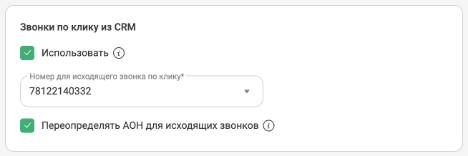
### **Раздел "Обратный звонок"**
При включении чек-бокса "Использовать" укажите номер телефона, на который будут поступать звонки от посетителей сайта при использовании обратной формы.

Поле "Номер для исходящего звонка" обязательное, звонить на номер из настроек интеграции будет только в случае, если не смогли найти сотрудника сопоставленного, или если сотрудник без сипа.

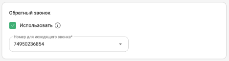

Настройка обратной формы в Bitrix24 находится в "Контакт-центре" → "Обратная форма":

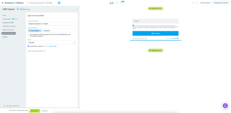
### **Раздел "Запись разговора"**
При активации "Передавать записи разговора" записи будут передаваться в Bitrix24. В зависимости от размера файла запись может загрузиться с задержкой после завершения звонка. При выключении - деактивируется чек-бокс ниже "Создавать дело и передавать записи, если настроены определенные фильтры"

При включении "Создавать дело и передавать записи, если настроены определенные фильтры" - в случае, если настроен один из фильтров: по операции сценария, фильтр по сотруднику - то дело и запись звонка будут передаваться в сущность в зависимости от данной настройки.

Например:

·       Включить «передавать записи, если настроен фильтр по операции сценария» = если есть фильтр по сотруднику(Включен) и включена данная функция, то запись и дело в сущности создается. Если тоже самое только фильтр по сотруднику (Исключен), то не создадим.

·       Выключена «передавать записи, если настроен фильтр по операции сценария» = есть фильтр по сотруднику(Включен), то даже если включена «Передавать записи разговора» - то записи разговора и дела в сущности не будет. Если все тоже самое, но нет фильтра по сотруднику, то запись разговора передадим.

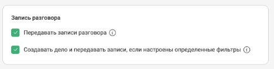
### **Радел "Открытые линии"**
При включении «Добавлять сообщение о совершенном звонке сотруднику в чат» сообщение появляется в чате в Bitrix24 при успешном/неуспешном входящем звонке в Bitrix24, находится в уведомлениях, где видно чат по номеру по конкретному сотруднику.

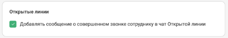

Пример отображения уведомления о звонке:

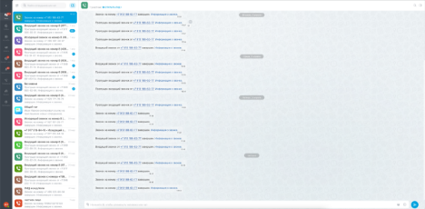
## **Настройка "Шаблоны"**

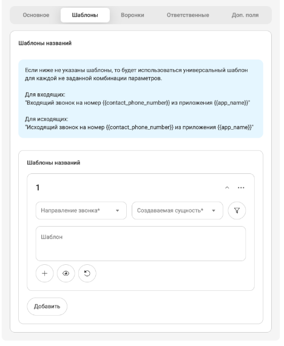

Доступна гибкая настройка для входящих/исходящих вызовов с выбором отдельного шаблона для каждой сущности:

При клике на кнопку + доступен выбор переменных для использования их в названии:

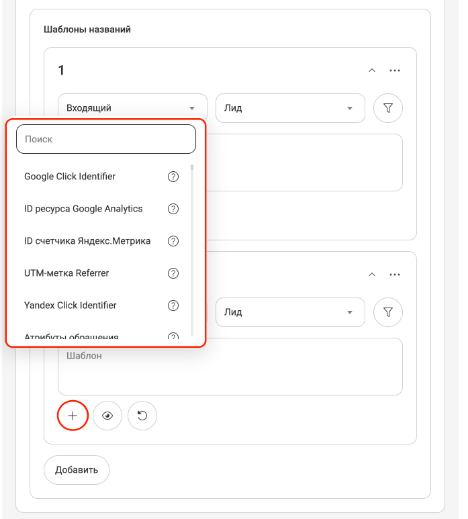

Также можно настроить уже известный вам фильтр с логическими настройками И / ИЛИ и параметрами:

При клике на кнопку с глазом можно посмотреть как будет выглядеть итоговый шаблон:

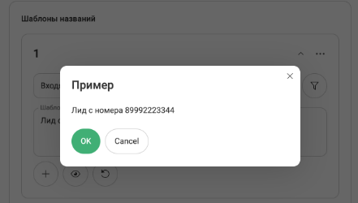

Данные настройки не обязательные, и если не указаны шаблоны, то будет использоваться универсальный шаблон для каждой не заданной комбинации параметров.

**Для входящих:**

- "Входящий звонок на номер {{contact\_phone\_number}} из приложения {{app\_name}}"

**Для исходящих:**

- "Исходящий звонок на номер {{contact\_phone\_number}} из приложения {{app\_name}}"
## **Настройка "Воронки"**
Поля с стадиями по умолчанию - то куда будут попадать все сущности при входящих/исходящих звонках.

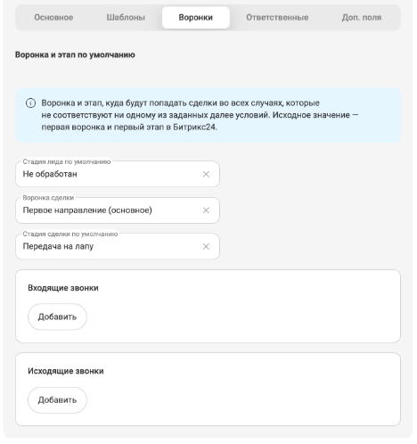

Далее идут поля для гибкой настройки воронок и стадий при входящих/исходящих звонках:

При их добавлении, данные поля являются обязательными.

![ref1]

При клике на круглую кнопку воронки откроются уже знакомые вам параметры и условия фильтрации:

- При выборе параметра с условием "Включить" - для звонков подпадающих под условия фильтра будет выбрана воронка/стадия выбранная в этом фильтре. Все остальные звонки получат воронку/стадию по умолчанию.
- При выборе параметра с условием "Исключить" - для звонков подпадающих под условия фильтра будет выбрана воронка/стадия по умолчанию. Все остальные звонки получат воронку/стадию выбранную в фильтре.

![ref2]
## **Настройка "Ответственные"**
Для данного раздела поля с ответственными по умолчанию - обязательные. 

В поле для **исходящих** звонков указан ответственный по умолчанию, в случае, если ответственный не найден в системе.

В поле для **входящих** звонков указан сотрудник, который будет назначен ответственным за сущность в случае пропущенного входящего звонка.

![ref1]

Для входящих звонков доступна гибкая настройка установки ответственных с применением фильтрации:

![ref1]

Рассмотрим примеры, когда звонок **первичный**:

·       Исходящий, сотрудник не найден = в лид и в дело ставим ответственного по умолчанию, указанного в настройках интеграции.

·       Исходящий, если сотрудник найден = в лиде и в деле ответственный тот кто делает исходящий звонок.

·       Входящий пропущенный (без фильтров) = за лид и дело ответственный тот, кто в поле по умолчанию.

·       Входящий успешный = за лид и дело ответственный тот, кто принял звонок, и в зависимости от настроек первый или последний разговаривающий.

·       Входящий звонок (с фильтром) или пропущенный входящий на номер из фильтра = если звонок первичный, то создаем сущность и дело на того, кто указан в фильтре. Если есть старая сущность, то ставим на пропущенный входящий в дело того кто ответственный в старой сущности, тк есть приоритеты: самое важное - старая сущность, далее сотрудник которому звонят, потом смотрим фильтры, потом по умолчанию. Но если кто-то ответил на повторный звонок, то ставим того ответственного за дело того, кто ответил лиду.

Рассмотрим примеры, когда звонок **повторный**:

·       Входящий с фильтром + повторный пропущенный входящий на номер из фильтра = т.к. есть старый лид, а у него приоритет, поэтому дело ставится на того, кто в старом лиде ответственный.

·       Входящий с фильтром + повторный пропущенный входящий на номер из НЕ фильтра = тк есть старый лид, а у него приоритет, поэтому дело ставится на того кто в старом лиде ответственный. 

·       Входящий с фильтром + пропущенный входящий на другой номер из фильтра = тк есть старый лид, а у него приоритет, поэтому дело ставится на того кто в старом лиде ответственный. 

·       Входящий с фильтром + успешный повторный входящий на номер из фильтра = ответственный  в сущности и в деле тот кто принял звонок. Если повторный звонок - то на том кто разговаривал последний/первый в зависимости от настроек

Также, существует **приоритеность** выставления ответственных по сортировке "Контакт" - "Компания" - "ЛИД"/"Сделка", где Контакт имеет наивысший приоритет:

·       Есть Контакт, Компания и Сделка = берем ответственного с Контакта, если сделка закрыта то создаем новую сделку на того кто в контакте, не смотря на то что звонили на другого сотрудника.

·       Есть Компания и Сделка = берем ответственного с Компании если звонок пропущенный. Если успешный то ставим того кто говорил.

·       Есть только Сделка = берем ответственного со сделки.

·       Есть Сделка и Контакт = берем с контакта при пропущенном, создается дело в контакте и в сделке. При успешном тот кто разговаривал.

·       Есть Лид, контакт, Сделка и Компания = берем в дело ответственного из контакта и ставим на пропущенный в дело его. При успешном ответственный тот, кто говорил.

·       Есть Лид и Контакт = берем ответственного с контакта, в деле ответственный тот кто в контакте, если звонок был неудачный. Если звонок успешный, то в деле у нас ответственный тот, кто разговаривал в зависимости от настроек первый/последний.

·       Есть Лид = берем с лида ответственного и ставим его в новую сделку. В дело же ставим того кто разговаривал, либо если звонок неуспешный то ставим того же, кто стоит в лиде.
## **Настройка "Доп. поля"**
Передавайте параметры обращения в карточку лида, сделки или контакта. Такими параметрами могут быть: источник звонка, название рекламной кампании и многое другое. Для этого укажите название полей из Bitrix24 и какие параметры коммуникации вы хотели бы передавать.

В списке доступных полей отображаются только поля с типом «Текст». 

·       Если переключатель **"Обновлять всегда" выключен**, то поля будут заполняться только при автоматическом создании "Лида".

·       Если **"Обновлять всегда" включен**, то данные будут обновляться в первой найденной сущности по приоритету "Контакт", "Компания", "Лид".

![ref1]
# **Сценарии звонков**
Для работы доступны все сценарии звонков, которые вы можете настроить в старом ЛК "Виртуальная АТС" → "Сценарии":

![ref3]![ref4]![ref4]
# **Проблемы с которыми вы можете столкнуться и как их решить**
1\.Если при звонках не создаются сущности, проверьте настройки интеграции по созданию сущностей и фильтры (возможно стоит исключающий фильтр для определенных звонков):

Также убедитесь, что установлены ответственные по умолчанию в настройках интеграции

![ref5]

2\. Если создаются дубли сущностей, стоит проверить настройку в вашем Bitrix24 если включена, то выключить:

![ref6]

3\. Если поля с ответственными или воронки пустые, то выполните синхронизацию сотрудников вручную нажав кнопку "Синхронизировать сотрудников", а в случае с воронками, попробуйте обновить авторизацию нажав круглую стрелочку:

![ref1]

[ref1]: Aspose.Words.61d3033d-81a2-4bad-b4f8-46768971c96a.035.png
[ref2]: Aspose.Words.61d3033d-81a2-4bad-b4f8-46768971c96a.036.png
[ref3]: Aspose.Words.61d3033d-81a2-4bad-b4f8-46768971c96a.037.png
[ref4]: Aspose.Words.61d3033d-81a2-4bad-b4f8-46768971c96a.038.png
[ref5]: Aspose.Words.61d3033d-81a2-4bad-b4f8-46768971c96a.039.png
[ref6]: Aspose.Words.61d3033d-81a2-4bad-b4f8-46768971c96a.040.png
