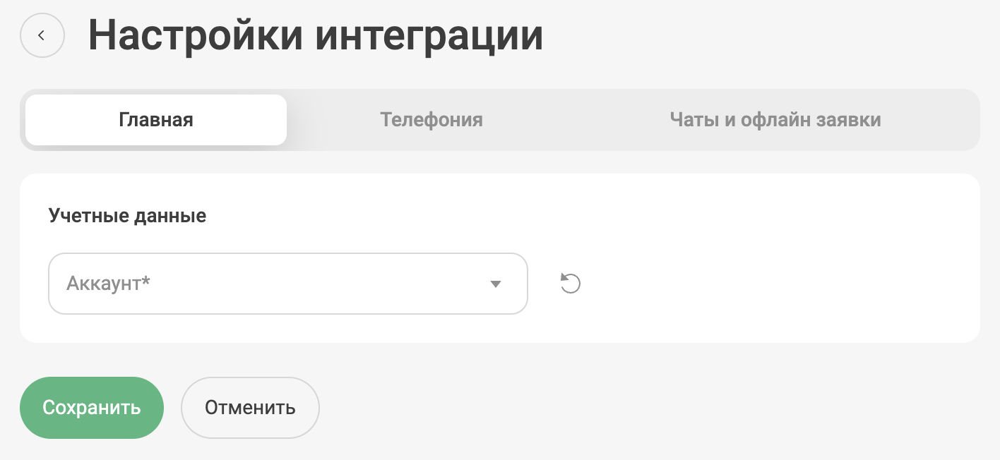
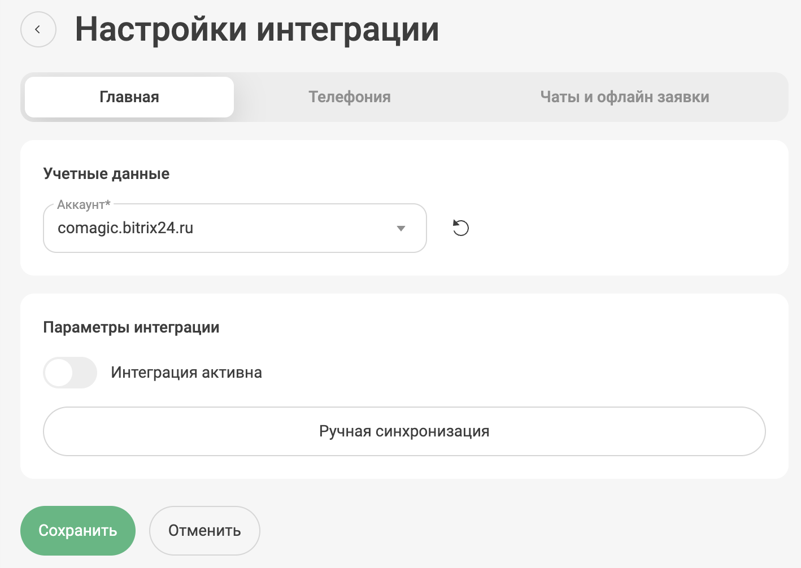
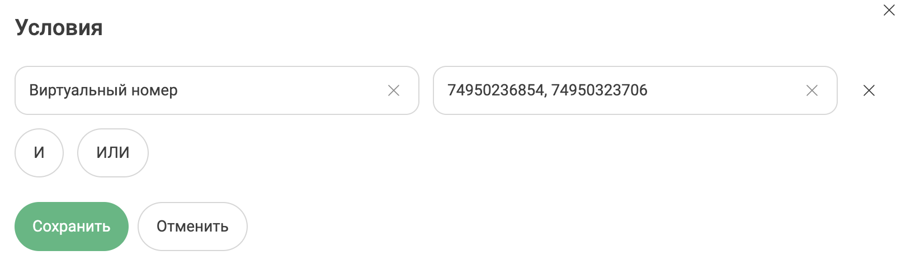
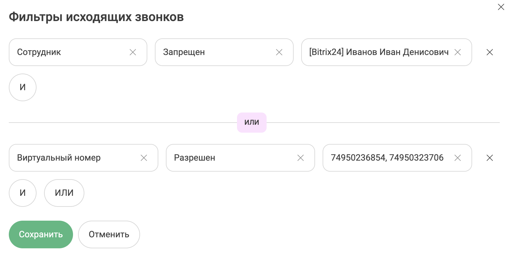
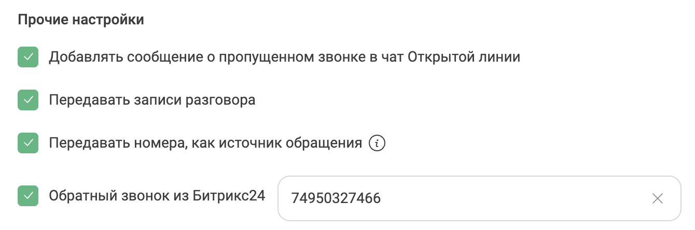

# Интеграция с Битрикс24

## ВАЖНчО! 
* Для корректной работы интеграции, необходимо, чтобы у каждого сотрудника было занесено поле "Фамилия" в профиле портала Битрикс24
* Не забудьте установить приложение UIS 2.0 в маркетплейсе Битрикс24

## После активации вам будут доступно:

### Телефония

- Всплывающие уведомления о звонках;
- Звонок в 1 клик из Битрикс24 (IP телефония или расширение для браузера);
- Обратный звонок из форм на сайте;
- Сохранение истории и записей звонков в карточке Битрикс24;

### Чаты и офлайн заявки

- Создание сущностей при получении чатов и передача содержимого переписки в сущности Битрикс24;
- Создание сущностей при получении офлайн заявок и передача содержимого заявки в сущности Битрикс24;

### Общие
- Фильтрация звонков, чатов, офлайн сообщений по различным сценариям;
- Фильтрация ответственных за сущности по различным сценариям;
- Шаблоны названий для вновь созданных сущностей;
- Передача дополнительных полей в сущности Битрикс24;
- Оповещения о созданных сущностях;

## Настройка интеграции

### Установка

Существует два способа установки интеграции с Битрикс24:

1. установить интеграцию через [Личный кабинет UIS](https://go.uiscom.ru/marketplace/integration_list/bitrix24), нажав кнопку "Подключить интеграцию".
    - Далее необходимо завести учетные данные: название (может быть любым) и адрес вашего портала Битрикс24.

2. Из маркетплейса Битрикс24.  После установки приложения откроется окно с приглашением завершить установку в ЛК UIS.
    - При установке из маркетплейса Битрикс24 заводить учетные данные не нужно, они будут созданы автоматически.

### Настройка

1. В окне настроек интеграции 3 вкладки: Главная, Телефония, Чаты и офлайн завки

> Важно! 
> 
> После внесения настроек в любой из вкладок необходимо нажать кнопку "Сохранить" внизу экрана, а затем уже переходить к следующей вкладке
> 
> Во каждой из вкладок есть флажок "Интеграция активна" для корректной работы необходимой части интеграции нужно следить, чтобы этот флажок был активирован.
> 
> Флажок "Интеграция Активна" всегда должен быть включен во вкладке Главная

2. Выбрать необходимые учетные данные, для доступа к настройкам интеграции.

### Вкладка Главная

В данной вкладке доступна кнопка Ручная синхронизация - это синхронизация сущностей, необходимая для работы интеграции

### Вкладка Телефония

#### Настройки телефонии

1. Режим работы телефонии
- IP Телефония
- WebRTC виджет (расширение Chrome UIS)

#### Входящие звонки

1. Переадресация на персонального менеджера
> В случае, если настроен сценарий телефонии Поиск персонального менеджера звонок будет отправлен ответственному сотруднику из Битрикс24.

2. Фильтрация ответственных

3. Ответственный по-умолчанию, во всех остальных случаях.

#### Исходящие звонки

1. Ответственный по-умолчанию в случае неуспешного звонка.
2. Назначение ответственного первого/последнего разговаривавшего сотрудника.

#### Шаблоны названий сущностей в CRM

1. Выбор типа звонка (входящий/исходящий)
2. Выбор результата звонка (пропущенный/не принятый)
3. Собственный шаблон для названия сущности.

#### Фильтрация

Отдельно фильтруются входящие и исходящие вызовы. Также можно группировать фильтры при помощи операторов И/ИЛИ

#### Сопоставление полей

Можно сопоставить поле из API UIS с полем Битрикс24.

#### Прочие настройки

1. Добавлять сообщение о пропущенном звонке в чат открытых линий
2. Передавать записи разговора
3. Передавать номера, как источник обращения
4. Активация обратного звонка из форм Битрикс24

### Вкладка Чаты

#### Чаты

1. Выбор канала чатов, которые будет отслеживать интеграция
2. Фильтр ответственных за чаты
3. Ответственный по-умолчанию во всех остальных случаях
4. Выбор создавать ли сущности при первичном или повторном обращении.
5. Выбор какого типа сущности будут создаваться
- Лид/Сделка
- Дело
- Лид/Сделка + Дело
6. Создание сущности при начале или завершении чатов оператором.
7. Выбор передавать ли чаты без контактных данных.
8. Выбор отправлять ли уведомления ответственному при создании сущности.

#### Офлайн заявки

1. Фильтр ответственных за офлайн заявки
2. Ответственный по-умолчанию во всех остальных случаях
3. Выбор создавать ли сущности при первичном или повторном обращении.
4. Выбор какого типа сущности будут создаваться
- Лид/Сделка
- Дело
- Лид/Сделка + Дело
5. Создание сущности при начале или завершении чатов оператором.
6. Выбор отправлять ли уведомления ответственному при создании сущности.

#### Фильтрация

Отдельно фильтруются чаты и офлайн заявки. Также можно группировать фильтры при помощи операторов И/ИЛИ

#### Сопоставление полей

Можно сопоставить поле из API UIS с полем Битрикс24.

