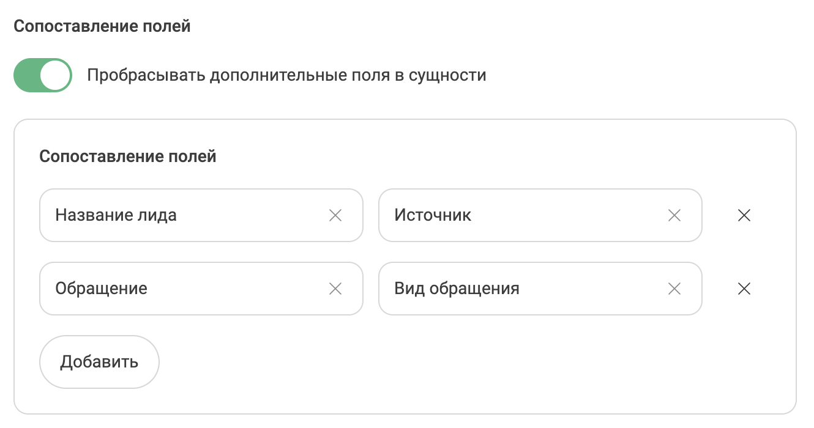

# Интеграция с Битрикс24 

## ВАЖНО!  
* Для корректной работы интеграции, необходимо, чтобы у каждого сотрудника было занесено поле "Фамилия" в профиле портала Битрикс24 
* Не забудьте установить приложение UIS 2.0 в маркетплейсе Битрикс24  

____

## После активации вам будут доступно: 

### Чаты и офлайн заявки 

- Создание сущностей при получении чатов и передача содержимого переписки в сущности Битрикс24; 
- Создание сущностей при получении офлайн заявок и передача содержимого заявки в сущности Битрикс24; 

### Общие 
- Фильтрация звонков, чатов, офлайн сообщений по различным сценариям; 
- Фильтрация ответственных за сущности по различным сценариям; 
- Шаблоны названий для вновь созданных сущностей; 
- Передача дополнительных полей в сущности Битрикс24; 
- Оповещения о созданных сущностях; 

____
## Настройка интеграции 

  
 Установка 
  

Существует два способа установки интеграции с Битрикс24: 

1. Установить интеграцию через [Личный кабинет UIS](https://go.uiscom.ru/marketplace/integration_list/bitrix24), нажав кнопку "Подключить интеграцию".
    - Далее необходимо завести учетные данные: название (может быть любым) и адрес вашего портала Битрикс24.

2. Из маркетплейса Битрикс24.  После установки приложения откроется окно с приглашением завершить установку в ЛК UIS.
    - При установке из маркетплейса Битрикс24 заводить учетные данные не нужно, они будут созданы автоматически.

  
 Настройка 
  

1. В окне настроек интеграции 2 вкладки: Главная, Чаты и офлайн завки 

> Важно! 
> 
> После внесения настроек в любой из вкладок необходимо нажать кнопку "Сохранить" внизу экрана, а затем уже переходить к следующей вкладке
> 
> Во каждой из вкладок есть флажок "Интеграция активна" для корректной работы необходимой части интеграции нужно следить, чтобы этот флажок был активирован.
> 
> Флажок "Интеграция Активна" всегда должен быть включен во вкладке Главная

2. Выбрать необходимые учетные данные, для доступа к настройкам интеграции. 

  
 Вкладка Главная 
  

В данной вкладке доступна кнопка Ручная синхронизация - это синхронизация сущностей, необходимая для работы интеграции 

  
 Вкладка Чаты 
  
    
#### Чаты

1. Выбор канала чатов, которые будет отслеживать интеграция 
2. Фильтр ответственных за чаты 
3. Ответственный по-умолчанию во всех остальных случаях 
4. Выбор создавать ли сущности при первичном или повторном обращении. 
5. Выбор какого типа сущности будут создаваться 
- Лид/Сделка
- Дело
- Лид/Сделка + Дело
6. Создание сущности при начале или завершении чатов оператором. 
7. Выбор передавать ли чаты без контактных данных. 
8. Выбор отправлять ли уведомления ответственному при создании сущности. 

#### Офлайн заявки

1. Фильтр ответственных за офлайн заявки 
2. Ответственный по-умолчанию во всех остальных случаях. 
3. Выбор создавать ли сущности при первичном или повторном обращении. 
4. Выбор какого типа сущности будут создаваться 
- Лид/Сделка
- Дело
- Лид/Сделка + Дело
5. Создание сущности при начале или завершении чатов оператором. 
6. Выбор отправлять ли уведомления ответственному при создании сущности. 

#### Фильтрация 

Отдельно фильтруются чаты и офлайн заявки. Также можно группировать фильтры при помощи операторов И/ИЛИ 

#### Сопоставление полей 

Можно сопоставить поле из API UIS с полем Битрикс24. 

