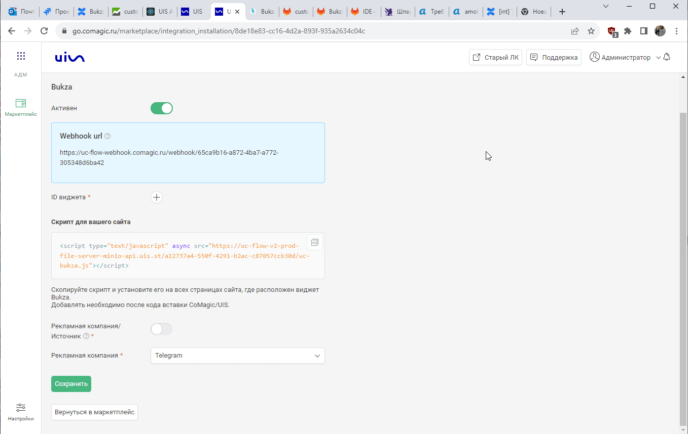

### Интеграция с Bukza
 

**Ценность**   

Решение позволяет настроить передачу заявок, оформленных через виджет онлайн-записи Bukza в CoMagic для дальнейшего анализа эффективности рекламы. 

 **Какие данные передаются**    
- контактные данные (имя,телефон,email);
- дату и время создания;
- данные сессии (рекламную кампанию, источник, UTM-метки и тд);
- в случае отсутствия сессии, дефолтную РК или источник.   

**Настройка интеграции**  
1. Нажмите "Активен" на этой странице.
2. Настройте Webhook в Bukza  

 
 Подробнее 
   

- Шаблоны и интеграции → Веб-запросы → Создать веб-запрос
  - указываем название;
  - в URL указываем Webhook url из настроек интеграции;
  - проставляем галочку POST запрос и в тело добавляем следующий json;   
  
    <Alert backgroundColor="#c3e8d7">
     
     {  
     "date_time": "[bukza_created_date]",  
     "name": "[bukza_full_name]",  
     "phone": "[bukza_phone]",  
     "email": "[bukza_email]",  
     "message": "Номер заказа: [bukza_order_id]; Код бронирования: [bukza_code]",  
     "visitor_session_id": "[bukza_n2]"  
     } 
     
    </Alert>   
     

   - сохраняем.
    
    

- Триггеры → Добавить задачу 
  - добавляем действие "Отправить веб-запрос" и выбираем созданный ранее веб-запрос;
  - "если в заказе несколько бронирований?" выбираем Выполнить для каждого;
  - сохраняем. 

 

  
 

3. **ID виджета** — у каждого виджета в Bukza уникальный id . Необходимо добавить список всех виджетов, с которыми требуется подключить интеграцию.   
ID можно взять из кода виджета. 

 

4. **Тип трафика** — необходимо выбрать какую сущность использовать для обращений без сессии.    
В зависимости от выбранного **типа трафика** выводится либо список источников и сайтов  из личного кабинета клиента, либо список рекламных кампаний. Необходимо указать какой **источник и сайт/рекламную кампанию** используем в случае отсутствия сессии.

  

5. Нажмите сохранить.
6. После сохранения будет выведен скрипт, который необходимо установить на сайт в соответствие с описанием в настройках.

 

После подключения интеграции записи будут попадать в наши отчеты с типом "Заявки".   
Для проверки корректности работы интеграции оставьте тестовое обращение в форме онлайн-записи Bukza на сайте. 
