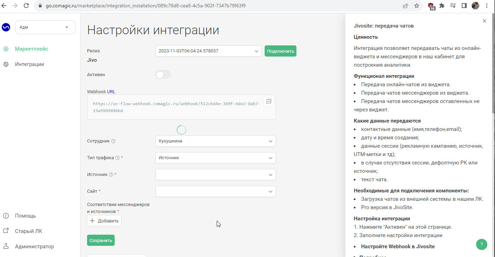

## Интеграция с Jivosite   

Решение позволяет передавать чаты из онлайн-виджета и мессенджеров Jivosite в наш кабинет для дальнейшего анализа эффективности рекламы.    

**Какие данные передаются**   
- контактные данные (имя,телефон,email);  
- дату и время создания;  
- данные сессии (рекламную кампанию, источник, UTM-метки и тд);  
- в случае отсутствия сессии, дефолтную РК или источник;  
- текст чата.  
 

<Alert backgroundColor="#c3e8d7"> 

  Обратите внимание, для подключения интеграции у вас должна быть подключена Pro версия JivoSite  

</Alert>   
 
 

### Подключение интеграции   

1. Нажмите "Активен" на этой странице.
2.  **Настройте Webhook в Jivosite** 
  

  
 Подробнее 
  
В Jivosite необходимо настроить Webhook на "Webhook url" сервиса UIS из настроек.   
a. Заходим в  Jivosite в раздел Управление -> Каналы связи , выбираем нужные сайт/мессенджер и нажимаем настроить.   
b. Далее в настройках заходим в раздел "Настройки интеграции для разработчиков".  
c. Нажимаем "Включить Webhooks" и в поле "URL для Webhooks" добавляем наш "Webhook url".     
  
  
  

 
 

3. **Сотрудник по умолчанию**  — выберете сотрудника, который будет указан в переписке чата.  
4. **Тип трафика** — необходимо выбрать какую сущность использовать для обращений без сессии.    
В зависимости от выбранного **типа трафика** выводится либо список источников и сайтов  из личного кабинета клиента, либо список рекламных кампаний. Необходимо указать какой **источник и сайт/рекламную кампанию** используем в случае отсутствия сессии.   
5. В разделе **Соответствие мессенджеров и источников** настраиваем в какую РК/Источник будут попадать чаты из мессенджеров с неопределившейся сессией.   
   
  

6. Нажмите **сохранить**.  
7. После сохранения будет выведен скрипт, который необходимо установить на всех страницах сайта после основного кода UIS. 
 
После подключения интеграции чаты будут попадать в  Сырые данные -> Обращения и цели.    
Для проверки корректности работы интеграции оставьте тестовое обращение в виджете JivoSite.  
