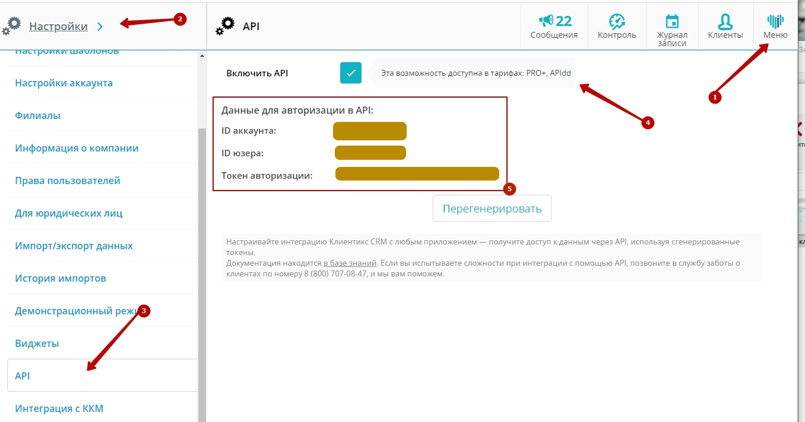
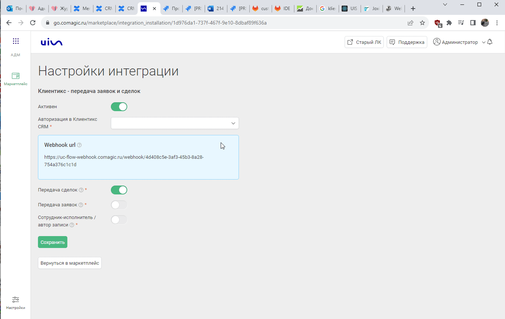

## Интеграция с Клиентикс CRM    
 
Решение позволяет получать заявки оставленные клиентами в форме Онлайн-записи , загружать в наш кабинет записи(сделки) из Клиентикс CRM, а также передавать данные по звонкам из нашего ЛК в Клиентикс CRM.

**Какие данные передаются**     

Данные получаемые по сделкам:   
- сделки: сумма сделки, название, даты изменения и тд; 
- воронка продаж и ее этапы;
- контакты;
- ответственный менеджер;
- дополнительные поля.     

Данные получаемые по заявкам:   

- контактные данные (имя,телефон,email);  
- дату и время создания; 
- данные сессии (рекламную кампанию, источник, UTM-метки и тд);  
- в случае отсутствия сессии, дефолтную РК или источник.    
  

Функциональность телефонии:   

- открытие карточки клиента при входящем звонке;
- история телефонных вызовов;
- прослушивание записи разговора из CRM;
- исходящий звонок по клику из CRM.
  

**Важно**: в Клиентикс CRM необходимо подключить один из тарифов "PRO+" или "APIdd"   
  

## Подключение передачи сделок      

  
  Шаги по подключению 
  
  
1.Заполните **учетные данные**.   

Для авторизации в Клиентикс и дальнейшей возможности совершать запросы к API, необходимо добавить :
- название
- account_id,  user_id и access_token от Клиентикс : Меню → Настройки → API

 

2.  Активируйте интеграцию.    

3. **Настройте Webhook в Клиентикс CRM**  

  
 Подробнее 
  

Инструкция по настройке Webhook [по ссылке](https://klientikscrm.helpdeskeddy.com/ru/knowledge_base/art/569/cat/29/administrativnaja-panel-dlja-sozdanija-uvedomlenij-webhook-po-sobitijam-v-sisteme)  
Пользователь с ролью Владелец может открыть административную панель [по ссылке](https://klientiks.ru/clientix/admin/eventHandlers) 

- Для событий “Запись клиента на прием” и “Онлайн-запись через виджет” в адрес для запроса указываются следующие значения:  
**Webhook url**?appointment_id={{#appointment}}{{id}}{{/appointment}}&status={{#new_data}}{{status}}{{/new_data}} ,   
где Webhook url - URL указанный в настройках интеграции

- Для события “Перенос визита, изменение длительности, изменение статуса” в адрес для запроса указываются следующие значения: 
**Webhook url**?appointment_id={{#new_data}}{{id}}{{/new_data}}&status={{#new_data}}{{status}}{{/new_data}} ,   
где Webhook url - URL указанный в настройках интеграции

   

3. **Передача сделок** — при прожатии будет включена интеграция по передаче сделок и будут выведены дополнительные настройки.  
4. **Сотрудник-исполнитель /автор записи** — определяет какая сущность будет использоваться в качестве ответственного сотрудника: не прожатый маркер - сотрудник-испольнитель , прожаты - автор записи.
 

5.  **Учитывать абонемент в сделке** - если включена настройка, в случае визита по абонементу сумма сделки не учитывается.

6. Нажмите **сохранить**.  

После подключения интеграции сделки будут попадать в  Сырые данные -> Сделки.   
Для проверки корректности работы интеграции создайте тестовую сделку(запись) в Клиентикс.  

 
 
  

### Подключение интеграции с Онлайн-виджетом    

  
  Шаги по подключению 
  

1. Заполните **учетные данные**.   

**Авторизация в Клиентикс CRM**    

Для авторизации в Клиентикс и дальнейшей возможности совершать запросы к API, необходимо добавить :

- название
- account_id,  user_id и access_token от Клиентикс : Меню → Настройки → API

   

2. Активируйте интеграцию.   

3. Настройте Webhook в Клиентикс CRM**  

  
 Подробнее 
  

Инструкция по настройке Webhook [по ссылке](https://klientikscrm.helpdeskeddy.com/ru/knowledge_base/art/569/cat/29/administrativnaja-panel-dlja-sozdanija-uvedomlenij-webhook-po-sobitijam-v-sisteme)  
Пользователь с ролью Владелец может открыть административную панель [по ссылке](https://klientiks.ru/clientix/admin/eventHandlers) 
  
 
- Выбирается событие “Онлайн-запись через виджет”   
- В адрес для запроса указываются следующие значения:  
**Webhook url**?appointment_id={{#appointment}}{{id}}{{/appointment}}&status={{#new_data}}{{status}}{{/new_data}} ,   
где Webhook url - URL указанный в настройках интеграции

 

  

4. **Передача заявок** — при прожатии будет включена интеграция по передаче заявок и будут выведены дополнительные настройки.   

5.  **Передавать тег по источнику ВОЗ** — при прожатии на заявку будет проставляться тег из поля источник ВОЗ. Параметр настраивается персонально под каждого клиента в Клиентикс , инструкция [по ссылке](https://klientikscrm.helpdeskeddy.com/ru/knowledge_base/art/623/cat/55/)      
В техническое имя поля обязательно указать "lead"   

6.  **Тип трафика** — необходимо выбрать какую сущность использовать для обращений без сессии. По умолчанию выбран Источник.    
В зависимости от выбранного **типа трафика** выводится либо список источников и сайтов  из личного кабинета клиента, либо список рекламных кампаний. Необходимо указать какой **источник и сайт/рекламную кампанию** используем в случае отсутствия сессии.     

7. Нажмите сохранить.   

После подключения интеграции заявки будут попадать в  Сырые данные -> Обращения и цели.    
Для проверки корректности работы интеграции оставьте тестовую запись в виджете Клиентикс.   

 
  
  

## Подключение телефонии    

 
 Шаги по подключению 
  

 
 

