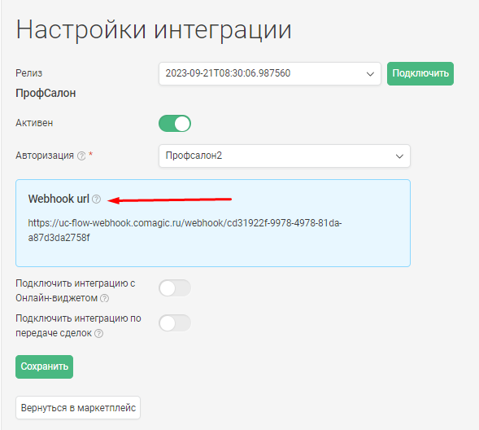

### Интеграция с ПрофСалон
 

 **Ценность**    
 
Решение позволяет передавать в наш кабинет заявки, оставленные клиентами в форме Онлайн-записи, а также сделки из ПрофСалона, для дальнейшего построения Сквозной аналитики.
 

**Какие данные передаются**   

Данные получаемые по сделкам:
- сделки: сумма сделки, название, даты изменения и тд;
- воронка продаж и ее этапы;
- контакты;
- ответственный менеджер;
- дополнительные поля.
 

Данные получаемые по заякам:
- контактные данные (имя,телефон,email);
- дату и время создания;
- передача обращений в дефолтную РК или источник.
 
 

### Подключение интеграции с Онлайн-виджетом   
 

 **Необходимые компоненты для работы интеграции**   
 - Загрузка оффлайн-заявок из внешней системы в нашем сервисе   

  
  Шаги по подключению 
  

1. Нажмите "Активен" на этой странице.
2. Заполните настройки интеграции

**Авторизация**  

a. Зайдите в ПрофСалон в раздел Маркетплейс. В нем необходимо найти интеграцию с CoMagic и подключить ее.  
После подключения будут выведены данные для авторизации (токен, ID салона, логин салона)  
b. Необходимо внести эти данные в раздел Авторизация в настройках интеграции.
  

**Настройте Webhook в Профсалон**  

В Профсалон необходимо настроить Webhook на создание/изменение сделки.  
Для этого направьте запрос  в ПрофСалон с просьбой создать хук на наш URL (указан в поле Webhook url).

Если в настройках ПрофСалона есть блок Интеграции → Вебхуки на внешний сервер , то это можно сделать самостоятельно.

 

**Переключатели:**  
a. Нажмите "Подключить интеграцию с Онлайн-виджетом". После этого будут выведены остальные настройки. 
b. "Рекламная кампания/источник" - необходимо выбрать какую сущность использовать для обращений без сессии. По умолчанию выбрана Рекламная кампания (переключатель не прожат), при прожатии выбирается Источник.   
с. В зависимости от положения переключателя "Рекламная компания/источник" выводится либо список рекламных кампаний из личного кабинета клиента, либо список источников и сайтов. Необходимо указать какую РК/источник и сайт используем в случае отсутствия сессии.   

3. Нажмите сохранить.  

После подключения интеграции заявки будут попадать в  Сырые данные -> Обращения и цели.  
Для проверки корректности работы интеграции оставьте тестовую запись в виджете ПрофСалона.  

 
 
 

### Подключение интеграции по передаче сделок    
 

**Необходимые компоненты для работы интеграции**    
- Сквозная аналитика в нашем сервисе  

  
  Шаги по подключению 
   

1. Нажмите "Активен" на этой странице.
2. Заполните настройки интеграции  

**Авторизация**  
a. Зайдите в ПрофСалон в раздел Маркетплейс. В нем необходимо найти интеграцию с CoMagic и подключить ее.  
После подключения будут выведены данные для авторизации (токен, ID салона, логин салона)  
b. Необходимо внести эти данные в раздел Авторизация в настройках интеграции.
  

**Настройте Webhook в Профсалон**  

В Профсалон необходимо настроить Webhook на создание/изменение сделки.  
Для этого направьте запрос  в ПрофСалон с просьбой создать хук на наш URL (указан в поле Webhook url).

Если в настройках ПрофСалона есть блок Интеграции → Вебхуки на внешний сервер , то это можно сделать самостоятельно.

 

**Переключатели:**  
a. Нажмите "Подключить интеграцию по передаче сделок". После этого будут выведены остальные настройки. 
b. "Дефолтная воронка" - при прожатии все сделки будут передаваться в воронку по умолчанию "Сделки из ПрофСалона". В противном случае будет создана воронка с названием салона, с которым подключена интеграция. 

3. Нажмите сохранить.  

После подключения интеграции сделки будут попадать в  Сырые данные -> Сделки.  
Для проверки корректности работы интеграции создайте тестовую сделку(запись) в ПрофСалоне.  

