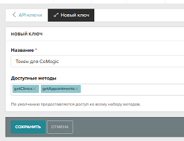
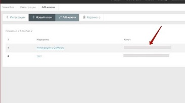
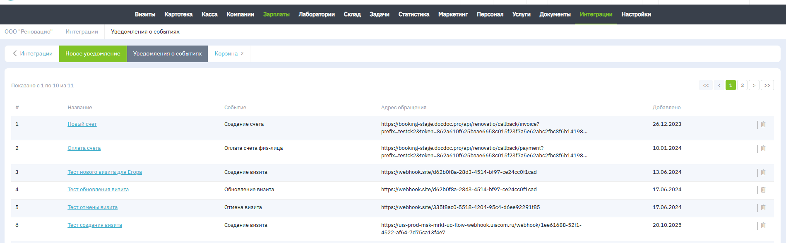
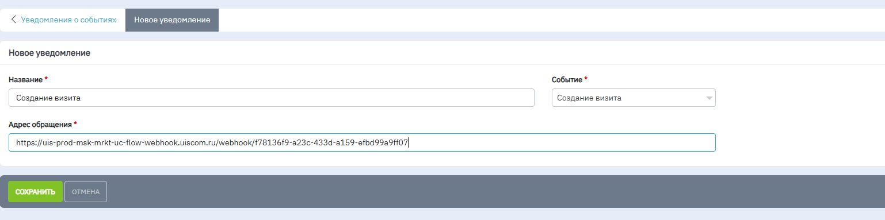

### Интеграция с Renovatio    

**Ценность**      

Решение позволяет передавать в наш кабинет данные по сделкам, для дальнейшего построения Сквозной аналитики.    

 **Какие данные передаются**       
- сделки: сумма сделки, клиника, к которой относится сделка, тип визита, услуги, врач и тд;  
- воронка продаж и ее этапы;  
- контакты;  
- ответственный менеджер.    

В качестве сделки выступает сущность визита.     
Все сделки передаем либо в одну воронку продаж “Сделки из  МИС Renovatio", либо создаем под каждую клинику отдельную воронку .     

**Необходимые компоненты для работы интеграции**      
- Сквозная аналитика.      

**Подключение учетных записей**     

 
 Шаги по подключению 
  

Для работы интеграции нажмите «Добавить учетные данные» и заполните поля в поле "Авторизация в Renovatio":

 - **Название**:  произвольное, понятное вам;

 - **Renovaito API Domen**: при использовании облачной версии оставьте поле заполненным значением по умолчанию. В случае использования коробочной версии, измените домен app.rnova.org на ваш.

- **API-ключ Renovatio**: вносим токен сгенерированный в ЛК Renovatio в разделе 'Интеграции" →  "API-ключи".  
У ключа обязательно должны быть доступы к методам getClinics, getAppointments, либо ко всем (по умолчанию).    
 
   
 
   

 

### Подключение интеграции    

Интеграция подключается в несколько шагов:    

1. Нажмите "Активен" на этой странице.    
2. Заполните поля в настройках:    

- **Webhook URL** - адрес для получения уведомлений по сделкам, необходимо прописать в разделе интеграций кабинета Renovatio.

 
 Подробная настройка 
  
 
 Необходимо перейти в раздел "Интеграции" - "Уведомление о событиях". 

Далее потребуется создать два уведомления - "Создание визита" и "Обновление визита". 
В поле "Название" запишите название понятное вам, в поле "Событие" выберите "Создание визита" для первого уведомления и "Обновление визита" для второго.   
В поле "Адрес обращения" вставьте адрес взятый из поля Webhook URL настроек интеграции.

 
 
   
- **Загружать сделки в воронку по умолчанию**  — прожимается в том случае, если клиенту не требуется создавать под каждую клинику отдельную воронку
- **Передать исторические данные**  — переключатель открывает доступ к ретроспективной загрузке сделок за переиод до подключения интеграции. При активации откроются два поля в с выбором дат для загрузки. 

**Важно** - В связи с ограничениями API Renovatio на выгрузку больших объемов данных, рекомендуем выгружать промежутками за одну неделю.
   

3. Нажмите сохранить    

После подключения интеграции сделки будут попадать в  Сырые данные -> Сделки.     

