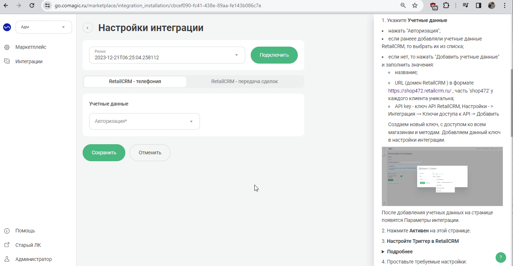

## Интеграция с RetailCRM  

Решение позволяет передавать в наш кабинет данные по сделкам, для дальнейшего построения Сквозной аналитики, а также интегрировать функционал телефонии и передавать данные по звонкам и текстовым коммуникациям в RetailCRM.   

 
 
 
 
 
 

## Функционал интеграции    

 
 Подробнее 
  

Данные передаваемые по звонкам:   

- всплывающие уведомления о входящих звонках;
- звонок в один клик из RetailCRM;
- сохранение истории и записей звонков в RetailCRM;
- синхронизация сотрудников;
- возможность гибкой настройки создания клиентов и задач по звонкам.  

Данные передаваемые по текстовым коммуникациям:   

- возможность гибкой настройки создания клиентов, заказов и задач по обращениям;
- передача дополнительных полей в клиента или заказ;
- встройка нашего виджета РМО в кабинет RetailCRM при подключении соответствующего расширения.  

Данные получаемые по сделкам:     
- сделки: сумма сделки, статус, магазин, к которому относится сделка и тд; 
- воронка продаж и ее этапы;
- клиенты;
- ответственный менеджер.    

 

 
 
 
 
 
 
 

## Подключение учетной записи  

 
 Шаги по подключению 
  

Для авторизации в RetailCRM необходимо в ЛК UIS:    

- нажать "Авторизация";
- если ранеее добавляли учетные данные RetailCRM, то выбрать их из списка;   
- если нет, то нажать "Добавить учетные данные" и заполнить значения:
  - название;  
  - URL (домен RetailCRM ) в формате YOURDOMAIN.retailcrm.ru , часть 'YOURDOMAIN' у каждого клиента уникальна;
  - API key - ключ API RetailCRM, Настройки - > Интеграция → Ключи доступа к API -> Добавить   
  Создаем новый ключ, с доступом ко всем магазинам и методам. Добавляем данный ключ в настройки интеграции.   

   

      
После добавления учетных данных на странице появятся Параметры интеграции.   

 

 
 
 
 
 
 
 

## Синхронизация сотрудников  
  

 
 Шаги по подключению 
    

 Свитч активации **Синхронизация сотрудников** прожат по умолчанию для корректной работы всех компонентов интеграции. Выключение может привести к потери работоспособности.  
  

1. **Синхронизировать всех сотрудников** - выберите настройку, если требуется импортировать всех сотрудников из RetailCRM в UIS. При выключенной настройке становится доступным список сотрудников для синхронизации.    

2. Выберите конкретных сотрудников в настройке **Сотрудники для синхронизации**, если требуется синхронизировать не всех сотрудников из amoCRM.    

3. Нажмите кнопку **Синхронизировать сотрудников** для ручной синхронизации сотрудников.  
При первом подключении интеграции обязательное действие.    

4. Нажмите **Сохранить**.    

 

## Телефония    

 
 Шаги по подключению 
  
  
Для передачи данных по звонкам из UIS в Retail прожмите свитч активации интеграции "Телефония".   

## Основное   
 

1. **Фильтровать звонки** - данная настройка необходима для фильтрации звонков по определенным условиям. Если не использовать фильтр, то по всем звонкам будет создаваться сущность в CRM. При включении настройки станет доступно для выбора две поднастройки: "Фильтр входящих" и "Фильтр исходящих" звонков.Условия можно прописывать через операторы И/ИЛИ. Если фильтр настроен, то он будет помечен зеленой точкой в верхнем правом углу. Если вы нажали на чекбокс "Фильтровать звонки", но не выбрали никакую настройку в выпадающем списке - передаем все звонки. 

2. **Номер для звонка по клику** - выберите, какой номер будет отражаться при звонке по клику.  

3. **Всегда отображать номер** - сли включить опцию, то правила отображения номера сотрудника будут игнорироваться и всегда будет отображаться выбранный номер.   

4. **Входящие звонки** - перечень настроек для обработки входящих звонков. Ниже подробнее про возможные варианты: 
  

 - **Первичные обращения** - выберите какие сущности создавать на первичное обращение.   

 - **Создавать на сотрудника** - выберите, на какого сотрудника назначать созданые сущности.     

 - **Повторные обращения** - выберите какие сущности создавать на на повторное обращение.  

- **Создавать на сотрудника** - выберите, на какого сотрудника назначать созданые сущности.    

- **Включить переадресацию на персонального менеджера** - активируйте, если необходима переадресация на персонального менеджера из CRM. Для работы необходим сценарий с данной операцией.  

5. **Исходящие звонки** - перечень настроек для обработки исходящих звонков. Ниже подробнее про возможные варианты:  

 - **Первичные обращения** - выберите какие сущности создавать на первичное обращение.   

 - **Создавать на сотрудника** - выберите, на какого сотрудника назначать созданые сущности.     

 - **Повторные обращения** - выберите какие сущности создавать на на повторное обращение.  

- **Создавать на сотрудника** - выберите, на какого сотрудника назначать созданые сущности.    

6. **Задачи** - настройка создания задач по пропущенным звонкам:  

- **При потеряном входящем звонке создавать задачу на** - выберите, откуда взять отвественного для создания задачи по пропущенному входящему звонку.   

- **При неуспешном исходящем звонке создавать задачу на** - выберите, откуда взять отвественного для создания задачи по неуспешному исходящему звонку.   

- **Срок действия задачи** - выберите продолжительность создаваемой задачи.   

6. **Основной магазин** - выберите магазин, к которому будут привязываться обращения.  

7. **Магазины** - для более гибкой настройки связки магизинов с виртуальными номерами. Номера, которые не выберутся в данной настройке, автоматически будут привязаны к магазину выбраному в п.6.  

## Шаблоны  
  

В этом разделе вы можете настроить шаблон названий задач, которые будут автоматически создаваться в RetailCRM при поступлении потерянных входящих или исходящих звонков.  

1. Нажав на кнопку плюса, можно выбрать, какое значение переменной установить в шаблон наименования сущности.     

2. Кнопка с иконкой (глаза) дает возможность сделать предпросмотр наименования которое будет отображено в создаваемой сущности.     

3. Кнопка с иконкой (закругленой стрелочки) возвращает шаблон поля к последнему сохраненному значению.   
 

## Ответственные    
  

Настройка позволяет управлять назначением ответственных сотрудников за сущности в зависимости от условий.  

1. Задайте ответственного по умолчанию - это обязательное поле.  

2. Для добавлении условия назначения ответственного нажмите кнопку "Добавить" в основных условиях.  
- Выберите сотрудника из выпадающего списка. 
- Далее выберите условия или группы условий для определения правил, по которым будут проставляться ответственные в создаваемых сущностях по обращениям.
- Нажмите "Сохранить".   

  
     

## Дополнительные поля    
  

Настройка позволяет передавать дополнительные поля в контакт и заказ.

1. Сопоставьте для каждой сущности дополнительные поля из Retail и UIS. 

2. При необходимости обновлять поля при каждом обращении прожмите **Обновлять всегда**.

3. После добавления сопоставления всех требуемых дополнительных полей - нажмите "Сохранить". 

  

 

 

При подключении интеграции в нашем ЛК, автоматически подключается приложение в Маркетплейсе в RetailCRM. 
Для проверки работы интеграции на тестовых звонках проверьте работу пунктов указаных в **"Данные передаваемые по звонкам"**.  

 

 
 
 
 
 
 
 

## Текстовые коммуникации   

 
 Шаги по подключению 
  

Для передачи данных по чатам и заявкам из UIS в Retail прожмите свитч активации интеграции "Текстовые коммуникации".    

 

## Основное   
 

**Заявки**

1. **Первичное обращение** - выберите, какие сущности необходимо создавать на первичное обращение.  

2. **Для повторных обращений** - выберите, какие сущности необходимо создавать на повторное обращение.   

3. **Создавать заказ для повторных обращений на** - выберите отуда взять отвественного сотрудника для повторного обращения.  

4. **Фильтры** - данная настройка необходима для фильтрации заявок по определенным условиям. Если не использовать фильтр, то по всем заявкам будет создаваться сущность в CRM. Условия можно прописывать через операторы И/ИЛИ. Если фильтр настроен, то он будет помечен зеленой точкой в верхнем правом углу. Если вы нажали на чекбокс "Фильтровать заявки", но не выбрали никакую настройку в выпадающем списке - передаем все заявки.     

**Чаты**   

1. **Для первичных обращений** - выберите, какие сущности необходимо создавать на первичное обращение.  

2. **Для повторных обращений** - выберите, какие сущности необходимо создавать на повторное обращение.   

3. **Создавать заказ для повторных обращений на** - выберите отуда взять отвественного сотрудника для повторного обращения. 

4. **Создавать клиента/клиента и заказ** - выберите событие, при котором необходимо создавать выбранные выше сущности.  

5. **Создавать задачу по пропущенному чату на** - при необходимости создавать задачу при потеряном чате, выберите откуда взять отвестенного для неё.  

6. **Срок действия задачи** - задайте продолжительность создаваемой задачи.  

7. **Передавать чаты без контактных данных** - ключите если необходимо передаваться чаты от посетителей, у которых отсутствует номер телефона. При каждом новом чате с посетителем без контактных данных будет создаваться новый контакт и задача, что может привести к дублям в RetailCRM.

8. **Фильтры** - данная настройка необходима для фильтрации заявок по определенным условиям. Если не использовать фильтр, то по всем заявкам будет создаваться сущность в CRM. Условия можно прописывать через операторы И/ИЛИ. Если фильтр настроен, то он будет помечен зеленой точкой в верхнем правом углу. Если вы нажали на чекбокс "Фильтровать заявки", но не выбрали никакую настройку в выпадающем списке - передаем все заявки.   

9. **Основной магазин** -  выберите магазин, к которому будут привязываться обращения.  

7. **Магазины** - для более гибкой настройки связки магизинов с сайтами. Сайты, которые не выберутся в данной настройке, автоматически будут привязаны к магазину выбраному в п.6.  
  
  

## Шаблоны  
  

В этом разделе вы можете настроить шаблон названий задач, которые будут автоматически создаваться в RetailCRM при поступлении потерянных входящих или исходящих звонков.  

1. Нажав на кнопку плюса, можно выбрать, какое значение переменной установить в шаблон наименования сущности.     

2. Кнопка с иконкой (глаза) дает возможность сделать предпросмотр наименования которое будет отображено в создаваемой сущности.     

3. Кнопка с иконкой (закругленой стрелочки) возвращает шаблон поля к последнему сохраненному значению.   
 

## Ответственные    
  

Настройка позволяет управлять назначением ответственных сотрудников за сущности в зависимости от условий.  

1. Задайте ответственного по умолчанию - это обязательное поле.  

2. Для добавлении условия назначения ответственного нажмите кнопку "Добавить" в основных условиях.  
- Выберите сотрудника из выпадающего списка. 
- Далее выберите условия или группы условий для определения правил, по которым будут проставляться ответственные в создаваемых сущностях по обращениям.
- Нажмите "Сохранить".     

  
     

## Дополнительные поля    
  

Настройка позволяет передавать дополнительные поля в контакт и заказ.

1. Сопоставьте для каждой сущности дополнительные поля из Retail и UIS. 

2. При необходимости обновлять поля при каждом обращении прожмите **Обновлять всегда**.

3. После добавления сопоставления всех требуемых дополнительных полей - нажмите "Сохранить". 

  

 

 

 

При подключении интеграции в нашем ЛК, автоматически подключается приложение в Маркетплейсе в RetailCRM. 
Для проверки работы интеграции на тестовых звонках проверьте работу пунктов указаных в **"Данные передаваемые по текстовым коммуникациям"**.  

  

 
 
 
 
 
 
 
 

## Передача сделок    

 
 Шаги по подключению 
  

1. **Настройте Триггер в RetailCRM**  

  
 Подробнее 
  

Автоматизация → Триггеры →  Добавить триггер  
Заполните настройки триггера:

- название ;
- добавляем событие 'Изменение заказа ': 
  - обязательно указываем в условиях:  "Новый заказ" или  "Изменение статуса заказа с Любой на Любой" или "Заказ оплачен "Да";
  - в действие добавляем "Выполнить HTTP-запрос"  , в нем заполняем настройки :
     - Адрес  - Webhook url из настроек интеграции;
     - HTTP метод - GET;
     - Передавать параметры - в строке запроса; 
        - Параметр: orderId 
        - Значение: {{ order.id }}  

 

 
 
3. Проставьте требуемые настройки:  
- **Воронка по умолчанию** — при прожатии все сделки будут передаваться в 1 воронку по умолчанию. В противном случае по каждом магазину будет создана отдельная воронка.  
- **Учитывать стоимость доставки** — при прожатии в сумму сделки будет включена стоимость доставки.  
- **Список дополнительных полей** —  список дополнительных полей из RetailCRM. Выберите те, которые требуется передавать в наши отчеты в связке со сделками.

4. Нажмите сохранить.  

После подключения интеграции сделки будут попадать в  Сырые данные -> Сделки.   
Для проверки корректности работы интеграции создайте тестовую сделку в RetailCRM.

 
