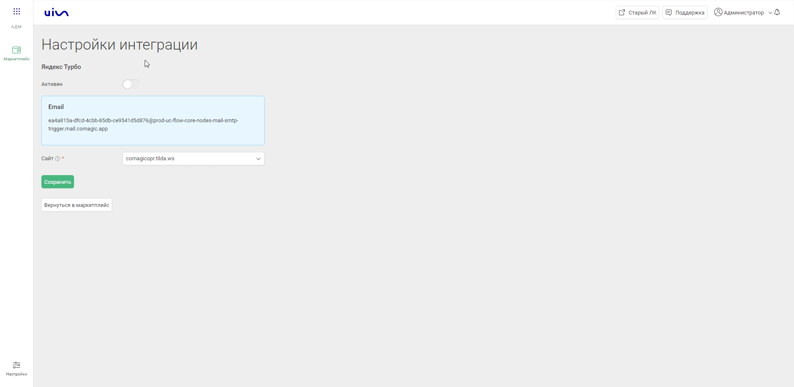

### Яндекс.Турбо интеграция с почтовым сервисом   

**Ценность интеграции**   
Данная интеграция позволяет получать заявки со страниц Яндекс.Турбо в наш кабинет для построения аналитики и дальнейшей обработки.   

**Функционал интеграции**   
- Передача заявок.  
- Передача меток.  
- Создание сессии по полученным данным.   

  **Необходимые компоненты для работы интеграции**   
- Загрузка оффлайн-заявок из внешней системы. 
- Загрузка сессий из внешних систем, а также требуются отдельные баллы API на создание "Сессий из внешней системы в день".   

  
### Подключение интеграции      

1. Нажмите "Активен" на этой странице. 
2. Выполните настройку интеграции.  

- Настройте отправку писем из Яндекс.Турбо в наш сервис.   
Для этого из раздела "Email" скопируйте адрес для отправки писем и внесите его в Яндекс.Турбо.  
- Выберите сайт, на который должны попадать загружаемые заявки.

  
  
 

3. Нажмите сохранить.    

Для проверки работы интеграции оставьте заявку на вашей странице Яндекс.Турбо и проверьте её попадание в наш кабинет.  
