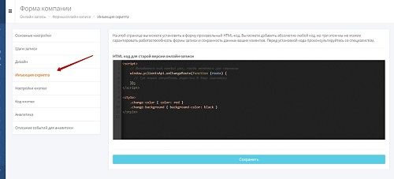

### Интеграция с Yclients   

**Ценность**    

Решение позволяет получать заявки оставленные клиентами в форме Онлайн-виджета , загружать в наш кабинет записи(сделки) из Yclients, а также интегрировать функционал телефонии и передавать данные по звонкам и текстовым коммуникациям в Yclients.    
 
**Какие данные передаются:**     

**Данные получаемые по заякам**:    

- контактные данные (имя,телефон,email);  
- дату и время создания; 
- данные сессии (рекламную кампанию, источник, UTM-метки);  
- в случае отсутствия сессии, дефолтную РК или источник. 

**Данные получаемые по сделкам**:     
- сделки: сумма сделки, название, даты изменения; 
- воронка продаж и ее этапы;
- контакты;
- ответственный менеджер;
- дополнительные поля.   

**Данные передаваемые по звонкам**:   

- всплывающие уведомления о входящих звонках;
- сохранение истории и записей звонков в Yclients.  

**Данные передаваемые по текстовым коммуникациям**:   

- возможность гибкой настройки создания клиентов по обращениям;
- встройка нашего виджета РМО в кабинет Yclients при подключении соответствующего расширения.  

 
 
 

## Подключение передачи заявок с Онлайн-виджета.   

**Необходимые компоненты для работы интеграции**     
- Загрузка оффлайн-заявок из внешней системы.   

**Важно:** 

Заявки, оставленные с мобильного приложения, будут загружены по site_id / добавлены в отдельную рекламную кампанию либо в источник.  
Решение позволяет отслеживать рекламную кампанию/источник с виджета на сайте, а также с лендингов YClients .
Для этого на сайте и на лендинге должен быть установлен наш стандартный код вставки, т.е. для лендинга придется завести отдельный сайт в UIS с доменом yclients.com и затем добавить сформированный код вставки на лендинг.

 
 Шаги по подключению 
  

1. Прожмите переключатель "Yclients передача заявок c Онлайн-виджета", для активации интеграции.  
2. Выполните настройку интеграции.  

- **Настройте Webhook в Yclients**  

 
 Подробнее 
  

Отправка хука настраивается в Yclients через создание собственного приложения, инструкция по созданию находится [по ссылке](https://support.yclients.com/67-68-202?_ga=2.235690817.1118622726.1689663799-975683808.1687778856) .  

- В поле «Адрес, на который отправлять уведомления» укажите url из параметра "Webhook URL".
- В настройке хука в разделе **"Отправлять события по сущностям"** выбираем **"Событие по записям", "Событие по клиентам"**.
  
  

**Важно**: если у клиента несколько филиалов, для каждого необходимо события хука настраивать отдельно, так как настройки для каждого филиала располагаются отдельно друг от друга. 

 

 
 

- **Рекламная кампания/источник** — необходимо выбрать какую сущность использовать для обращений без сессии. По умолчанию выбран Источник.  
- В зависимости от выбора выводится либо список рекламных кампаний из личного кабинета, либо список источников и сайтов. Необходимо указать какую **Рекламную кампанию/источник и сайт** используем в случае отсутствия сессии.  

3. Нажмите сохранить.  
4. После сохранения будет выведен скрипт, который необходимо установить на сайт в соответствие с описанием в настройках. 
 
Данный скрипт устанавливаем на всех страницах сайта, где расположен виджет Yclients, а так же требуется добавить наш скрипт и стандартный код вставки в саму форму в YClients (инъекция скрипта).   

**Важно**:  
   - Инъекция скрипта доступна для всех клиентов в старом дизайне. В новом дизайне Yclients  добавляет данную функцию по запросу.  
       
   - Если клиент на сайт добавляет не виджет Yclients (кнопку), а отдельную ссылку на лендинг, то в этой ссылке необходимо добавить  class="yclick"  
   
   **Пример:**  
 
  <Alert backgroundColor="#c3e8d7">
    
   a class="yclick" href="https://n822081.yclients.com/" target="_blank">Открыть новую вкладку</a>

   где "https://n822081.yclients.com/" - это домен страницы на которой стоит ваш виджет.
   
 </Alert>    
  
После подключения интеграции сделки будут попадать в  Сырые данные -> Обращения и цели.   
Для проверки корректности работы интеграции оставьте тестовую запись в Онлайн-виджете Yclients.

 

 
 
 
 
 
 
 
  
## Подключение передачи сделок    

**Необходимые кампоненты для работы интеграции**    
- CU_Сквозная аналитика.   

 
 Шаги по подключению 
  

 
1. Активируйте переключатель "Yclients передача сделок", для подключения интеграции.  
2. **Авторизация в Yclients**  

 
 Подробнее 
  
 
   - Добавьте название авторизации, а также логин и пароль, от Yclients.
   - Нажмите сохранить. 

 
 
3. Выполните настройку интеграции.  

- **Настройте Webhook в Yclients**  

 
 Подробнее 
  

Отправка хука настраивается в Yclients через создание собственного приложения, инструкция по созданию находится [по ссылке](https://support.yclients.com/67-68-202?_ga=2.235690817.1118622726.1689663799-975683808.1687778856) .  

- После создания и подключения приложения, перейдите в "Настройки" - "Cистемные настройки" - "WebHook"
- В настройке хука в разделе **"Отправлять события по сущностям"** выбираем **"Событие по записям", "Событие по клиентам"**.
  
  

**Важно**: если вы используете несколько филиалов, события хука необходимо настраивать отдельно, так как настройки для каждого филиала располагаются отдельно друг от друга.  

 
 

После подключения интеграции сделки будут попадать в  Сырые данные -> Сделки.   
Для проверки корректности работы интеграции создайте тестовую сделку в Yclients.

 
 
 
 
 
 
 
 

## Подключение телефонии      

**Необходимые кампоненты для работы интеграции**    
- Базовые отраслевые решения.   

 
 Шаги по подключению 
  

1. Укажите **Учетные данные**  
- Для работы интеграции по телефонии, потребуются две авторизации;
- если ранее добавляли учетные данные Yclients, то выбрать их из списка,   
- если нет, то нажать "Добавить учетные данные" и заполнить значения:  
  **Подключение учетной записи:**   
 - Добавьте **User token** из Yclients в поле **Авторизация**.   
 - User token можно получить в Телефония -> Интеграция, поле "Токен".

  
 
  **Подключение телефонии:**       
  - название;     
  - Введите логин и пароль, от Yclients.   
   

2. **Обработка звонков** - внесите настройки обработки звонков.  
- **Сеть** - укажите название сети, с которой подключаете интеграцию. С каждой сетью интеграция подключается отдельно, так как User token в Yclients формируется под каждую сеть.
- **Внешние номера филлиалов** - укажите соотношение вируальных номеров с филлиалами выбраной сети.  
- **Филлиал по умолчанию** - укажите филлиал, в который будут попадать звонки с номеров не выбранных в настройке выше.  
- **Условия фильтрации** - задайте условия, если требуется фильтровать звонки по сайтам, источникам,сценариям и/или типам.  
- **Создавать клиента** - настройка позволяет создавать клиента по звонкам.  
3. Нажмите **сохранить**.  
4. В кабинете Yclients, после проведенных настроек, появятся дополнительные разделы в блоке Сеть –> Телефония:    
Маршрутизация, Маршруты и Звонки (1), а статус интеграции изменится на Интеграция подключена (2)

 

В Yclients перейдите в раздел **Маршруты** и выстроите маршрут, по которому будет идти звонок.  
Маршрут по умолчанию всего один – Маршрут для всех пользователей.  
Настройка маршрута по умолчанию – сохранять историю звонков по маршруту в Истории сети. 

   

Кликните, чтобы открыть настройки.  

  

При такой настройке всплывающие уведомления о звонках работать не будут, а звонки будут видны только в истории звонков сети.   
**Измените настройку** на ту, которая вам подходит:  
  - история звонков сети и всех салонов – всплывающее окно о звонке будет появляться во всех филиалах сети, звонок будет виден во всех филиалах в разделе Обзор – Звонки. 
  - история звонков сети и уведомленных салонов – всплывающее окно о звонке будет появляться в том филиале/филиалах, которые будут выбраны в этом маршруте.  
  
После настройки маршрута свяжите его с номером телефона/идентификатором абонента телефонии, sip или внутренний номер, на который поступают звонки.  
Для этого перейдите в раздел **Маршрутизация**.
   
Укажите номер телефона своей компании без плюса, скобок, дефисов, пробелов и других символов и сохраните.  
Настройка в  Yclients завершена.  
 

Для проверки работы интеграции на тестовых звонках проверьте работы пунктов указаных в **"Данные передаваемые по звонкам"**.  
Если после всех настроек звонки в Yclients не появляются, проверьте, совпадают ли номера телефонов в маршрутизации Yclients и нашем Личном кабинете.

   

 
 
 
 
 
 
 

## Подключение текстовых коммуникаций      

**Необходимые кампоненты для работы интеграции**    
- Базовые отраслевые решения;   
- ОМНИ-Чаты.   

 
 Шаги по подключению 
    
 
1.Укажите  **Учетные данные**     
Добавьте название авторизации, а также логин и пароль, от Yclients.  
 
  
2. **Передача заявок**  

- **Передавать заявки** - выберите настройку, если требуется передавать данные по заявкам в Yclients.
При её выборе выводятся дополнительные настройки вариантов передачи заявок.  

- **Соотношение филиалов** - задайте соответствие сайтов с вашими филиалами.   
- **Филиал по умолчанию** - выберите филиал для всех сайтов не выбранных в настройке выше.  

- **Условия фильтрации** - задайте условия, если требуется фильтровать заявки по сайтам и/или типам.     
- **Создавать клиента** - настройка позволяет создавать клиента по заявкам.  

3. **Передача чатов**   

- **Передавать чаты** - выберите настройку, если требуется передавать данные по чатам в Yclients.
При её выборе выводятся дополнительные настройки вариантов передачи чатов.   

- **Соотношение филиалов** - задайте соответствие сайтов с вашими филиалами.  

- **Филиал по умолчанию** - выберите филиал для всех сайтов не выбранных в настройке выше.   
 
- **Условия фильтрации** - задайте условия, если требуется фильтровать заявки по сайтам и/или типам.   

- **Создавать клиента** - настройка позволяет создавать клиента по чатам.  
  При активации данной настройки выводятся дополнительные параметры, позволяющие выбрать на какое событие создавать клиента:
- начало чата;
- завершение чата;
- простановка тега.

4. Активируйте интеграцию.
5. Нажмите "Сохранить".

 

 

