# **Подключение интеграции CallGear для Дубаи и Латвии**
- [Термины](#id-подключениеинтеграцииcallgearдлядуба)
- [Подключение интеграции CallGear Латвия](#id-подключениеинтеграцииcallgearдлядуба) 
  - [Полезные ссылки](#id-подключениеинтеграцииcallgearдлядуба)
- [Подключение интеграции CallGear Дубаи](#id-подключениеинтеграцииcallgearдлядуба) 
  - [Полезные ссылки](#id-подключениеинтеграцииcallgearдлядуба)
- [Настройки интеграции](#id-подключениеинтеграцииcallgearдлядуба) 
  - [Настройки учетных данных "Accounts"](#id-подключениеинтеграцииcallgearдлядуба)
  - [Настройки чатов "Chats"](#id-подключениеинтеграцииcallgearдлядуба) 
    - [Каналы чатов](#id-подключениеинтеграцииcallgearдлядуба)
    - [Ответственные](#id-подключениеинтеграцииcallgearдлядуба)
  - [Создание сущностей](#id-подключениеинтеграцииcallgearдлядуба)
  - [Распределение по воронкам](#id-подключениеинтеграцииcallgearдлядуба)
  - [Настройки оффлайн заявок](#id-подключениеинтеграцииcallgearдлядуба)
  - [Остальные настройки](#id-подключениеинтеграцииcallgearдлядуба) 
    - [Шаблоны названий сущностей](#id-подключениеинтеграцииcallgearдлядуба)
    - [Сопоставление полей "Field mapping"](#id-подключениеинтеграцииcallgearдлядуба)
    - [Сценарии распределения чатов](#id-подключениеинтеграцииcallgearдлядуба)
# **Термины**
Портал / портал Bitrix24 - это облачный или коробочный вариант CRM Битрикс24 (Bitrix24). Под ним мы понимаем обобщенную информацию о ресурсе с конкретным доменом. Например «Проверяйте настройки и тарифы на своем портале Б24». В нашем случае это Б24 с доменом вида «[test.bitrix24.ru](http://test.bitrix24.ru/)». Некоторые люди называют его ЛК Б24 или же сайт Б24.

Новый Личный Кабинет (Новый ЛК) – это личный кабинет CallGear, который выглядит так (см. рисунок). Используется для большинства видов коммуникации и является интерфейсом и рабочим местом для сотрудников и руководителей.

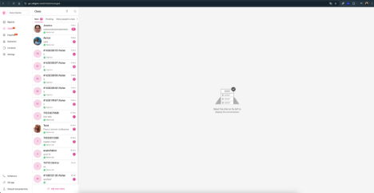
# **Подключение интеграции CallGear Латвия**
1\. Для настройки вашей интеграции: перейдите по ссылке <https://go.callgear.com/marketplace/integration_list/bitrix24>

2\. Откроется такое окно для подключения, нажмите на кнопку **"Add installation"**

![ref1]

3\. После клика на кнопку **"Add installation"** откроется страница с настройками подключения

![ref2]

4\. Теперь необходимо добавить портал Bitrix24 в список аккаунтов, чтобы в дальнейшем быстро подключать интеграцию, просто выбрав её из списка поля **"Account".**

5\. Нажмите на кнопку **"Add account"**

![ref3]

6\. В поле "Name" введите любое понятное вам наименование аккаунта интеграции, например: наименование вашего портала. Данное поле не обязательное, но лучше его заполнить, чтобы в списке аккаунтов отображалось понятное имя подключаемого портала Bitrix24.

7\. В поле "\*Bitrix24 portal domain" вставьте ссылку вашего адреса портала, например: <https://callgeartest.bitrix24.ru/>

Адрес портала в поле "\*Bitrix24 portal domain" должен быть ваш, в данной инструкции указанный портал написан для примера

Пример заполненных полей:

![ref4]

9\. Нажмите кнопку **"Connnect"**, если поля заполнены.

10\. Откроется такое окно, нажмите на кнопку **"CallGear"**

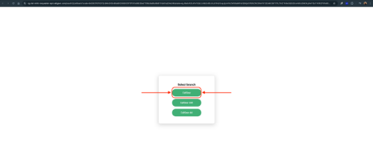

12\. Далее будет открыта страница с успешным подключением портала, данная страница закроется автоматически.

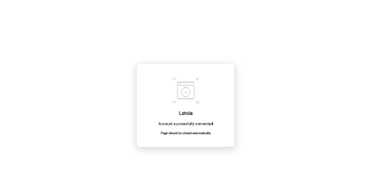

13\. Будет открыта данная страница с вашим подключенным порталом

![ref5]

При клике на поле **"Account"** - откроется список ваших подключенных интеграций, которые можно редактировать. При наведении курсора на строку с порталом, появится кнопка с иконкой "Шестеренки" при клике на которую откроется окно с возможностью отредактировать имя портала, ссылку на портал, либо возможность удалить подключенный портал, нажав на кнопку "Корзины":

![ref6]![ref7]

14\. Сделайте вашу интеграцию активной, включив переключатель **"Integration is active"** и нажмите кнопку **"Save"**

![ref8]

15\. Перейдите в соседний раздел текущей страницы: "chats and offline messages" и выберите ваш портал из списка в поле **"Account"**

![ref9]

16\. Вам откроются на странице все возможности настроек интеграции.

После установки необходимых вам настроек (о которых поговорим ниже), важно в самом последнем разделе внизу " Other settings", включить переключатель " Integration is active" и нажать "Save". Иначе, все включенные вами функции в настройках не будут работать в рамках подключенной вами интеграции. 

![ref10]
## **Полезные ссылки**
Сайт для отправки заявок через чат на сайте (со своей стороны уже настроили): <https://hcp.tb.ru/usa64832com>
# **Подключение интеграции CallGear Дубаи**
1\. Для настройки вашей интеграции: перейдите по ссылке <https://go.callgear.ae/marketplace/integration_list/bitrix24>

2\. Откроется такое окно для подключения, нажмите на кнопку **"Add installation"**

![ref1]

3\. После клика на кнопку **"Add installation"** откроется страница с настройками подключения

![ref2]

4\. Теперь необходимо добавить портал Bitrix24 в список аккаунтов, чтобы в дальнейшем быстро подключать интеграцию, просто выбрав её из списка поля **"Account".**

5\. Нажмите на кнопку **"Add account"**

![ref3]

6\. В поле "Name" введите любое понятное вам наименование аккаунта интеграции, например: наименование вашего портала. Данное поле не обязательное, но лучше его заполнить, чтобы в списке аккаунтов отображалось понятное имя подключаемого портала Bitrix24.

7\. В поле "\*Bitrix24 portal domain" вставьте ссылку вашего адреса портала, например: <https://callgeartest.bitrix24.ru/>

Адрес портала в поле "\*Bitrix24 portal domain" должен быть ваш, в данной инструкции указанный портал написан для примера

Пример заполненных полей:

![ref4]

9\. Нажмите кнопку **"Connnect"**, если поля заполнены.

10\. Откроется такое окно, нажмите на кнопку **"CallGear UAE"**

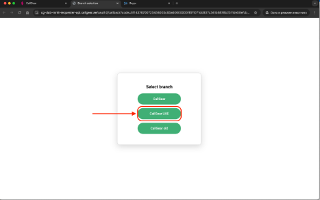

11\. Далее будет открыта страница с успешным подключением портала, данная страница закроется автоматически.

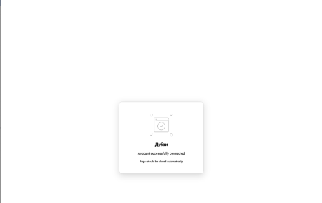

12\. Будет открыта данная страница с вашим подключенным порталом

![ref5]

При клике на поле **"Account"** - откроется список ваших подключенных интеграций, которые можно редактировать. При наведении курсора на строку с порталом, появится кнопка с иконкой "Шестеренки" при клике на которую откроется окно с возможностью отредактировать имя портала, ссылку на портал, либо возможность удалить подключенный портал, нажав на кнопку "Корзины":

![ref6]![ref7]

13\. Сделайте вашу интеграцию активной, включив переключатель **"Integration is active"** и нажмите кнопку **"Save"**

![ref8]

14\. Перейдите в соседний раздел текущей страницы: "chats and offline messages" и выберите ваш портал из списка в поле **"Account"**

![ref9]

15\. Вам откроются на странице все возможности настроек интеграции.

После установки необходимых вам настроек (о которых поговорим ниже), важно в самом последнем разделе внизу **"Other settings"**, включить переключатель **"Integration is active"** и нажать **"Save"**. Иначе, все включенные вами функции в настройках не будут работать в рамках подключенной вами интеграции. 

![ref10]
## **Полезные ссылки**
Сайт для отправки заявок (со своей стороны уже настроили): <https://siteusa.dev.uis.st/usa_64943.html>
# **Настройки интеграции**
## **Настройки учетных данных "Accounts"**
В настройках интеграции, первой доступной настройкой идет уже знакомый вам раздел "**Accounts"**.

Здесь вы можете выбрать к какому порталу подключить интеграцию или отредактировать существующий. А также, есть кнопка справа - (иконка закругленной стрелки) для обновления ключей авторизации интеграции.

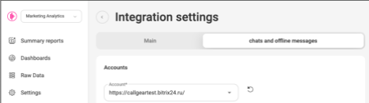
## **Настройки чатов "Chats"**
Далее идут настройки чатов **"Chats"**: с полями **"Chats channels"** и **"Default chat responsible\*":** данное поле обязательные к заполнению. 

Напротив некоторых полей можно посмотреть подсказку, наведя на иконку восклицательного знака курсор.

Включите настройку **"Enable chats"**:

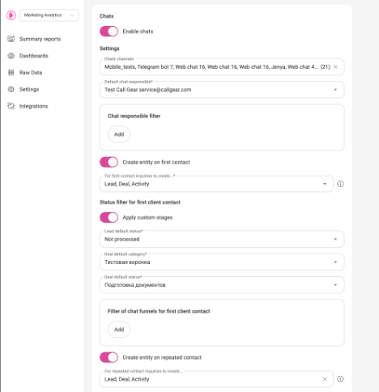

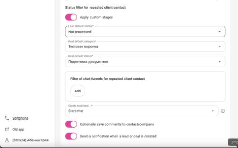
### **Каналы чатов**
В интеграции за то, какие каналы будут создавать сущности и обрабатывать интеграция, отвечает поле **"Chats channels"**. К примеру, нам не нужен канал Telegram, но нужен WhatsApp. Тогда мы выберем нужный нам канал, а тот, который не хотим передавать в Б24, не станем отмечать:

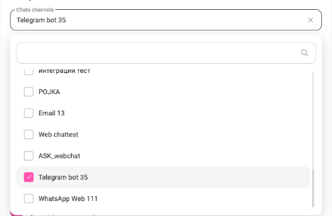

Чтобы ваши каналы появились в этом поле в настройках интеграции, перейдите в раздел **"Виджеты"** в **"Каналы"/"Channels"**, вам откроется окно с настройками каналов:

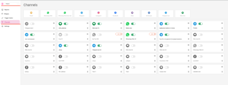

На данной странице можно как редактировать уже существующие каналы, так и подключать свои. Например, если нажать на шестеренку любого из каналов, например **whatsapp** или **telegram**, то вам откроется такое окно с настройками:

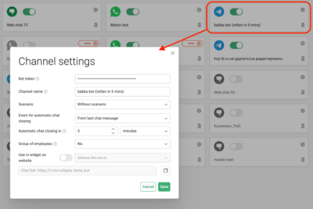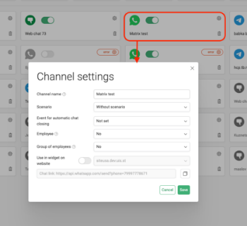

- Здесь можно переименовать канал в поле **"Channel name"**
- Выбрать сценарий в поле **"Scenario"**
- Выбрать событие, по которому чат будет завершаться в поле **"Event for automatic chat closing"**
- Выбрать сотрудника в поле **"Employee"**, если хотите, чтобы сообщения в данный канал приходили только ему, либо выбрать группу сотрудников в поле **"Group of employees"**
- Переключатель **"Use in widget on website"** при включении можно выбрать сайта, на которых данный виджет будет отображаться
- И, кнопка копирования ссылки на канал, для более быстрого перехода в нужный канал или её отправки кому либо

Если вам необходимо подключить ваш канал, выберите нужный источник (**whatsapp,** **telegram или что-то другое**):

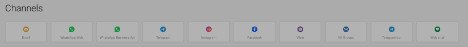

Вам откроется такое окно, если вы выбрали например **whatsapp:**

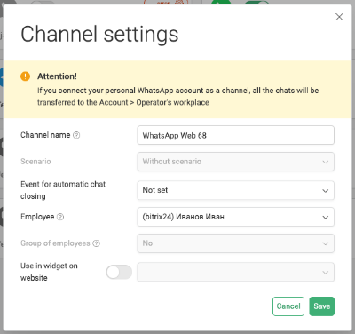

Обратите внимание на предупреждение, что при подключении персонального whatsapp, подтянутся и все личные переписки 

Далее, при необходимости дайте имя вашему каналу и установите нужные настройки о которых мы рассказали выше.

Нажмите кнопку "Сохранить"

Вам откроется окно с QR-кодом, который необходимо будет отсканировать в вашем приложении whatsapp, чтобы канал был связан с вашим устройством.

После всех этих действий канал появится в настройках интеграции в списке поля **"Chats channels"**
### **Ответственные**
В поле **"Default chat responsible\*"** Выберите ответственного по-умолчанию и при желании настройте фильтр ответственных по условиям. 

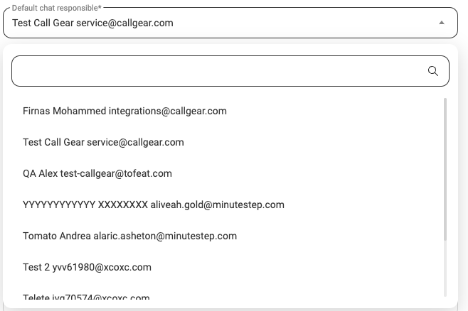

Если в «Фильтре ответственных за чаты» выбраны условия фильтрации по сайту, то приходящие с выбранного сайта запросы от клиентов будут назначены на ответственного, указанного в блоке фильтра, а не ответственного по умолчанию. Запросы с других сайтов будут назначены на ответственного по умолчанию.

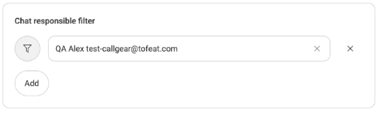

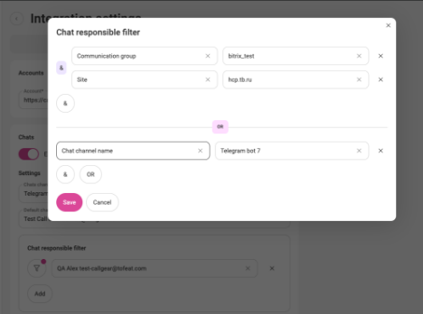
## **Создание сущностей**
Выберите, какие сущности создавать при первичных и повторных обращениях. Чаты привязываются к Лидам и Сделкам в Б24, поэтому для первичных обращений нужно обязательно выбрать что-то из этого.

Для повторных обращений можно выбрать как просто **«Activity»** или ничего не выбирать, тогда повторные чаты попадут в первую найденную сущность, которая связана с коммуникацией.

**«Comment priority on repeated contact»** нужен для того, чтобы сотрудник мог определиться, в какую сущность ему надо передать чаты. Активируется, если при повторном обращении ничего не выбрать или выбрать только **«Activity»**.

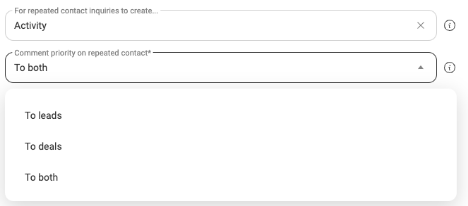

Если клиент хочет подгружать чаты только при повторных обращениях, так как переезжает в UIS из другого сервиса. Ему важно продолжать работать со старыми сущностями и не плодить дубли. В настройках повторных обращений он ничего не выбрал. 

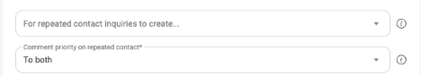

По его бизнес-логике, ему нужно в первую очередь добавлять комментарии в сделку, так как лиды он использует как «мусорную» сущность для поступающих заявок, а потом сортирует их по воронкам в сделках. В этом случае, клиенту нужно выставить в настройках приоритет «В сделки». Тогда мы будем в первую очередь искать сделки и добавлять туда комментарий. Если сделка будет не найдена – будем искать Лид → Контакт/Компанию. Если ничего не найдем, значит это первичное обращение, которое отработаем по соответствующей логике из настроек.

Если же клиент выбрал **«To both»**, то мы найдем связанную Сделку и Лид, а затем добавим комментарий с чатом в обе сущности. Важно помнить, что это актуально для самой «свежей» сделки и лида. Если у клиента много сделок и лидов с одним и тем же клиентом, то мы не будем понимать, куда положить чат.
## **Распределение по воронкам**
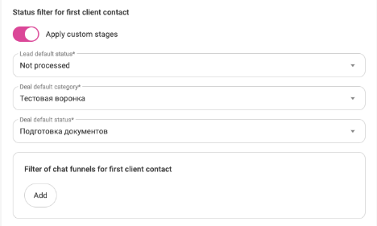

«Filter of chat funnels for first/repeated client contact» необходим для распределения обращений по воронкам. Нажмите «Add» или на икнопку "воронки" и выберите, на какой стадии должен появляться лид, и в какой воронке и стадии окажется сделка, если запрос соответствует условиям:

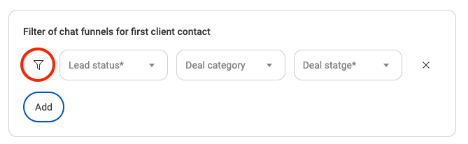

Нажмите на иконку воронки слева от поля «Стадия лида» и выберите вариант «&»:

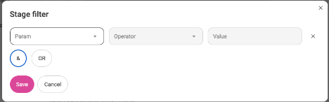

В поле «Param» выберите параметры фильтрации входящих чатов:

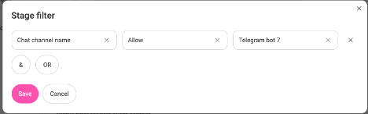

Если канал имеет условие Разрешен, то для всех запросов с этого канала создаваемые Лиды и Сделки будут иметь Стадию/Воронку/Этап, указанную в этом фильтре. Чаты из других каналов попадут в Стадию/Воронку/Этап по умолчанию, которые вы выберите здесь:

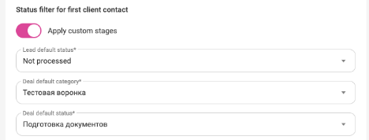

Если канал имеет условие Запрещен, то для чатов с этого канала создаваемые Лиды/Сделки будут иметь Стадию/Воронку/Этап, указанную по умолчанию.

Аналогична настройка и для повторных обращений.

**Переключатель "Create lead/deal":**

- **"Start chat"**: сообщения чата будут подгружаться в комментарий Лида/Сделки в режиме онлайн. 
- **"End chat"**: переписка будет подгружена в Лид/Сделку после завершения диалога.

**Переключатель "Optionally save comments to contact/company"**: включите, если хотите дублировать комментарии с чатами в найденный контакт/компанию.

**Переключатель "Send a notification when a lead or deal is created"**: при включении, вам будет отправляться уведомление на портеле при создании лида или сделки
## **Настройки оффлайн заявок**
Важно!

Интеграция с офлайн заявками настраивается так же, как и с чатами.

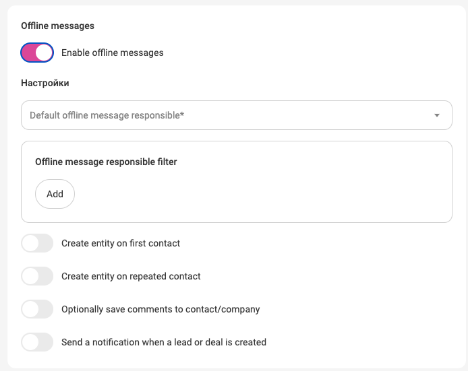

**После настройки включите активность интеграции:**

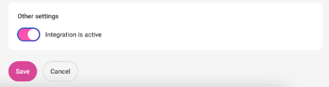
## **Остальные настройки**
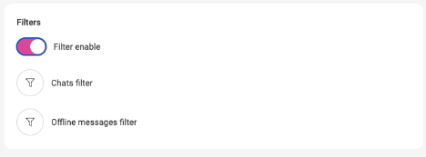

Дает возможность фильтровать передачу чатов и заявок. В этой настройке тоже используется принцип Разрешения/Запрета, который влияет на создание Лидов/Сделок в Б24. 
### **Шаблоны названий сущностей**
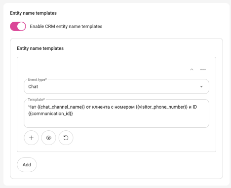

Задайте названия для создаваемых в Б24 сущностей с использованием нужных параметров. Через кнопку плюса - добавляются переменные которые будут использоваться в наименовании, кнопка с глазом позволяет сделать предпросмотр того как это будет выглядеть, кнопка стрелочки - будет обновлять поля, приводя их к последнему сохраненному значению.

На картинке выше мы выбрали тип события «Чат». В шаблон добавили текст и параметры «Тип канала», «Телефон посетителя» и ID коммуникации. Теперь в названии Лида/Сделки будет сразу видно, из какого канала пришел чат, номер телефона клиента и ID коммуникации:

![ref11]
### **Сопоставление полей "Field mapping"**
Включите переключатель "Add additional fields into entities"

![ref11]

Здесь можно задать параметры для передачи данных в дополнительные поля сущностей в Б24. 

Если нужно добавлять комментарии в уже закрытые лиды и сделки, включите настройку «Add data to closed leads/deals»:

![ref12]

Если у вас много открытых и закрытых Лидов/Сделок, то комментарий с чатом попадет в последние активные сделки. 

Если все Лиды/Сделки закрыты, и нет условий для создания Лида/Сделки, то комментарий с чатом попадет в последний закрытый Лид/Сделку.
### **Сценарии распределения чатов**
Чтобы сущности в Б24 не дублировались, для онлайн-чата на сайте [настройте сценарий](https://docs.uiscom.ru/pages/viewpage.action?pageId=154722857) с операцией Форма сбора контактов: 

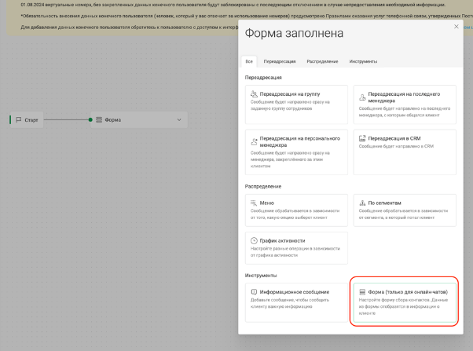

[ref1]: Aspose.Words.05e370b3-0a48-4aa8-9961-8fd87a37cef7.002.png
[ref2]: Aspose.Words.05e370b3-0a48-4aa8-9961-8fd87a37cef7.003.png
[ref3]: Aspose.Words.05e370b3-0a48-4aa8-9961-8fd87a37cef7.004.png
[ref4]: Aspose.Words.05e370b3-0a48-4aa8-9961-8fd87a37cef7.005.png
[ref5]: Aspose.Words.05e370b3-0a48-4aa8-9961-8fd87a37cef7.008.png
[ref6]: Aspose.Words.05e370b3-0a48-4aa8-9961-8fd87a37cef7.009.png
[ref7]: Aspose.Words.05e370b3-0a48-4aa8-9961-8fd87a37cef7.010.png
[ref8]: Aspose.Words.05e370b3-0a48-4aa8-9961-8fd87a37cef7.011.png
[ref9]: Aspose.Words.05e370b3-0a48-4aa8-9961-8fd87a37cef7.012.png
[ref10]: Aspose.Words.05e370b3-0a48-4aa8-9961-8fd87a37cef7.013.png
[ref11]: Aspose.Words.05e370b3-0a48-4aa8-9961-8fd87a37cef7.039.png
[ref12]: Aspose.Words.05e370b3-0a48-4aa8-9961-8fd87a37cef7.040.png
